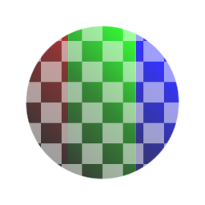

# RGBA Merge

<table>
<tr style="border: 0;">
<td style="border: 0;" valign="top">

{width="128px"}

## RGBA Merge

**In:** *Filters/Channels*

**Simple**

</td>
<td style="border: 0;" valign="top">

## Description

Packs a separate grayscale input into each of the four channels. Not to be confused with RGB-A Merge, as this node gives you more merging control!

Very useful node for channel-packing maps together. Can for example be used for packing Smoothness, Metallic and AO into respective R, G and B channels.

## Parameters

### Inputs

* **R**: *Grayscale Input*
* **G**: *Grayscale Input*
* **B**: *Grayscale Input*
* **A**: *Grayscale Input*

*No Parameters.*

## Example Images

|  |
| --- |
| There are no images attached to this page. |

</td>
</tr>
</table>
