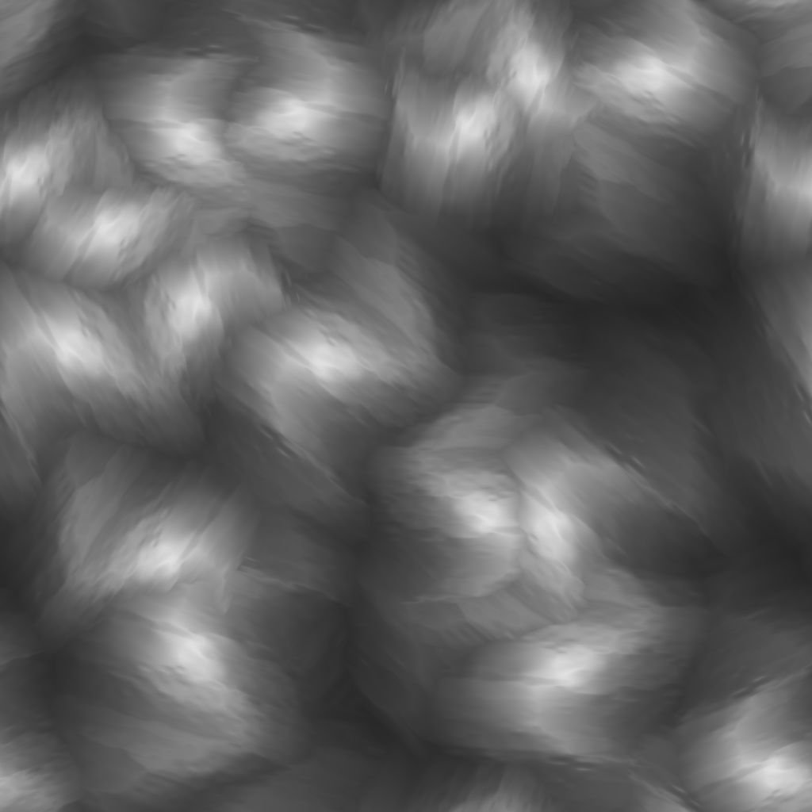

# Diffusion Grayscale

<table>
<tr style="border: 0;">
<td width="41.60%" style="border: 0;" valign="top">

{width="200px"}

**In:** *Filters/Effects*

**Intermediate**

</td>
<td width="58.30%" style="border: 0;" valign="top">

## Description

Apply a diffusion process to the values in **Source** image input according to the provided **Mask** image input, creating smooth gradations between values.

Only values from pixels matching the mask are diffused; other pixels don't participate in the result.

</td>
</tr>
</table>

## Parameters

* **Iterations**: *0.0 - 64.0*The number of diffusion iterations to perform (higher is better but slower). Useful values are in the &#91;8, 48&#93; range.  
  Please note that if you are not looking for mathematical correctness, low values are fine or even better.  
  **Distance**: **0.0 - 1.0**Adjusts the maximum distance of the diffusion.
* **Enable Dithering**: *True/False*Controls the sampling method of each pass. Dithering allows convergence in less passes, but introduces noise.  
  Without it, each pass is faster but more passes are required to achieve a smooth result without banding artifacts.

## Inputs

* **Source** *Grayscale*  
  The image to diffuse.
* **Mask** *Grayscale*  
  Diffusion mask: white pixels are sampled in *Source* and diffused in black pixels. The image should be black and white. If the mask includes gradients, the cutoff value is 0.5.
* **Intensity** *Grayscale*  
  Defines locally how strong the diffusion process is applied. This map should be *contrasted* for a noticeable effect.

## Example Images

<table>
<tr style="border: 0;">
<td style="border: 0;" valign="top">

{width="256px"}

</td>
<td style="border: 0;" valign="top">

{width="256px"}

</td>
<td style="border: 0;" valign="top">

{width="256px"}

</td>
</tr>
</table>

<table>
<tr style="border: 0;">
<td style="border: 0;" valign="top">

{width="256px"}

</td>
<td style="border: 0;" valign="top">

{width="256px"}

</td>
<td style="border: 0;" valign="top">

{width="512px"}

</td>
</tr>
</table>
