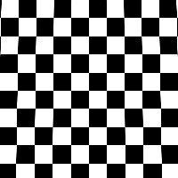

# Trapezoid Transform

<table>
<tr style="border: 0;">
<td style="border: 0;" valign="top">

{width="128px"}

{width="128px"}

## Trapezoid Transform (Grayscale)

**In:** *Filters/Transforms*

**Simple**

</td>
<td style="border: 0;" valign="top">

## Description

Special transform node that modifies the input in a perspective/trapezoid warp manner. Has control for Top and Bottom stretch. Values can be pushed beyond limits for stronger effects.

## Parameters

* **Top Stretch**: *0.0 - 1.0*Set the amount of stretch or squash at the top.
* **Bottom Stretch**: *0.0 - 1.0*Set the amount of stretch or squash at the botton.
* **Background Color**: *(Grayscale/Color value)*  
  Set solid background color in case tiling is turned off.
* **Sampling**: *Bilinear, Nearest*Set sampling quality.

## Example Images

</td>
</tr>
</table>
