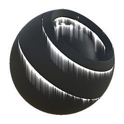

# Leaks

<table>
<tr style="border: 0;">
<td style="border: 0;" valign="top">

{width="128px"}

## Leaks

**In:** *Mesh Based Generators**/Mask Generators*

**Intermediate**

</td>
<td style="border: 0;" valign="top">

## Description

Generates a black and white mask based on baked maps and user settings. Similar to [Smart Masks](https://support.allegorithmic.com/documentation/display/SPDOC/Smart+Materials+and+Masks) in [Painter](https://support.allegorithmic.com/documentation/display/SPDOC/Substance+Painter).

This node represents leaking streaks of dirt and grime coming from sharp edges. As streaks are generated with baked Position, they always run downwards.

Make sure to try changing the variation mask: because it drives the placement of streaks, it can have a much larger influence than with other Mask Generators.

## Parameters

### Inputs

* **Position**: *Grayscale Input*   
  Baked position map, used for streak directions. Required!
* **Curvature**: *Grayscale Input*   
  Baked map used for streak placement. Required!
* **Ambient Occlusion**: *Grayscale Input*   
  Baked map used for internal effects and masking. Recommended, but you could use flat white instead.
* **Normal World Space**: *Color Input*   
  Baked World Space Normalmap, used for streak direction. Required!
* **Variation Mask**: *Grayscale Input*   
  Optional variation mask, enable by setting the override to True.
* **Mask (optional)**: *Grayscale Input*   
  Mask slot used for masking the node's effects.

### Parameters

* **Level**: *0.0 - 1.0*  
  Total level of the result. Progressively reveals the effect, affects length as well. Should be set fairly high to get long drips.
* **Contrast**: *0.0 - 1.0*  
  Adjusts the contrast of the result.
* **Variation**: *0.0 - 1.0*Sets the amount of large-scale variation used to mask the streaks. Setting this value to 0 leads to full uniform streaks, so avoid this.
* **Lenght**: *0.0 - 8.0*Length of the streak drips. Setting this value too high at a small scale will lead to visible stepping. Play around with the Level too.
* **Occlude**: *X, Y, Z, None*Sets what direction the AO should affect.
* **Override variation mask**: *False/True*Enables overriding of the variation mask with a custom input slot. Using sparser or denser masks can be interesting and is a good way to control the drips.

## Example Images

</td>
</tr>
</table>
