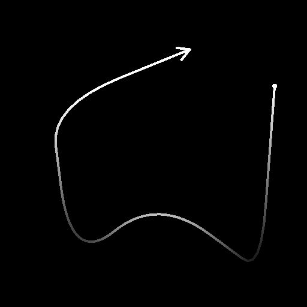

# Scatter on Spline Grayscale

<table>
<tr style="border: 0;">
<td width="33.33%" style="border: 0;" valign="top">

<b>In:</b> Spline &amp; Path Tools &gt; Spline Tools

</td>
<td width="100.00%" style="border: 0;" valign="top">

## Description

Draws the specified pattern(s) along the input splines over the input background.

</td>
</tr>
</table>

The node offers deep customization options for controlling how patterns are scattered.

Some aspects of the scattering may be controlled using images from other nodes in the graph to further the dynamic aspect of the result.

>[!NOTE]
>
> See also [Scatter on Spline Color](../scatter-on-spline-color/scatter-on-spline-color.md).

## Input connectors

<b>Background</b>*Grayscale* (Primary)The grayscale image over which splines should be drawn.

<b>Spline Coords</b> *Color*The coordinates of the input splines’ points encoded in the RGBA channels of a color image:  
<b>    R</b> - X position  
<b>    G</b> - Y position  
<b>    B</b> - Height  
    <b>A</b> - Packed data:  
        * Sign: Spline is closed (negative) or open (positive);  
        * Absolute value: Thickness + 1.

<b>Spline Data</b> *Color*Additional data of the input splines encoded in the RGBA channels of a color image.  
<b>    R</b> - Tangents X  
<b>    G</b> - Tangents Y  
<b>    B</b> - Unused  
<b>    A</b> - Unused

<b>Spline Amount</b> *Integer*The number of input splines.

<b>Pattern Input &#35;</b> *Grayscale*The pattern(s) which should be scattered along the splines.

<b>Scale Map</b> *Grayscale*The map controlling the scale of the scattered patterns. The effect of this map is controlled by the ‘Scale Map Input Multiplier’ parameter and is combined with the other parameters in the ‘Size’ group.

<b>Height Map</b> *Grayscale*The map controlling the height of the scattered patterns. The effect of this map is controlled by the ‘Height Input Multiplier’ parameter and is combined with the other ‘Color’ parameters in the ‘Color’ group.

<b>Mask Map</b> *Grayscale*The map controlling the masking of the scattered patterns. The effect of this map is controlled by the ‘Mask Map Threshold’ parameter and is combined with the other ‘Mask’ parameters in the ‘Color’ group.

## Output connectors

<b>Output</b> *Grayscale*The image representing the pattern(s) scattered along the input spline(s) over the input background.

## Parameters

<b>Spline Input</b> *Integer*The method of selecting which splines should be used for scattering patterns:  
* *All splines*: Use all splines in the input list;  
* *Single Spline*: Use only the specified spline from the input list;  
* *Spline Range*: Use only the splines in the specified range from the input list.

<b>Spline Index</b> *Integer* (Available when ‘Spline Input’ is set to ‘Single Spline’)The list index of the spline which should be used for scattering patterns.

<b>Spline Range</b> *Integer2* (Available when ‘Spline Input’ is set to ‘Spline Range’)The range of list indexes including the splines which should be used for scattering patterns.

<b>Scatter Mode</b> *Integer*The method of scattering the patterns along the splines, which impacts the amount of patterns on each spline:  
* Shape Amount: The specified amount of evenly spaced patterns is scattered;  
* Shape Spacing: The number of patterns is automatically adjusted to fit the specified even spacing.  
In both cases, the first and last patterns fall exactly on the start and end of each spline respectively.

<b>Shape Amount</b> *Integer* (Available when ‘Scatter Mode’ is set to ‘Shape Amount’)The amount of evenly spaced patterns scattered along each spline.

<b>Shape Distribution Along Spline</b> *Integer* (Available when ‘Scatter Mode’ is set to ‘Shape Amount’)The method of distributing the patterns along a spline:  
* *From Source*: The spacing of the patterns is influenced by the spline point’s tangents, where shapes are further apart near points with long tangents;  
* *Uniform*: The patterns are evenly spaced along the spline regardless of its tangents and trajectory.

<b>Shape Spacing</b> *Float* (Available when ‘Scatter Mode’ is set to ‘Shape Spacing’)The minimum distance along a spline by which patterns should be spaced, while still landing the first and last pattern on the start and end of each spline respectively.

<b>Start</b> *Float*Offsets the point from the start of a spline where the scattering starts. The value is the normalized length of each spline.

<b>End</b> *Float*Offsets the point from the start of a spline where the scattering ends. The value is the normalized length of each spline.

<b>Shape Pivot</b> *Float2*Offsets the pivot of the pattern X and Y in spline tangent space.  
Considering the pivot is what is placed on the spline, this effectively offsets the patterns along or perpendicularly to the spline.  
Note: The positions of the pivots impacts the effect of the ‘Scale’ and ‘Rotation (Pivot)’ parameters.

+++Pattern

PatternIntegerThe pattern which should be scattered along the splines:- Pattern Input: Use the patterns supplied to the ‘Pattern Input #’ inputs;- Square;- Disc;- Paraboloid;- Bell;- Gaussian;- Thorn;- Pyramid;- Brick;- Gradation;- Waves;- Half Bell;- Ridged Bell;- Crescent;- Capsule;- Cone;- Gradation w. offset;- Hemisphere.

Pattern Input NumberInteger(Available when ‘Pattern’ is set to ‘Pattern Input’)Selects the index of the input pattern which should be scattered.

Pattern Input DistributionInteger(Available when ‘Pattern’ is set to ‘Pattern Input’)The method used to select which of the input patterns should be scattered on a given spline:- Random: a pattern is randomly selected;- Along Spline: The pattern index increases gradually along the spline;- Pattern Index: Loops over the index of input patterns along each spline;- Spline Index: Loops over the index of input patterns from one spline to the next in the list of input splines.

Distribution JitteringFloat(Available when ‘Pattern Input Distribution’ is set to ‘Along Spline’)Randomly increases or decreases the selected index of patterns on the spline.

Override First PatternBooleanManually select the index of the pattern that should be placed at the start of each spline.

First Pattern Input IndexInteger(Available when ‘Override First Pattern’ is set to ‘True’)The index of the pattern that should be placed at the start of each spline.

Override Last PatternBooleanManually select the index of the pattern that should be placed at the end of each spline.

Last Pattern Input IndexInteger(Available when ‘Override Last Pattern’ is set to ‘True’)The index of the pattern that should be placed at the end of each spline.

+++

+++Duplicates

Distribution ModeIntegerThe method used to place the duplicate patterns:- Linear: duplicates are evenly spaced along the spline’s normal from the pattern’s original location;- Circular: duplicated are arranged along a virtual circle centered on the spline at the pattern’s original location.

Duplicates AmountIntegerThe number of duplicated patterns.

OffsetFloat2(Available when ‘Distribution Mode’ is set to ‘Linear’)Applies an offset to the duplicates’ positions along the spline’s tangent (parallel) and normal (perpendicular).Duplicates on opposite sides of the spline are moved in opposite directions.

Offset CenterFloat2(Available when ‘Distribution Mode’ is set to ‘Linear’)Applies an offset to the duplicates along the spline on X (parallel) and Y (perpendicular).

Spread AngleFloat(Available when ‘Distribution Mode’ is set to ‘Circular’)The arc of the virtual circle along which duplicates are distributed, as the angle of that arc where 1 is the full circle.

Offset DistanceFloat(Available when ‘Distribution Mode’ is set to ‘Circular’)The radius of the virtual circle along which duplicates are distributed.

RotationFloatRotates the virtual circle along which duplicates are distributed.

Offset Start/End AttenuationFloat2Factors in the distance from the midpoint of the spline to its Start and End, when applying offsets to duplicates.This means offsets are decreased for duplicates closer to a spline’s extremities.

Offset Attenuation by ThicknessFloatFactors in the spline’s thickness when applying offsets to duplicates.This means offsets are decreased for duplicates on a portion of a spline with a lower thickness.

+++

+++Size

Size ModeIntegerThe method of setting the size of the scattered patterns:- Normal: Size is controlled uniformly using a global ‘Scale’ parameter;- Use Thickness from Spline: Size is driven by the spline’s thickness.

Thickness AffectsInteger(Available when ‘Size Mode’ is set to ‘Use Thickness from Spline’)Specifies which axis of a pattern’s scale should be driven by the spline’s thickness:- X &amp; Y: Thickness is multiplied against the size in both the X and Y axes;- X: Thickness is multiplied against the size on the X axis only;- Y: Thickness is multiplied against the size on the Y axis only.When not multiplied, the pattern’s original scale is the full span of the image.This means in the ‘X’ mode, the size in the Y axis is the full span of the image and needs to be tweaked using the Size parameter. The same applied for size in the X axis when using the ‘Y’ mode.

SizeFloat2The original size of patterns in X and Y before other adjustments are made by other parameters.

Size RandomFloat2Applies a random multiplier up to the specified value for reducing the size of the patterns in X and Y.

Thickness ScaleFloat(Available when ‘Size Mode’ is set to ‘Use Thickness from Spline’)An additional multiplier for the scale of the patterns when driven by the spline’s thickness.

ScaleFloat(Available when ‘Size Mode’ is set to ‘Normal’)A global control for the size of all patterns, where 1 is the full span of the image.Scaling is applied relatively to a pattern’s pivot. The pivot position can be offset using the ‘Shape Pivot’ parameter.

Scale RandomFloatApplies a random multiplier up to the specified value for decreasing the size of the patterns.

Scale Map Input MultiplierFloatControls the intensity of the Scale Map input. This map acts as a multiplier for the current size of the patterns.The effect of this map is combined with the other parameters in the ‘Size’ group.

Scale Input Sampling ModeTexture SpaceThe method of mapping the values in the Scale Map to the splines:- Texture space: The values are applied to the splines where they would be if placed in a texture using the texture’s UV coordinates. This effectively applies the value to the splines ‘in place’;- Horizontal along spline: The values are applied to the encoded splines’ coordinates directly (see Spline Coords input), where each row is applied to a different spline from top to bottom;- Hor. along spline (rand. offset X): The values are applied to the encoded splines’ coordinates directly (see Spline Coords input), with a random horizontal offset in the Scale map for each spline (I.e., each row in Spline Coords);- Hor. along spline (rand. offset Y): The values are applied to the encoded splines’ coordinates directly (see Spline Coords input), with a random vertical offset in the Scale map for each spline (I.e., each row in Spline Coords).

Start/End AttenuationFloat2Factors in the distance from the midpoint of the spline to its Start and End when scaling the patterns.This means size is decreased for patterns closer to a spline’s extremities.

+++

+++Position

Local OffsetFloat2Applies an offset to the patterns’ positions along the spline’s tangent (parallel) and normal (perpendicular).

Local Offset RandomFloat2Applies an additional random offset to the patterns’ positions along the spline’s tangent (parallel) and normal (perpendicular).

Local Offset Random CenterFloat2Offsets the center of the random offset applied by the Local Offset Random parameter along the spline’s tangent (parallel) and normal (perpendicular).

Local Offset Start/End AttenuationFloat2Factors in the distance from the midpoint of the spline to its Start and End when applying position offsets to the patterns.This means offsets are decreased for patterns closer to a spline’s extremities.

Local Offset Attenuation by ThicknessFloatFactors in the spline’s thickness when applying offsets to patterns.This means offsets are decreased for duplicates on a portion of a spline with a lower thickness.

Offset on SplineFloatApplies a position offset to the patterns along the splines.

Random Offset on SplineFloatApplies an additional position offset to the patterns along the splines.

+++

+++Rotation

Align with TangentBooleanRotates the patterns to match the direction of the spline at their location.

Rotation (Pivot)FloatRotates the patterns around their pivots.The pivot position can be offset using the ‘Shape Pivot’ parameter.

Rotation Random (Pivot)FloatApplies an additional random rotation to the patterns around their pivots.The pivot position can be offset using the ‘Shape Pivot’ parameter.

Rotation Random Center (Pivot)FloatRotates around the pattern’s pivots the center of the random rotations applied by the Rotation Random parameter.

Rotation (Center)FloatRotates the patterns around their center.

Rotation Random (Center)FloatApplies an additional random rotation to the patterns around their center.

Rotation Random Center (Center)FloatRotates around the pattern’s center the center of the random rotations applied by the Rotation Random parameter.

+++

+++Color

Blend ModeIntegerThe method of blending together the colors of patterns with both the background and other overlapping patterns:- Max: Use the brightest color;- Add: Add the colors together.

Shape Base ColorFloatThe base color of the patterns.

Shape Base Color MultiplierFloatThe intensity of the patterns’ Shape Base Color.Note: The output color is the weighted result of all color multipliers.

Spline Thickness MultiplierFloatThe intensity by which the color of each pattern is multiplied against the thickness of the spline at its location.Note: The output color is the weighted result of all color multipliers.

Shape Index MultiplierFloatThe intensity by which the color of each pattern is multiplied against its normalized index.Note: The output color is the weighted result of all color multipliers.

Hemisphere Height ModeInteger(Available when ‘Pattern’ is set to ‘Hemisphere’)The effect of the spline’s height on a Hemisphere pattern scattered onto it:- Offset: the spline height is added to the height of the Hemisphere;- Scale: the spline height is multiplied against the height of the Hemisphere.

Spline Height MultiplierFloatThe intensity by which the color of each pattern is multiplied against the height of the spline at its location.Note: The output color is the weighted result of all color multipliers.

Shape Scale MultiplierFloatThe intensity by which the color of each pattern is multiplied against its scale.Note: The output color is the weighted result of all color multipliers.

Random LuminanceFloatApplies a random multiplier up to the specified value for decreasing the luminance of the patterns.Note: The output color is the weighted result of all color multipliers.

Height Input MultiplierFloatControls the intensity of the Height Map input. This map acts as a multiplier for the current luminance of the patterns.The effect of this map is combined with the other parameters in the ‘Color’ group.Note: The output color is the weighted result of all color multipliers.

Height Map Input Sampling ModeIntegerThe method of mapping the values in the Height Map to the splines:- Texture space: The values are applied to the splines where they would be if placed in a texture using the texture’s UV coordinates. This effectively applies the value to the splines ‘in place’;- Horizontal along spline: The values are applied to the encoded splines’ coordinates directly (see Spline Coords input), where each row is applied to a different spline from top to bottom;- Hor. along spline (rand. offset X): The values are applied to the encoded splines’ coordinates directly (see Spline Coords input), with a random horizontal offset in the Scale map for each spline (I.e., each row in Spline Coords);- Hor. along spline (rand. offset Y): The values are applied to the encoded splines’ coordinates directly (see Spline Coords input), with a random vertical offset in the Scale map for each spline (I.e., each row in Spline Coords).

Mask RandomFloatAdjusts the range of the random masking of patterns, where 0 means no patterns are masked and 1 means all patterns are.

Mask Map ThresholdFloatValues in the Mask Map below this threshold value are processed as black, while values above the threshold are processed as white.This means all patterns in areas of the Mask Map below this value will be masked.

Mask Map Input Sampling ModeIntegerThe method of mapping the values in the Mask Map to the splines:- Texture space: The values are applied to the splines where they would be if placed in a texture using the texture’s UV coordinates. This effectively applies the value to the splines ‘in place’;- Horizontal along spline: The values are applied to the encoded splines’ coordinates directly (see Spline Coords input), where each row is applied to a different spline from top to bottom;- Hor. along spline (rand. offset X): The values are applied to the encoded splines’ coordinates directly (see Spline Coords input), with a random horizontal offset in the Scale map for each spline (I.e., each row in Spline Coords);- Hor. along spline (rand. offset Y): The values are applied to the encoded splines’ coordinates directly (see Spline Coords input), with a random vertical offset in the Scale map for each spline (I.e., each row in Spline Coords).

Invert Mask MapBooleanInverts the values of the Mask Map using a ‘One minus’ operation (1 - x).

Mask InvertBooleanInverts the masking of the patterns.

+++

<b>Non-Square Correction</b> *Boolean*Adjust the points’ positions to retain the spline shape in non-square resolutions.

## Examples

<table>
<tr style="border: 0;">
<td style="border: 0;" valign="top">

<table>
  <tr>
    <td>
      
       <i>Before</i>
    </td>
    <td>
      
       <i>After</i>
    </td>
  </tr>
</table>

</td>
<td style="border: 0;" valign="top">

<table>
  <tr>
    <td>
      
       <i>Before</i>
    </td>
    <td>
      
       <i>After</i>
    </td>
  </tr>
</table>

</td>
</tr>
</table>

<table>
<tr style="border: 0;">
<td style="border: 0;" valign="top">

</td>
<td style="border: 0;" valign="top">

</td>
</tr>
</table>
