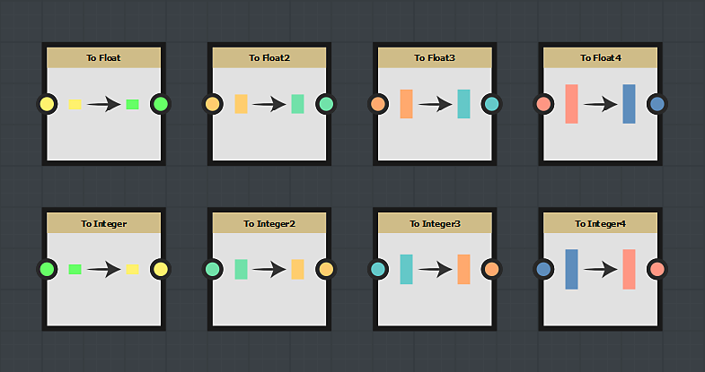

# Cast nodes

Cast nodes are used to convert a node from a type to another type:

## How to use a cast node ?

Just select the cast node that corresponds to the length of the node you want to convert.
