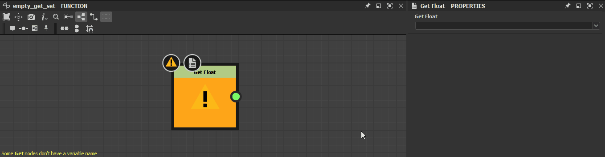

# Warnings in function graphs

This page lists warnings and errors messages which may be triggered by [function graphs](../function-graphs.md) in Substance 3D Designer, and offers common troubleshooting steps for each.

Warnings are displayed in the warning icon's tooltip for the graph resource in the [Explorer](https://helpx.adobe.com/substance-3d/unlisted/documentation/sddoc/the-explorer-129368147.html) panel, as well as in the bottom left corner of the [Graph view](../../interface/the-graph-view/the-graph-view.md) if the graph is loaded.  
If the function is *applied to a parameter* in a [Substance graphs](../../compositing-graphs/substance-compositing-graphs.md), any warning will result in the warning "*The &#91;x&#93; parameter's function has some errors*" being raised for that parameter.

##  No output node defined

The function has no output node defined.

<table>
<tr style="border: 0;">
<td width="58.30%" style="border: 0;" valign="top">

** Solution**

Select any node in the graph which outputs a value which type matches the expected type for this function if any, then click RMB and select the **Set as Output Node** option in the contextual menu.  
A function graph's output node is colored *orange*.

>[!NOTE]
>
> If a function has an expected output value type, a note in the bottom left corner of the [Graph view](../../interface/the-graph-view/the-graph-view.md) lets you know about that type.

</td>
<td width="41.60%" style="border: 0;" valign="top">

</td>
</tr>
</table>

###  The current output node returns a value of type *x*

The function's output node returns a value which type does not match the expected output value type for that function.

<table>
<tr style="border: 0;">
<td width="58.30%" style="border: 0;" valign="top">

** Solution**

Select any node in the graph which outputs a value which type matches the expected type for this function, then click RMB and select the **Set as Output Node** option in the contextual menu.  
A function graph's output node is colored *orange*.

>[!NOTE]
>
> If a function has an expected output value type, a note in the bottom left corner of the [Graph view](../../interface/the-graph-view/the-graph-view.md) lets you know about that type.

</td>
<td width="41.60%" style="border: 0;" valign="top">

</td>
</tr>
</table>

###  Some Get nodes don't have a variable name

One or more [Get](../nodes-reference-for-fun/atomic-function-nodes/get-nodes/get-nodes.md) nodes have their **Get...** property left blank, thus refer to no variable.

<table>
<tr style="border: 0;">
<td width="58.30%" style="border: 0;" valign="top">

** Solution**

Input a string matching the name of a variable *available in the function's scope* into the **Get...** property of Get nodes raising this warning.

>[!NOTE]
>
> The input string is *displayed in the node*, which makes it easy to find nodes with blank values.

</td>
<td width="41.60%" style="border: 0;" valign="top">

</td>
</tr>
</table>

###  Some Set nodes don't have a variable name

One or more [Set](../fxmaps/using-functions-in-fxmaps/using-the-set-sequence/using-the-set-sequence-nodes.md) nodes have their **Set** property left blank, thus refer to no variable.

<table>
<tr style="border: 0;">
<td width="58.30%" style="border: 0;" valign="top">

** Solution**

Input any string into the **Set** property of Set nodes raising this warning.

>[!NOTE]
>
> The input string is *displayed in the node*, which makes it easy to find nodes with blank values.

>[!NOTE]
>
> If the string does *not* match any variable available in the function's scope, a *new variable is created* within that scope and named after the string.

</td>
<td width="41.60%" style="border: 0;" valign="top">

</td>
</tr>
</table>
