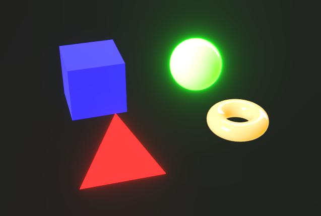
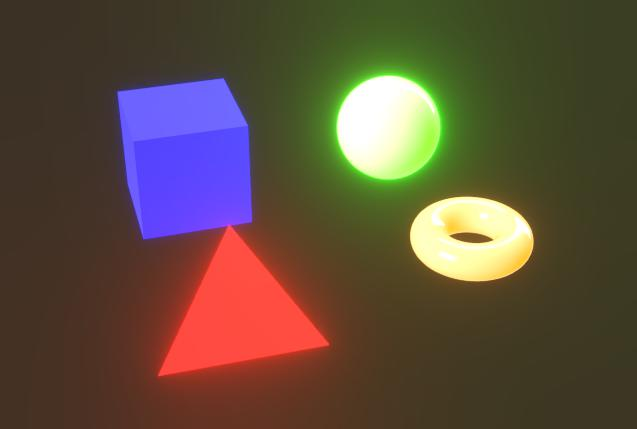

# Post effects

{zoomable="yes"}

In the camera properties, you can enable post effects to enhance renders or check specific material properties.

These effects are developed in-house and are only available for the Rasterizer and GPU Pathtracer [renderers](../../3d-renderers/3d-renderers.md).

Any post effect enabled at the time of saving [3D scene resources](../../../../resources/3d-scene-resource/3d-scene-resource.md) or [scene state files](../../../../working-with-3d-scenes/working-with-3d-scenes.md) will be saved as part of the scene state.

<table>
<tr style="border: 0;">
<td style="border: 0;" valign="top">

</td>
<td style="border: 0;" valign="top">

</td>
<td style="border: 0;" valign="top">

</td>
<td style="border: 0;" valign="top">

</td>
</tr>
</table>

## Tone mapping

Remaps the colors of the render according to specific algorithms and/or look-up tables (LUT).

This lets you improve color consistency between applications. For instance, the AgX tone mapper is also available in Blender.

+++Reinhard

<table>
  <tr>
    <td>
      
       <i>Before</i>
    </td>
    <td>
      
       <i>After</i>
    </td>
  </tr>
</table>

+++

+++Atan

<table>
  <tr>
    <td>
      
       <i>Before</i>
    </td>
    <td>
      
       <i>After</i>
    </td>
  </tr>
</table>

+++

+++Exp

<table>
  <tr>
    <td>
      
       <i>Before</i>
    </td>
    <td>
      
       <i>After</i>
    </td>
  </tr>
</table>

+++

+++Log

<table>
  <tr>
    <td>
      
       <i>Before</i>
    </td>
    <td>
      
       <i>After</i>
    </td>
  </tr>
</table>

+++

+++Aces

<table>
  <tr>
    <td>
      
       <i>Before</i>
    </td>
    <td>
      
       <i>After</i>
    </td>
  </tr>
</table>

+++

+++Hejl

<table>
  <tr>
    <td>
      
       <i>Before</i>
    </td>
    <td>
      
       <i>After</i>
    </td>
  </tr>
</table>

+++

+++Neutral

<table>
  <tr>
    <td>
      
       <i>Before</i>
    </td>
    <td>
      
       <i>After</i>
    </td>
  </tr>
</table>

+++

+++Agx

<table>
  <tr>
    <td>
      
       <i>Before</i>
    </td>
    <td>
      
       <i>After</i>
    </td>
  </tr>
</table>

+++

+++Pbr neutral

<table>
  <tr>
    <td>
      
       <i>Before</i>
    </td>
    <td>
      
       <i>After</i>
    </td>
  </tr>
</table>

+++

## Bloom

Simulates the in-camera effect of fringes of lights bleeding outward from very bright areas onto areas receiving less light.

The effect is influenced by the scene's lighting, camera exposure and emissive materials.

+++Threshold

The luminance value above which bloom should be visible.

Left: 1.0 / Right: 4.0

<table>
  <tr>
    <td>
      
       <i>Before</i>
    </td>
    <td>
      
       <i>After</i>
    </td>
  </tr>
</table>

+++

+++Falloff

The bloom attenuation ramp, where a lower value results in a shorter bloom radius.

Left: 1.0 / Right: 0.6

<table>
  <tr>
    <td>
      
       <i>Before</i>
    </td>
    <td>
      
       <i>After</i>
    </td>
  </tr>
</table>

+++

+++Level

The intensity of the bloom. A higher value results in brighter, more pronounced light fringes.

Left: 8.0 / Right: 2.0

<table>
  <tr>
    <td>
      
       <i>Before</i>
    </td>
    <td>
      
       <i>After</i>
    </td>
  </tr>
</table>

+++

+++Color shift

Offsets the hue of the areas affected by the bloom towards warmer colors.

Left: 0.0 / Right: 0.8

<table>
  <tr>
    <td>
      
       <i>Before</i>
    </td>
    <td>
      
       <i>After</i>
    </td>
  </tr>
</table>

+++

## Depth of field

Simulates the optical phenomenon caused by camera lenses where objects nearer and farther than the focus distance are blurred.

The effect is impacted by both the camera’s ‘F-Stop’ and ‘Focus distance’ parameters.

>[!TIP]
>
> To quickly adjust the camera focus, place the cursor on the location of a scene you want in focus and press Ctrl+LMB (Windows) or Cmd+LMB (macOS) to automatically set the focus distance to that location.

+++Max radius

The maximum radius of the blurring effect.

Left: 32.0 / Right: 4.0

<table>
  <tr>
    <td>
      
       <i>Before</i>
    </td>
    <td>
      
       <i>After</i>
    </td>
  </tr>
</table>

+++

+++Composite strength

The magnitude of the blurring effect from the focus distance outward.

Left: 0.2 / Right: 0.05

<table>
  <tr>
    <td>
      
       <i>Before</i>
    </td>
    <td>
      
       <i>After</i>
    </td>
  </tr>
</table>

+++

+++Longitudinal aberration

The intensity of the aberration occurring away from the focus distance.

Aberration simulates how different wavelengths of light have a slightly different focal lengths, resulting in colors appearing to be offset and having sublte differences in focus.

Left: 0.0 / RIght: 1.0

<table>
  <tr>
    <td>
      
       <i>Before</i>
    </td>
    <td>
      
       <i>After</i>
    </td>
  </tr>
</table>

+++

+++Achromatic aberration

Specifies whether the aberration should be achromatic, meaning that some or all colors have the same focal length.

This makes the blurring effect appear to be more equally distributed.

Left: True / Right: False

<table>
  <tr>
    <td>
      
       <i>Before</i>
    </td>
    <td>
      
       <i>After</i>
    </td>
  </tr>
</table>

+++

+++Cat's eye

Enables the cat’s eye effect in the scene, which simulates how light entering at an oblique angle does not enter a disc, but a uneven oval, causing distortion.

This effect is more pronounced at higher apertures – I.e., lower F-Stop values.

Left: True / Right: False

<table>
  <tr>
    <td>
      
       <i>Before</i>
    </td>
    <td>
      
       <i>After</i>
    </td>
  </tr>
</table>

+++
