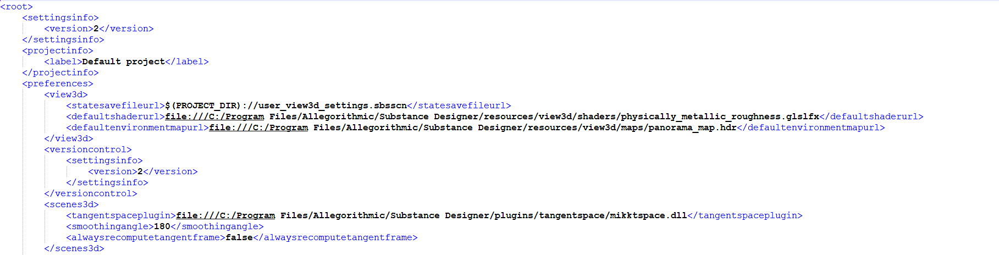

# Overview

<table>
<tr style="border: 0;">
<td width="100.00%" style="border: 0;" valign="top">

<b>Project configuration files</b> are the most complex and most expansive files used to configure Substance 3D Designer.

They are special in that you can use multiple Project configuration files, where each next 'child' project expands or overrides the previous 'parent'. Unless explicitly needed, settings should not be modified or added to the project files, so Designer can fall back on its parent configuration, or even defaults.

</td>
<td width="25.00%" style="border: 0;" valign="top">


</td>
</tr>
</table>

By default, Designer has two active project configurations:

<b>Default Project: </b>Contains all the default settings and the library Designer comes with on a fresh install.*Read only, can not be modified or removed.*

<b>User Project: </b>Because the Defaults are read-only, *any changes by the user* go into this project by default. *Can not be removed.*

This basic setup ensures that the default library and other settings can not be corrupted or modified, yet still allow single, amateur users to add their own modifications without having to bother with complex setups.

## Expand or override

Most settings in a consecutive Project will <b>override</b> the ones from the previous Project. For example, a different Tangent Space plugin in a custom Project file will override any TS Plugin defined in the Default or User project. This means that unless explicitly needed, it's recommended not to override or change settings in child projects.

There are however some settings that <b>expand</b> upon parent settings, instead of overriding them. Most notably these settings are the Library paths and filters, so you always add more content to the library instead of overriding it. Additionally, there's the aliases (path keywords for relative filepaths) that expand, as well as override if a duplicate is defined. This allows for great control over content filepaths and references.

## Project file contents

Project files can contain the following settings:

<b>3D View: </b>Default Shader, HDR and scene state definitions.

<b>Aliases: </b>Keyword aliases for relative paths.

<b>Baking: </b>Settings for baking naming conventions.

<b>General: </b>Graph Templates, Tangent Space plugins, normal and image format defaults.

<b>Library: </b>Watched paths to display in the Library, as well as [filters and categories for the Library view](https://helpx.adobe.com/content/help/en/substance-3d/unlisted/documentation/sddoc/creating-library-filters-for-projects-170459772.html).

<b>MDL: </b>MDL watched paths.

<b>Scripting: </b>Callback scripts and interpreters.

<b>Version Control: </b>Settings for integrating Version control into Designer.

## Modifying project files

Project configurations are, like all other types, saved as structured XML files (using an <b>.sbsprj</b> extension) that can be modified through the Designer UI, or through an external text editor.

## Inside Substance 3D Designer

See the [Project settings](../../interface/preferences-window/project-settings/project-settings.md) page to learn more about managing project files and changing project settings.

Project files also include custom <b>categories</b> and <b>filters</b> for the [Library](../../interface/the-library/the-library.md), which you can learn more about in the [Managing custom content and filters](https://helpx.adobe.com/content/help/en/substance-3d/unlisted/documentation/sddoc/creating-library-filters-for-projects-170459772.html) page.

## Edit XML Externally

For Windows, [Notepad++](https://notepad-plus-plus.org) is a good free option. On macOS, [Sublime Text](https://www.sublimetext.com/) is an alternative. That said, any editor with proper indentation, section collapsing and some form of syntax highlighting will make your life much easier.

Once you open the SBSPRJ file in an editor, you should see a fairly straightforward structured layout, with sections corresponding to tabs in the UI. Not every setting will be documented here, as it's fairly self-explanatory.



## Relative paths and aliases

Relative paths combined with aliases are one of the more complicated, yet most important parts of a project configuration, this section will clarify them. Adding custom aliases for a specific project file is done in the [Project Settings](../../interface/preferences-window/project-settings/project-settings.md).

One of the major problems with files referencing other files in a system across multiple user's PC, is that absolute filepaths will not work. Users can define their SVN repositories in completely different locations (eg. C:/John/Gamedev/SubstanceLibrary or D:/Dev/SubstanceLibrary). Aliases and relative paths both work together to solve this problem. Otherwise, you might open someone else's file and it will try to look for the custom node used in the specific location that user had it locally, which you probably won't have defined in exactly the same way.

An <b>alias</b> is a keyword that replaces (part of) a path. It's similar to a Windows environment variable like %TEMP%, where a single word replaces an often-used path that is then defined centrally. The advantage is simplified paths everywhere, and a way to modify all the references in one go when you decide to relocate the this path.

>[!NOTE]
>
> **Alias Example**
> 
> | Alias | Actual path value |
> | --- | --- |
> | <b>sbs</b> | *C:\Program Files\Adobe\Adobe Substance 3D Designer\resources\packages* |
> | <b>custom</b> | *D:\Dev\CustomProject\Substance* |
> 
> The default library is by default located at *C:\Program Files\Adobe\Adobe Substance 3D Designer\resources\packages*, and all graphs using default content reference this directory. Instead of referencing the full path, an alias of '<b>SBS</b>' (without quotation marks) is defined. In the case of a the default library, the exact value for the SBS path is set upon installation to whichever directory the user chooses for Designer.
> 
> Internally a reference is modified the following way, when it contains a path with an alias:
> 
> **C:\Program Files\Adobe\Adobe Substance 3D Designer\resources\packages\blur\_hq.sbs =&gt; <b>sbs://</b>blur\_hq.sbs**

<b>Relative paths</b> are always relative to the file in which they are defined. That means the current location of the config file determines most of the path, and alias paths will be based upon it, mostly by just adding a subfolder. <b>This means it&#39;s strongly recommended to put your sbsprj files next to the folders you want to watch!</b>

For example, take a repository at *C:/Versioncontrol/Substance/* containing *CustomProject.sbsprj* and then two folders, */Base* and */Tools,* containing nodes.

To define two relative Aliases for Base and Tools would be done as following inside the SBSPRJ file:

### C:/Versioncontrol/Substance/CustomProject.sbsprj

```

   <urlaliases> 

    <size>2</size> 

    <_2 prefix="_"> 

     <path>file:Base</path> 

     <name>BaseAlias</name> 

    </_2> 

    <_1 prefix="_"> 

     <path>file:Tools</path> 

     <name>ToolsAlias</name> 

    </_1> 

   </urlaliases>
```


The result of this config file is the following:

**BaseAlias://** will be *C:/Versioncontrol/Substance/Base/* and **ToolsAlias://** will be *C:/Versioncontrol/Substance/Tools/.*

If you would want to define just  *C:/Versioncontrol/Substance/*, the path would be listed as **"file:."**, the dot signifying the location of the file itself.
