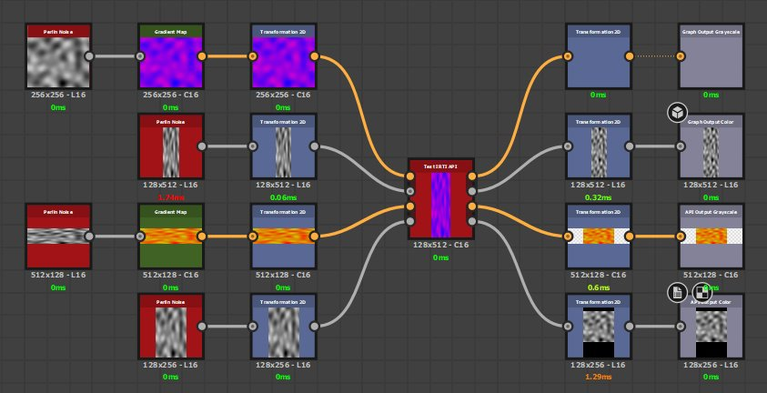
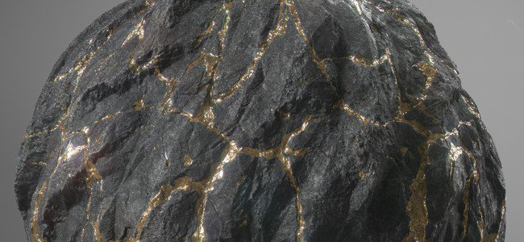

# Version 11.3

**Substance 3D Designer**

Release date: *24 November 2021*

## Major feature

### New model graph functionalities

A lot of improvements have been added to the model graph to expand the modeling capabilities:

* <b>New particle workflow</b>  
  The new particle modeling workflow allow to create clouds of point to manipulate geometry. They can be used to create a lot of new complex and/or repetitive shapes such as the roof tiles on the image just above.  
  To learn more about the new particle workflow, see the following documentation pages:

  * Types of Items in a scene
  * Particles
  * Particle pruning
  * Particles from instances

  

* <b>New modeling and deformation nodes</b>  
  Additional new nodes have added to create more complex shapes, click on each node to learn mroe about them:
  * Generative transform
  * Organic pattern
  * Lathe
  * Curve trim

* <b>General improvements  
  </b>The workflow around the modeling graph has been improved with:
  * New tooltips on nodes parameters to make them easier to learn.
  * The 3D model hierarchy is now preserved when exporting in FBX
  * Material assignation can be exported with the OBJ and FBX file formats.
  * Preview intermediate nodes in the viewport in overlay mode.

### Improved interoperability

The send-o actions have been expanded, with two new possibilities:

* **Send SBSM (substance model file) to Stager**   
  Procedural 3D models can now be sent to Stager and be modified from there with the exposed parameters.

* **Receive SBS/SBSAR from Sampler**   
  It is now possible to receive Substance files generated by Sampler directly into Designer.

### Miscellaneous

Various quality of life improvements have been made:

* **Inputs relative to inputs**   
  Graph inputs set in Relative to inputs will now inherit the connected node size instead of default to the parent graph size. This makes managing different resolutions via inputs of different sizes much easier.

  {width="400px"}

* **New graph window**   
  The new graph window has been reworked and now allow to better see the details of a specific template and to create new graph directly into an existing package.

  {width="400px"}

* **Close All Packages**   
  A small action which makes less tedious to manage many packages in the explorer. Use **File** &gt; **Close all** to close all the currently opened packages.

  

* **Maximize Current View**   
  Use the new title bar **icon** or the shortcut **SHIFT+Space** to expand a window to the full screen. This can be used on floating window as well.

* **3D view improvements**   
  The 3D view has new display settings to toggle the display of back faces on a 3D model as well the display of Vertices, Tangent and Bitangents.

### Content

This releases add new diffusion nodes and improvements for the PBR Render node:

* <b>Diffusion nodes</b>  
  The new Diffusion Color, Diffusion Grayscale and Diffusion UV nodes allow to generate soft bleeding blurs based on an input mask.

  {width="230px"}

   

* **Improved PBR render node**   
  This node had the following changes:
  * New cubic UV mode for the Sphere shape.
  * New support for Subsurface scattering.
  * Anisotropy now follows the Adobe Strand Material 5ASM) model.
  * Image based lighting has been improved with the support of importance sampling.
  * Emissive lighting has been improved with the support of importance sampling.

## Release notes

### 11.3.0

*(Released November 24, 2021)*

**Added:**

* &#91;Substance models&#93; Add tooltips for nodes parameters
* &#91;Substance models&#93; Allow to display in overlay in the 3D viewport the result of an intermediate node
* &#91;Substance models&#93; Improve how Basis are displayed
* &#91;Substance models&#93; Preserve the objects' hierarchy when exporting a Substance Model graph to .fbx
* &#91;Substance models&#93; Support multiple materials in FBX/OBJ export from Substance Model graph
* &#91;Substance models&#93;&#91;Content&#93; Particle node
* &#91;Substance models&#93;&#91;Content&#93; Generative Transform node
* &#91;Substance models&#93;&#91;Content&#93; Organic Pattern node
* &#91;Substance models&#93;&#91;Content&#93; Particles from Instances node
* &#91;Substance models&#93;&#91;Content&#93; Particle Pruning node
* &#91;Substance models&#93;&#91;Content&#93; Lathe node
* &#91;Substance models&#93;&#91;Content&#93; Shell node
* &#91;Substance models&#93;&#91;Content&#93; Projection node
* &#91;Substance models&#93;&#91;Content&#93; Curve Trim node
* &#91;Substance models&#93;&#91;Content&#93; Update Curve Sampler node
* &#91;Substance models&#93;&#91;Content&#93; Update Mesh Sampler node
* &#91;Substance models&#93;&#91;Content&#93; Update Jitter node
* &#91;UX&#93; Button to maximize current view
* &#91;UX&#93; Update the New Graph window
* &#91;UX&#93; Add 'Download Player' option in Tools menu and aggregate with 'Locate Player'
* &#91;UX&#93; Add 'Close All' entry to the file menu
* &#91;UX&#93; Apply consistent casing throughout the main menu
* &#91;UX&#93; Automatically display the properties of duplicated graph items
* &#91;UX&#93; Add buttons in the graph toolbar to disable constant screen size for Frame titles / Comments / Pins
* &#91;UX&#93; Buttons to copy versions information to the clipboard in the About dialog
* &#91;Materials&#93; Inputs relative to inputs
* &#91;Content&#93; Add 'Tiling' option on 3D Perlin Noises
* &#91;Content&#93; New Diffusion process node
* &#91;Content&#93; New PBR Render node version
* &#91;Interoperability&#93; Receive SBS and SBSAR from Sampler
* &#91;Interoperability&#93; Send SBSM To Stager
* &#91;3D View&#93; Add an option to disable backface culling
* &#91;3D View&#93; Add an option to display Vertex tangent space
* &#91;Explorer&#93; Highlight graph in the Explorer when double clicking the Graph View's background
* &#91;Explorer&#93; Remove the 'Explore' option in contextual menus
* &#91;Bakers&#93; Hide deprecated bakers
* &#91;Color Management&#93; Add support for OCIO v2 config file rules
* &#91;Library&#93; Rename categories according to graph types
* &#91;Preferences&#93; Auto-disable the CPU in Iray hardware preferences if supported CUDA GPU is detected

**Fixed:**

* &#91;Substance models&#93; Crash on Mac when using "as sudb" option on .fbx
* &#91;Substance models&#93; Crash when exporting to SBSM in a specific case
* &#91;Substance models&#93; Export failure when exporting exposed parameters which widgets were never built
* &#91;Substance models&#93; Random crash when opening a graph that refers to multiple .fbx files
* &#91;Substance models&#93; Ranges are not applied dynamically in exposed parameters' widgets
* &#91;Substance models&#93; Reload mesh option doesn't work on resources used in Substance models graph
* &#91;Substance models&#93; Scenes are not displayed in an available 3D View in a specific case
* &#91;UI&#93; Disable area is too large in material options
* &#91;UI&#93; Style issue in 'Package File not Saved' dialog
* &#91;UI&#93; Tab key has to be pressed twice to navigate across values
* &#91;UI&#93; Zooming with mouse drag is inversed between 3D View and other Viewports
* &#91;UI&#93; Loading an already open SBS using the 'Recent files' list incorrectly triggers a 'Package Not Found' prompt
* &#91;UI&#93;&#91;macOS&#93; Incorrect default interface layout after starting the application
* &#91;UI&#93; Packages cannot be saved to a drive's root (Windows only)
* &#91;Graph&#93; 'Automatically display in 2D View' option is inconsistent in a specific case
* &#91;Graph&#93; 'Open Reference' option is available for SBSAR instance nodes
* &#91;Graph&#93; Pin properties are only displayed when item is created
* &#91;Graph&#93; Pin string rules are inconsistently enforced
* &#91;Graph&#93; Crash when saving an empty graph
* &#91;3D View&#93; Anisotropy angle is inverted in ASM shader
* &#91;3D View&#93; ASM Shader: linearization issues with SSS related maps
* &#91;3D View&#93; Broken OpenGL rendering after closing additional 3D Views in a specific case
* &#91;3D View&#93; The predefined cameras positions are not correct in the 3D View with some .fbx files
* &#91;MDL&#93; 'Add Node' from the contextual menu is not working for MDL Graphs
* &#91;MDL&#93; Bug: Connection of node fails when using float2.x components and alike (SD 11.1.2)
* &#91;MDL&#93; Crash upon opening specific.sbs file
* &#91;MDL&#93; Scene units per meter in Iray not set at render session start
* &#91;MDL&#93; Freezes when tweaking a lerp node in the MDL graph
* &#91;MDL&#93; Order of parameters in exported MDL code
* &#91;Explorer&#93; empty resource folder is created after canceling resource creation
* &#91;Explorer&#93; Only the first element of a package can be moved to the bottom of the list
* &#91;Content&#93; RT Bent Normal and RT AO triggers node computation in nested graphs
* &#91;Input Node&#93; Bitmap in Input Nodes is not updated when UDIM change
* &#91;Iray&#93; Long time is taken when trying to display a Substance models Scene with lots of instances
* &#91;Preferences&#93; Empty line when cancelling the addition of a project file
* &#91;Python editor&#93; 'Close' option stays enabled after closing last script and still includes its name æ
