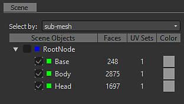

# Bakers Legacy Interface

Here is the description of the baker interface available in  [Adobe Substance 3D Designer](https://www.adobe.com/products/substance3d-designer.html) versions before 6.0.4.

## Overview

The baker panel is divided in 4 parts:

### 1: Scene

Let you define which part of the mesh is involved in the baking process.

New in version 6, you can also select by material:

### 2: Bakers

By pressing the  button, you can add the desired bakers to the processing list

>[!NOTE]
>
> Bakings are processed following the list order (from top to bottom): this may be important if you want to reuse the result of a bake (like the normal map) in another baking process

Clicking on the "+" in the bakers layout lets you add the bakers in a stack (You can put as many bakers as you want in a stack).

.

You can remove a baking process from the list by pressing 

You can reorder the baking process list by selecting a baking process and using 

### 3: Bakers parameters

This section displays the specific options for the current selected baker.

### 4: Common Parameters

Displays the parameters that are shared between bakers.

>[!NOTE]
>
> By default, changing one of these parameters; will affect all the bakers, except if you check Override Parameters, common to all bakers: in that case, the changes will be local to the current baker.

* **The Resource Name** field lets you change the name of the generated bitmap, if desired.
* **The File Format** drop-down list lets you change file format from the default (Windows or OS/2 Bitmap format, "BMP").
* **The** **Place** resource into a mesh specific folder check-box lets you choose whether the generated bitmap is stored at the same level as the model, or inside a new sub-folder named "Resources".
* **The Method** lets you define whether the new bitmap resource should be linked or embedded into the Substance package.
* **The Folder** lets you define where to save the maps.

Pressing the OK button at the bottom right of the bakers window will start the baking process.

New in version 6: you can now cancel the baking process with the cancel button:

