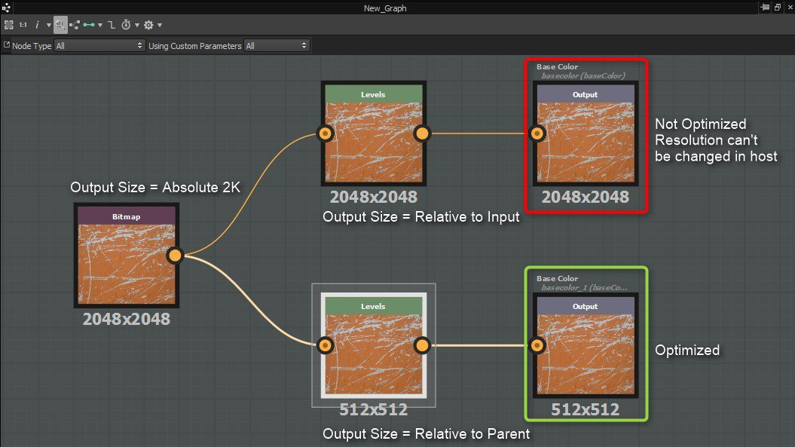

# Performance optimization guidelines

## Substance graphs

The more complex your [Substance graphs](../../compositing-graphs/substance-compositing-graphs.md) are, the more processing power you need to render them. You should try to <b>strike a balance between complexity and rendering speed</b>.  
This is *especially* important if you will use them in real-time graphics applications, such as games.

Generally speaking, nodes exposing custom parameters - that can be modified at run-time - <b>should be placed as close to the end of the graph as possible</b>.

This is because the output of each node is cached wherever possible. Therefore, the further up the graph your tweakable node is, the more outputs will need to be processed whenever one of those exposed parameters is modified. If your exposed node is close to the end of the graph, only the few nodes between it and the output nodes will need to be recomputed.

For example, if tweaking a uniform color at the beginning of your graph, all the following nodes will be recomputed. If you tweak a HSL node placed right before the output, only this node will be recomputed, greatly improving the performance of the graph.

Please make a good note of the following guidelines:

### GENERAL PERFORMANCE-RELATED SETTINGS

+++GPU engine is much faster than CPU engine
Unless you have an unsupported (integrated) graphics card, use the GPU substance engine (change with Hotkey F9).

+++

+++Switching parent resolution of the graph is slow
It recomputes graph, cache and all thumbnails. It's better to use [the <b>Batch </b>tab of the export dialog](../../compositing-graphs/exporting-bitmaps/exporting-bitmaps.md) as it avoids extensive, unneeded recalculation (for example when exporting to 8192 resolution).

+++

+++In extreme cases, increased memory cache might be needed
The application [limits the amount of RAM that can be used](../../interface/preferences-window/preferences-window.md) for the image cache, but you can override and increase this (with care).

+++

### GRAPH OPTIMIZATION

+++Pay careful attention to node resolutions and inheritance in general!
High values will seriously affect performance, so consider how the material is likely to be used and whether you can reduce the data sizes involved.

We recommend you learn more about [node resolution (Output size)](../../compositing-graphs/output-size/output-size.md) and [inheritance in Substance graphs](../../compositing-graphs/inheritance-compositing/inheritance-in-substance-compositing-graphs.md).

+++

+++Use grayscale when no color is needed
Color operations take four times longer than grayscale operations. Also try to minimize type conversions between color and grayscale.

+++

+++Use 8 bit when 16-bit is not needed
The CPU version of the Substance Engine (SSE2) *does not* actually support 16-bit color or 8-bit greyscale. The GPU engine supports all 4 combinations of 8/16 bits and greyscale/color. *Currently, only the CPU engine is used in Unity and Unreal Engine plugins*.

+++

+++Minimize node output size whenever possible
Sometimes, downsizing some nodes doesn't affect the final result, but will affect performance. For example, using a Uniform Color node set to the same output size as the document is pointless: The Uniform Color should be set to Absolute [16px x 16px] and the subsequent node to Relative to Parent. Generally this trick works well for low-frequency images, such as Perlin noise.

+++

+++Do not use images smaller than 16*16 pixels
This slows rendering performance.

+++

+++When using the Blend node, disable Alpha blending when it's not required

+++

+++Blurs and Warps are the most processor-intensive nodes

+++

+++Some noise generators are affected by the amount of patterns drawn
For instance, the [Tile Generator](../../compositing-graphs/nodes-reference-for-com/node-library/texture-generators/patterns/tile-generator/tile-generator.md) node will get slower to process the more patterns you add to it.

+++

+++Some noises are affected by a scale factor
This factor will in fact draw more patterns. Affected nodes include noises, Cells patterns, etc. If you need a white noise pattern, don't use a noise with a very high scale value and use the [White Noise](../../compositing-graphs/nodes-reference-for-com/node-library/texture-generators/noises/white-noise/white-noise.md) or [White Noise Fast](../../compositing-graphs/nodes-reference-for-com/node-library/texture-generators/noises/white-noise-fast/white-noise-fast.md) nodes instead.

+++

+++Conversely, there are some very fast noise generators
These include [White Noise Fast](../../compositing-graphs/nodes-reference-for-com/node-library/texture-generators/noises/white-noise-fast/white-noise-fast.md), [Fractal Sum Base](../../compositing-graphs/nodes-reference-for-com/node-library/texture-generators/noises/fractal-sum-base/fractal-sum-base.md), and [Anisotropic Noise](../../compositing-graphs/nodes-reference-for-com/node-library/texture-generators/noises/anisotropic-noise/anisotropic-noise.md).

+++

+++Watch out with heavy image sampling functions in some cases
Functions are executed on CPU engine, except in [Pixel Processors](../../compositing-graphs/nodes-reference-for-com/atomic-nodes/pixel-processor/pixel-processor.md). If you are doing a lot of heavy image sampling (changing $pos coordinates) in [Value Processors](../../compositing-graphs/nodes-reference-for-com/atomic-nodes/value-processor/value-processor.md) or [FXmaps](../../function-graphs/fxmaps/fxmaps.md), there would be a lot of swapping between VRAM and CPU RAM, causing performance delays.

+++

### OPTIMIZATIONS FOR MOBILE USAGE

+++It is not recommended to use Warps and FX-Maps
They are very performance costly.

+++

+++Avoid Blur nodes
Use downscale transformations instead.

+++

+++Work as much as possible in grayscale
Switch to color mode at the end of the graph.

+++

+++Share nodes as much as possible between outputs

+++

### SIZE OPTIMIZATIONS FOR EMBEDDED BITMAPS

[Bitmaps](../../resources/bitmap-resource/bitmap-resource.md) have their [Output Size](../../compositing-graphs/output-size/output-size.md) set to ['Absolute'](../../compositing-graphs/inheritance-compositing/inheritance-in-substance-compositing-graphs.md) by default. This means that if the bitmap is connected through the node chain to an output, it will then force the final output to be the size of the embedded bitmap.  
A node you insert after the bitmap will have its Output Size set to ['Relative to Input'](../../compositing-graphs/inheritance-compositing/inheritance-in-substance-compositing-graphs.md). This means that the node will also inherent the size of the bitmap and carry this size down the node chain to the outputs. To correct this, you need to set the node after the bitmap to have its Output Size set to ['Relative to Parent'](../../compositing-graphs/inheritance-compositing/inheritance-in-substance-compositing-graphs.md).

If the graph is set to have a dynamic resolution, you can change the Output Size on the embedded bitmap to be Relative To Parent.  
This way, the bitmap size will change based on the parent graph and you won't get into a situation where the graph is processing higher resolution in the bitmap than what is needed.

>[!WARNING]
>
> Setting a [Bitmap](../../compositing-graphs/nodes-reference-for-com/atomic-nodes/bitmap/bitmap.md) node to "Relative to parent" and [publishing](https://helpx.adobe.com/substance-3d/unlisted/documentation/sddoc/publishing-sbsar-file-200574380.html) the graph to a Substance 3D asset (SBSAR) will save the bitmap at a resolution of **256x256** instead of its original size. It is advised instead to keep the [inheritance method](../../compositing-graphs/inheritance-compositing/inheritance-in-substance-compositing-graphs.md) of Bitmap nodes' [Output Size](../../compositing-graphs/output-size/output-size.md) as 'Absolute' and use a [Transformation 2D](../../compositing-graphs/nodes-reference-for-com/atomic-nodes/transformation-2d/transformation-2d.md) node set to 'Relative to parent' just after the Bitmap node.

<table>
<tr style="border: 0;">
<td style="border: 0;" valign="top">

Also, it is advised to set the format of Bitmap resources to Jpeg for minimising the size of [published](https://helpx.adobe.com/substance-3d/unlisted/documentation/sddoc/publishing-sbsar-file-200574380.html) Substance 3D assets (SBSAR).

</td>
<td style="border: 0;" valign="top">

</td>
</tr>
</table>
