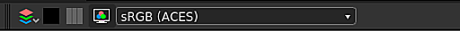

# Color Management

This page explains the Color Management features and settings in Substance 3D Designer.

Substance 3D Designer can be configured to use [OpenColorIO](https://opencolorio.org/) (OCIO) or Adobe Color Engine (ACE) for Color Management. This allows you to have *consistent* color transforms and image display across multiple applications.

In this mode, Designer will work internally with **linear RGB** colors. Since 8-bit depth is usually not enough to represent linear colors, it is recommended to use *at least* **16-bit** depth for color textures in the [graph](../compositing-graphs/substance-compositing-graphs.md).

>[!WARNING]
>
> An effective Color Management workflow relies on working with a correctly *calibrated* display, Third party solutions exist to correctly calibrate your monitor for your work environment using specialised hardware.
> 
> OpenColorIO users should use matching OpenColorIO color spaces for their monitors.  
> Adobe ACE users should make sure the ICC profiles selected *in the OS* matches *their* monitors.

## Configuration

Color Management settings can be configured in [Projects](../interface/preferences-window/project-settings/project-settings.md) tab of the [Preferences](../interface/preferences-window/preferences-window.md) dialog. You can set the following settings:

### Color Management Mode

|  |  |
| --- | --- |
| <b>Color management</b> | This setting lets you select the [Legacy](color-management.md),  or  modes for Color Management in Substance 3D Designer. *Default: Legacy* |

## OpenColorIO

### OpenColorIO configuration

When using the OpenColorIO mode for Color Management, Designer will use the information stored in a <b>configuration file</b> (*\*.config*) to perform color transforms, identify color spaces and set defaults.

Substance 3D Designer ships with the following configurations:

* Substance: a simple configuration which includes common color spaces
* [ACES 1.0.3](https://github.com/hpd/OpenColorIO-Configs/tree/master/aces_1.0.3): the full-featured [Academy Color Encoding System](https://www.oscars.org/science-technology/sci-tech-projects/aces) (ACES) configuration, an industry standard for Color Management workflows

You can find these configuration files in the <b>resources &gt; ocio</b> folder of Designer's installation files.

|  |  |
| --- | --- |
| <b>OpenColorIO Configuration</b> | This setting lets you select the OpenColorIO configuration file to use throughout Designer. Alternatively, you can set the OpenColorIO configuration file using the OCIO environment variable.  When it exists, the configuration file will be *locked* in Designer. It is still possible to change default color spaces and displays transforms (see settings below).  **Alert:** After adding the environment variable, we recommend closing Designer, *signing out* from your user session in the OS, then signing back in. This ensures the environment variable is in effect when starting Designer. You also may use the command line to create a temporary environment variable and start Designer from the *same* command line environment.  *Default: Substance* |
| **Custom Configuration File** | If the **Custom** option is set in **OpenColorIO Configuration**, you can select the *specific \*.config file* to use as a configuration file in this field.*Default: set by OpenColorIO configuration file or OCIO environment variable* |

### Bitmap Color Space Defaults

|  |  |
| --- | --- |
| <b>8-bit images</b> | Sets the default color space for 8-bit bitmaps. *Default: Set by OpenColorIO configuration file* |
| <b>16-bit images</b> | Sets the default color space for 16-bit bitmaps. *Default: Set by OpenColorIO configuration file* |
| <b>Floating point images</b> | Sets the default color space for floating point precision bitmaps, such as *HDR* images in the *\*.exr* or *\*.hdr* formats. *Default: Set by OpenColorIO configuration file* |
| <b>Use file name to detect color space</b> | Lets Designer assign a color space automatically if the *suffix* of a bitmap filename *matches exactly*the the lowercase name of a color space included in the current OpenColorIO *configuration*. Example: a bitmap resource *mybitmap\_aces\_acescg.png* would be automatically set to the *ACES - ACEScg* color space, and the appropriate transform will be applied to the working color space. *Default: Checked* |

### 2D and 3D View Display Default

|  |  |
| --- | --- |
| <b>2D and 3D view display default</b> | Sets the default *display* color space for the [2D view](../interface/2d-view/2d-view.md) and [3D view](../interface/3d-view/3d-view.md) viewports. *Default: Set by OpenColor IO configuration file* |
| <b>Color manage thumbnails</b> | Lets Designer automatically transform the node *thumbnails* to the *working* color space in the graph. *Default: Checked* |

## Adobe ACE

### Color settings

When using the Adobe ACE mode for Color Management, Substance 3D Designer will use the information stored in <b>ICC Profiles</b> (*\*.icc / \*.icm*) to perform color transforms and identify color spaces.

Designer ships with a number of ICC Profiles. You can find the files for these profiles in the `resources > icc` folder of Designer's installation files.  
You can add *your own* ICC Profiles by placing these files in the `Adobe/Adobe Substance 3D Designer/icc` location in the *Documents* folder for the current system user.

|  |  |
| --- | --- |
| <b>Working space</b> | This setting lets you select the working color space to *perform color operations* throughout Substance 3D Designer. *Default: sRGB IEC61966-2.1* |
| <b>Rendering intent</b> | This option lets you control how colors should be transformed when they are *outside the gamut* of the *working*colour space. *Default: Relative Colorimetric* |

### Bitmap Color Space Defaults

|  |  |
| --- | --- |
| <b>8-bit images</b> | Sets the default ICC profile to use for 8-bit bitmaps. *Default: *sRGB IEC61966-2.1** |
| <b>16-bit images</b> | Sets the default ICC profile to use 16-bit bitmaps. **Default: *sRGB IEC61966-2.1*** |
| <b>Floating point images</b> | Sets the default ICC profile to use for floating point precision bitmaps, such as *HDR* images in the *\*.exr* or *\*.hdr* formats. *Default: Raw (i.e. no profile applied)* |
| <b>Use embedded ICC profiles when available</b> | Lets Designer use the ICC profile embedded in a bitmap instead of the defaults listed above. *Default: Checked* |

### 2D and 3D View Display Default Space

|  |  |
| --- | --- |
| <b>2D and 3D view display default</b> | Sets the default *display* color space for the [2D view](../interface/2d-view/2d-view.md) and [3D view](../interface/3d-view/3d-view.md) viewports. *Default: ***ICC Profile for the main screen, retrieved from the OS**** |

### Graph Display

|  |  |
| --- | --- |
| <b>Color manage thumbnails</b> | When *checked*, Designer will transform the *node thumbnails* to the current *working color space*. *Default: ***Unchecked**** |

## Legacy mode

When using <b>Legacy</b> mode, Color Management is *disabled* in Designer-

In this mode, graphs and images behave exactly in the same way as in previous versions. This means your workflow from previous versions is *entirely unaffected* if this setting is left *untouched*. There are however some useful additions:

You can choose to use <b>ACES sRGB</b> *tonemapping* in the <b>3D View</b> to match the output of other software, such as *[Unreal Engine](https://docs.unrealengine.com/en-US/Engine/Rendering/PostProcessEffects/ColorGrading/index.html)*.

You can set a colour space for *exported bitmaps* as described in the section in this page. The available color spaces are the following:

* sRGB
* Linear
* Raw

In Legacy mode, Designer uses the <b>sRGB working color space</b>, which can be reproduced by most displays.

Considering the 'Raw' option writes the image data *as-is* from the graph – i.e. using the graph working color space – this means the <b>Raw</b> and <b>sRGB</b> options result in the *same color output*.

By default, the 'sRGB' option will be set for outputs which contain *color information* (e.g. Base Color, Emissive), and the 'Raw' option is set for outputs which hold *pure data* (e.g. Roughness, Metallic, Height, Normal). As explained above, these defaults effectively result in the same colors, and are set only to *differentiate the end usage* of their outputs.

The <b>Linear</b> option is the *only* one which results in a *color transform* being applied to the image, and may be only used for <b>High Dynamic Range</b> (HDR) images, which commonly use *floating point precision* (i.e. 16F or 32F bit depth) in linear color space. This allows these images to be used in a wide array of color spaces and production environments.

>[!NOTE]
>
> For more information about image exports, you can refer to the [Exporting Bitmaps](../compositing-graphs/exporting-bitmaps/exporting-bitmaps.md) page of the documentation.

## Importing bitmaps

You can assign a <b>color space</b> (OCIO) or <b>ICC profile</b> (Adobe ACE) to imported and linked bitmaps.

When importing or linking bitmaps, a color space or ICC profile will be set *by default* to the bitmap resource using the options set in the <b>Bitmap Color Space Default</b> section of the <b>Color Management</b> tab in the [Project settings](../interface/preferences-window/project-settings/project-settings.md).

You can change the color space of a bitmap at any time, the option is located in the bitmap resource's <b>Properties</b>.

>[!NOTE]
>
> **OpenColorIO only**
> 
> In particular, the **file name** can be used to set the appropriate color space *automatically*. Please note the color space name in the file name must *match the name* in the OpenColorIO configuration file (e.g. *myImage\_utility - linear -srgb.png* will be set to the *Utility - Linear - sRGB* color space).

## Exporting outputs

When using the <b>Export Outputs</b> dialog, it is possible to assign a <b>color space</b> (OCIO) or attach an <b>ICC profile</b> (Adobe ACE) for *each* output.  
Designer will *convert* images to the specified color spaces before saving the image files.

{width="512px"}

You can also assign a color space (OCIO) or attach an ICC profile (Adobe ACE) to images *saved* from the [2D View](https://helpx.adobe.com/substance-3d/unlisted/documentation/sddoc/2d-view-deprecated-129368155.html).

## 2D &amp; 3D views

### Display toolbar

You can *toggle* Color Management on/off and change the *display transform* for the view at any time using the drop down menu in the display toolbar.

{width="512px"}

### Library HDRI environments

The HDRI environments shipped with Designer are in the <b>Linear sRGB</b> color space.  
When using an OpenColorIO configuration where the scene linear color space is *not* Linear sRGB – such as the [ACES](https://acescentral.com/t/getting-started-with-aces/1372) configuration – the environment will display *incorrect colors*.

In that case, the color space for library HDRI environments should be set *manually* in the environment properties, available in the 3D View panel <b>Environment</b> menu.

{width="512px"}

## Color conversion nodes

The [Library](../interface/the-library/the-library.md) includes the following nodes for performing <b>conversions</b> to and from the ACEScg color space:

<table>
<tr style="border: 0;">
<td style="border: 0;" valign="top">

[Substance graph](../compositing-graphs/substance-compositing-graphs.md)

* ACEScg to Linear sRGB
* Linear sRGB to ACEScg
* ACEScg to sRGB
* sRGB to ACEScg

</td>
<td style="border: 0;" valign="top">

[Substance function graph](../function-graphs/function-graphs.md)

* ACEScg to Linear sRGB
* Linear sRGB to ACEScg

</td>
</tr>
</table>

These are useful when working with graphs created *without* Color Management or materials from the [Substance 3D assets](https://helpx.adobe.com/substance-3d/unlisted/assets.html) library.

{width="512px"}

## Known limitations

The current implementation of color management in Substance 3D Designer has the following limitations:

* Color management is currently *not* exposed in the [Python API](../scripting/scripting.md);
* Color management does *not* work with [MDL graphs](../mdl-graphs/creating-an-mdl-graph/creating-an-mdl-graph.md);
* [OpenColorIO](https://opencolorio.org/) *looks* are *not* supported.
