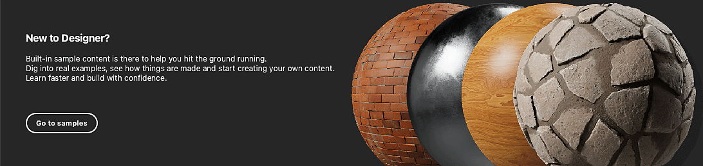
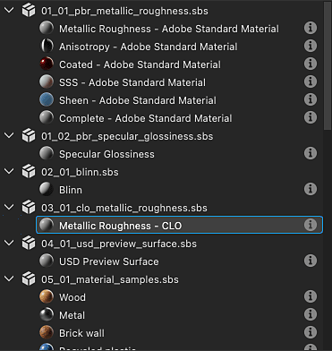
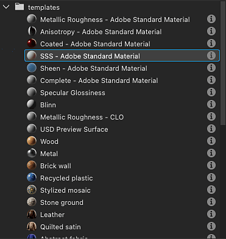

# Creating a Substance graph

Authoring textures in Designer starts with creating a Substance graph, either from an prebuilt template or an empty graph.

<table>
<tr style="border: 0;">
<td style="border: 0;" valign="top">

## creating a graph

</td>
<td style="border: 0;" valign="top">

### Graph templates

</td>
<td style="border: 0;" valign="top">

### Managing templates

</td>
</tr>
</table>

## Creating a Substance graph

To start the process of creating a new [Substance graph](../../help/compositing-graphs/substance-compositing-graphs.md), you may use one of these methods:

* <table>
  <tr style="border: 0;">
  <td style="border: 0;" valign="top">

  In the Home screen, click the <b>New graph</b> button.

  </td>
  <td style="border: 0;" valign="top">

  {zoomable="yes"}

  </td>
  </tr>
  </table>

* <table>
  <tr style="border: 0;">
  <td style="border: 0;" valign="top">

  On any *existing* package item in the [Explorer](https://helpx.adobe.com/substance-3d/unlisted/documentation/sddoc/the-explorer-129368147.html), click <b>RMB</b> and go to <b>New &gt; Substance graph</b> in the contextual menu.

  </td>
  <td style="border: 0;" valign="top">

  {zoomable="yes"}

  </td>
  </tr>
  </table>

* <table>
  <tr style="border: 0;">
  <td style="border: 0;" valign="top">

  In the main toolbar, click the  <b>New Substance graph</b> button.

  </td>
  <td style="border: 0;" valign="top">

  {zoomable="yes"}

  </td>
  </tr>
  </table>

* <table>
  <tr style="border: 0;">
  <td style="border: 0;" valign="top">

  In the [main menu](https://helpx.adobe.com/substance-3d/unlisted/documentation/sddoc/the-main-menu-143720673.html), go to <b>File &gt; New &gt; Substance graph...</b>

  </td>
  <td style="border: 0;" valign="top">

  

  </td>
  </tr>
  </table>

* Press the <b>Ctrl+N</b> (Windows) / <b>Cmd+N</b> (macOS) keystroke.

No matter which method you choose, you'll be presented with the <b>New Substance graph</b> dialog.

## Graph templates

Regardless of the method used to create a new Substance graph, you will always be met with the <b>New Substance graph</b> dialog which lets you configure the new graph.

{zoomable="yes"}

### Templates

Designer includes graph templates with preconfigured nodes to get you started faster. They may include [Output](../../help/compositing-graphs/nodes-reference-for-com/atomic-nodes/output/output.md) nodes, simple nodes to pass values to these outputs - e.g. [Uniform color](../../help/compositing-graphs/nodes-reference-for-com/atomic-nodes/uniform-color/uniform-color.md), as well as [Input](../../help/compositing-graphs/nodes-reference-for-com/atomic-nodes/input/input.md) nodes.

Double-click on a template in the list, or select it and click the <b>Create</b> button to create a new Substance graph using that template. By default, the new graph is placed in a new unsaved package.

>[!TIP]
>
> Starting from scratch
> 
> To start from an completely blank graph, select the <b>Empty</b> template in the 'Empty' category.

>[!NOTE]
>
> Switching templates
> 
> If you select the wrong template, you *cannot* switch to a different one after creating the graph.
> 
> To port your existing graph to another template, you may create a new graph using the appropriate template, and copy-paste your graph to the new one. Reconnect nodes as appropriate, Output nodes in particular.

<table>
<tr style="border: 0;">
<td width="100.00%" style="border: 0;" valign="top">

Each template is listed by its label and subtitle.

The subtitle provides more context about the *use case* for the template: the material definition it is based on, the software it is meant to integrate with, etc.

In <b>Thumbnails</b> mode, the subtitle is placed under the label in a darker, smaller text.

In <b>List</b>, <b>Packages</b> and <b>Directories</b> view modes, the subtitle is appended to the label thusly: *Label - Subtitle*.

</td>
<td width="25.00%" style="border: 0;" valign="top">

</td>
</tr>
</table>

### Material samples

The <b>Material samples</b> category includes a [curated selection of graphs](../../help/compositing-graphs/creating-compositing-gra/material-samples/material-samples.md) to learn from and experiment with.

You can also access the samples directly from the Home screen, using the <b>Go to samples</b> button.

{zoomable="yes"}

<table>
<tr style="border: 0;">
<td style="border: 0;" valign="top">

### Information tooltip

Hovering the information icon for each template item displays a tooltip with additional information about the template:

<b>Type:</b> The type of asset the template is meant to produce. This is editable in the [graph properties](../../help/compositing-graphs/graph-parameters/graph-parameters.md).

<b>Description:</b> Details about the template such as the workflow it integrates into, its intended use case and recommendations for its usage.

<b>Outputs:</b> The template's [Output](../../help/compositing-graphs/nodes-reference-for-com/atomic-nodes/output/output.md) nodes, if any.

</td>
<td style="border: 0;" valign="top">

{zoomable="yes"}

</td>
</tr>
</table>

<table>
<tr style="border: 0;">
<td width="100.00%" style="border: 0;" valign="top">

### View modes

The templates list can be displayed in different modes using the <b>View modes</b> button.

The filtering performed by the selected category and project file is applied in all views.

</td>
<td width="33.33%" style="border: 0;" valign="top">

{zoomable="yes"}

</td>
</tr>
</table>

+++View modes
{zoomable="yes"}

<b>Thumbnails</b>

Cards with thumbnails providing a preview or icon of the template type.

{zoomable="yes"}

<b>List</b>

Templates are listed by their label only.

{zoomable="yes"}

<b>Packages</b>

Templates are listed by their label as children of the package file they belong to.

Hover a package file item to display a tooltip with its full path.

{zoomable="yes"}

<b>Directories</b>

Templates are listed by their label as children of the directory hosting the package file they belong to.

Hover a directory item to display a tooltip with its full path.

+++

### Properties

After selecting the template, you may set up basic information regarding the new graph. It can be changed at any time after creating the graph.

<b>Graph name</b>: the graph's identifier. It needs to be unique for a given package and cannot include spaces and some special characters.

<b>Size</b>: the graph's parent resolution, which will control the output resolution of most nodes - see the [Output size](../../help/compositing-graphs/output-size/output-size.md) page to learn more. The width and height are linked together by default, and you can unlink them by clicking the link button between the width and height combo boxes.

<b>Create graph in</b>: You can use this combo box to create a *new* package for the new graph, or add the new graph to any *existing* package already loaded in the [Explorer](https://helpx.adobe.com/substance-3d/unlisted/documentation/sddoc/the-explorer-129368147.html) panel.

### Help tooltip

Hover the question mark icon to display a tooltip with a button which links directly to this page, so you can refer back to this documentation as needed.

{zoomable="yes"}

## Managing templates

<table>
<tr style="border: 0;">
<td width="100.00%" style="border: 0;" valign="top">

### Filtering by category

Categories are used to group templates that are related to each other by use case or asset type.

Use the <b>Category</b> combobox to select the category you wish to filter the templates by.

</td>
<td width="41.67%" style="border: 0;" valign="top">

{zoomable="yes"}

</td>
</tr>
</table>

<table>
<tr style="border: 0;">
<td width="100.00%" style="border: 0;" valign="top">

Templates may have a category set up in their <b>Template data</b> [graph attribute](../../help/compositing-graphs/graph-parameters/graph-parameters.md), which is used as a filter to narrow down the list of templates:

&lt;category&gt;;&lt;subtitle&gt;

Custom categories can be set up in the templates provided by project files (see below). Then, these categories will be added to the list in the combobox.

</td>
<td width="50.00%" style="border: 0;" valign="top">

{zoomable="yes"}

</td>
</tr>
</table>

<table>
<tr style="border: 0;">
<td width="100.00%" style="border: 0;" valign="top">

### Filtering by Project file

If any of the active [project files](../../help/interface/preferences-window/project-settings/project-settings.md) provide one or more template paths, the graphs in the package files found at these paths will be added to the list of templates.

Then, use the <b>Filter by project file</b> button to narrow down the list of templates to the ones provided by a specific project file.

</td>
<td width="33.33%" style="border: 0;" valign="top">

{zoomable="yes"}

</td>
</tr>
</table>
