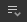
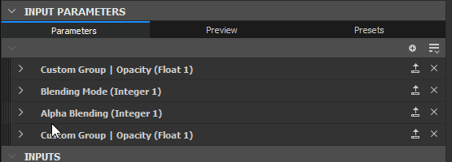
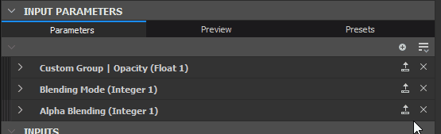
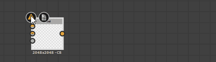
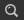

# Exposing a parameter

Exposing parameters is one of the most powerful tools and is key to opening up your graphs to other applications such as Substance 3D Painter, Substance 3D Sampler and Substance Integrations for Maya and 3DS Max.

This page explains all required concepts to get started exposing. It's recommended [that you first learn what a Graph Instance is ](../../creating-compositing-gra/graph-instances-sub-gra/graph-instances-sub-graphs.md)before continuing on this page. It's also good to have a grasp on[ the difference between Publish and Exporting, as well as the filetypes involved.](../../../getting-started/overview/overview.md)

*\*Dashed, transparent lines above are an abstract representation of the connection  
from exposed parameters to Graph Parameters.*

## Understanding parameters and exposing

+++What is a parameter?

A parameter is a simple value, with a UI element, that controls the behavior of a graph.You use them constantly in all Substance software: to change a color, to set blend mode, to choose an opacity value, etc... Without parameters, Substance software would not allow for any customization at all.

Parameters can come in many different forms: sliders, dials, type-in boxes, drop-down menus, etc... The values they represent can be many different types: decimal values, whole (integer) values, boolean (true/false) values, even text snippets.

+++

+++What is 'exposing'?

Exposing is the process of making a parameter available for use outside of your current Graph View.When building a Graph, you usually select a node to change the parameters in its properties; when exposed, youenable access to this parameter from an external control panel. This "external control panel" can mean different things based on the context: when used as a Graph Instance inside Designer, it just acts as another node. When used in Substance 3D Painter, Substance 3D Sampler or an integration, these exposed parameters will bethe only controlyou have over the graph.

+++

+++Why is exposing useful?

Exposing Parameters is what takes Substance 3D Designer beyond a simple texture editor, allowing you to create customisable, dynamic texture-generation tools.Without exposing, Substance Materials wouldn't be very different from static textures: you'd have no way to modify their outputs.

+++

+++Why not expose every parameter automatically, all the time?

Substance graphscan get complicated and can contain hundreds of parameters at once. It doesn't make sense to always show all parameters to a user, especially if you are building graphs with a simple goal, that don't need many parameters.When exposing parameters, you work as a UI or UX designer: you think what controls make sense, which values are required and how to make it easy to use for yourself, for other users online or for your coworkers.

[Substance graphs](../../substance-compositing-graphs.md)

+++

+++Do I have to know math for exposing? Should I understand Substance function graphs?

Mathematical knowledge is not required to make good use of Exposing Parameters, nor is the use of functions.As a beginning user you can almost completely avoid having to do mathematical operations inFunction graphs. The only thing that is strongly recommended, is adecent base knowledge of the different data types such as Integer, Float and Boolean.

[Function graphs](../../../function-graphs/function-graphs.md)

[decent base knowledge of the different data types such as Integer, Float and Boolean.](../../../function-graphs/nodes-reference-for-fun/function-nodes-overview/function-nodes-overview.md)

+++

## How to expose

Currently there are two main methods to expose parameters. One method is more suited for quickly exposing a single parameter, the second method is more suited for exposing multiple parameters in one sweep.

{width="512px"}

### SINGLE EXPOSE METHOD

1. Find the parameter you want to expose in the [Properties Window](https://helpx.adobe.com/substance-3d/unlisted/documentation/sddoc/parameters-ui-129368153.html), under the Specific Parameters tab
1. Click the  dropdown options button
1. Choose  <b>Expose as new graph input</b> from the drop down list, the first option.
1. The <b>Expose parameter</b> dialog appears, set any parameter properties as you wish.

   It is recommended to at least change the <b>Identifier</b> and <b>Label</b>
1. Press <b>OK</b> to confirm
1. The parameter's name turns *blue*, and the   
   <b> Edit parameter function</b> button appears next to the dropdown options to confirm the parameter is exposed

>[!NOTE]
>
> Most numerical fields support *basic math formulas* as an input – E.g., `17+3.5`, `7/3`, `(4+2)*3`. Press *Enter* to validate the formula and the result will be input in the field. If the formula is invalid, the field reverts to its previous value.  
> Some numerical fields in other parts of the application, such as in the [Properties](https://helpx.adobe.com/substance-3d/unlisted/documentation/sddoc/parameters-ui-129368153.html) dock, also support this feature.

{width="512px"}

### Batch expose method

When exposing one parameter, this method will be a bit slower than the previous. When exposing multiple parameters, it is much faster.

1. Instead of finding a single parameter, find the  <b>Multi-expose</b> button at the top right of the <b>Specific parameters</b> tab
1. Choose <b>Batch expose parameters...</b> from the drop down menu
1. The <b>Batch expose</b> dialog appears, allowing you to customize the exposing of all of a node's <b>Specific parameters</b>
1. Use <b>All</b>, <b>None</b> or specific checkboxes to decide which parameters to expose
1. Click on a parameter name under the <b>Graph input identifier</b> column in the list to change its name.
1. Click on a <b>Group name</b> under the <b>Graph input group</b> column in the list to add a (sub-)group for one specific parameter
1. Use the <b>Graph input identifier</b> and <b>Graph input group</b> type-in boxes at the bottom to add prefix, suffix and input groups to all exposed parameters at once. All these values are applied on top of the per-parameter settings.
1. Click <b>OK</b> to confirm and expose all selected parameters. The parameter names now show *blue* to confirm the parameters are exposed, as well as an  <b>Edit function</b> button.

## Limitations

There are some limitations tied to exposing parameters, as listed in the table below.

| Parameter type | Reason |
| --- | --- |
| [Gradient Ramp](../../nodes-reference-for-com/atomic-nodes/gradient-map/gradient-map.md), [Curve Editor](../../nodes-reference-for-com/atomic-nodes/curve/curve.md), [Font](../../nodes-reference-for-com/atomic-nodes/text/text.md), [Levels Histogram](../../nodes-reference-for-com/atomic-nodes/levels/levels.md) | Require widgets which are not available for user-created parameters. |

Another significant limitation is related to [static parameters](../../../glossary/glossary.md). These cannot be changed in a [published Substance 3D asset](https://helpx.adobe.com/substance-3d/unlisted/documentation/sddoc/publishing-sbsar-file-200574380.html) (SBSAR).

Static parameters – as opposed to dynamic parameters – *cannot be edited on-the-fly* after the graph has been *cooked* – i.e., processed in order to run its algorithm quickly and efficiently. Cooking occurs in Designer every time the graph is *edited* or *published*.

As such, static parameters are visible and editable in Designer, but are *hidden* in a published Substance 3D asset. You may use Preview mode to see these limitations in effect before publishing to a Substance 3D asset: see 'Previewing parameters' below.

As a workaround, you may use a [Switch](../../nodes-reference-for-com/node-library/filters/blending/switch/switch.md) or [Multi Switch](../../nodes-reference-for-com/node-library/filters/blending/multi-switch/multi-switch.md) node and multiple sets of logic to switch between different values/states for these parameters.

| Node | Parameter |
| --- | --- |
| All nodes | Tiling mode  Pixel ratio |
| [Uniform color](../../nodes-reference-for-com/atomic-nodes/uniform-color/uniform-color.md) | Color mode |
| [Pixel processor](../../nodes-reference-for-com/atomic-nodes/pixel-processor/pixel-processor.md) | Color mode |
| [Blend](../../nodes-reference-for-com/atomic-nodes/blend/blend.md) | Blending mode  Alpha blending  Cropping area |
| [FX-Map](../../nodes-reference-for-com/atomic-nodes/fx-map/fx-map.md) | Blending mode |
| [Quadrant](../../../function-graphs/fxmaps/the-quadrant-node/the-quadrant-node.md) | Pattern  Input image alpha  Input image filtering |

## Modifying exposed parameters

Once exposed, it is no longer possible to access a parameter like before. Changing its value, renaming, arranging in the UI and even removing the parameter all happen on the Graph Properties level. This section details how to do so.

To change an exposed parameter's options either:

1. Click on the Dropdown options button  next to the already exposed parameter
1. Choose <b> Edit exposed graph input</b>. This takes you straight to the relevant entry in the graph properties
1. Double-click in an empty area of your graph to get to the graph properties, then find the parameter in the list of <b>Input parameters</b>
1. Single click on your graph in the <b>Explorer</b>, then find the parameter in the list of <b>Input parameters</b>

{width="512px"}

### INPUT PARAMETERS

All exposed Parameters are listed under the Input Parameters tab. The following properties are available for most common cases such as Floats and Integers with default Editor type.

1. <b>Identifier</b>: Unique identifier for this parameter. Can not contain spaces or special characters.
1. <b>Label</b>: UI-only Label. If no Label is defined, the identifier is shown in the UI. Can contain spaces and special characters
1. <b>Group</b>: Group parameters together into collapsible section to keep long lists of parameters clean and manageable. Parameters are grouped together if they share the *exact same* group name. Use the `/` character to create *sub-groups* – e.g. `My Group/My Sub-group`
1. <b>Description</b>: Textfield for description, used as tooltip.
1. <b>Type / Editor</b>: Set the data type as well as the UI editor type. Certain Editors are only available for certain data types (such a drop down list only for Integer). *Changing Editor will in many cases wipe default values, be careful.*
1. <b>Default</b>: Default value the parameter starts out at. This is also the value used in your graph while previewing nodes. Try to use an easy, useable value here, avoid extreme cases.
1. <b>Min</b>: Minimum value for UI
1. <b>Max</b>: Maximum value for UI
1. <b>Clamp</b>: Set wether Min and Max are soft or hard limits (allow the user to go past the limits).
1. <b>Step</b>:Set the precison or granularity of the value.
1. <b>User Data: </b>Custom user data, available for any purpose.
1. <b>Visible If</b>: Special expression system to show or hide parameters based on external conditions. See [Visible if: control visibility of inputs, outputs and parameters](../../exposing-a-parameter/visible-control-vis/visible-if-control-visibility-of-inputs-outputs-and-parameters.md)

{width="512px"}

#### Drop down list

A special case is the <b>Drop down list</b> for Integer types. There is no Default, Min or Max, just a single Value setting that allows you to define a list of Items.

* Every Item corresponds to an Item in the Drop Down List.
* The first value for an Item is the actual, internal integer used by the graph. Make sure you set these up correctly for your [Multi Switch](../../nodes-reference-for-com/node-library/filters/blending/multi-switch/multi-switch.md) for example (they start at 1, not 0).
* The second value is the UI Label shown to the user.
* The third checkbox allows you to mark one Item as the default selected one.
* The X deletes an Item, the + adds an Item

{width="512px"}

#### Re-order

Re-ordering of Parameters can easily be done by dragging and dropping the dark, striped handles to the left of the input parameters name in the list. Keep in mind Grouping parameters can affect the order.

{width="512px"}

### PREVIEWING PARAMETERS

As setting up parameters can be difficult without seeing the final result, a <b>Preview Mode</b> can be enabled, to check how the parameters UI will look and behave externally. Click the <b>Preview</b> tab in the top middle of the Input Parameters rollout.

Normally, any changes made in <b>Preview Mode</b> are *discarded*. You can however use the <b>Apply button </b>next to the eye icon to set the current values of the<b> Preview Mode</b> as the *new default values*.

[Preview Mode also allows you to create Embedded Presets.](../parameter-presets/parameter-presets.md)

>[!IMPORTANT]
>
> Preview Mode is disabled when using [in-context editing](../../../interface/preferences-window/preferences-window.md).

>[!WARNING]
>
> Preview mode aims to represent the experience of a [published Substance 3D asset](https://helpx.adobe.com/substance-3d/unlisted/documentation/sddoc/publishing-sbsar-file-200574380.html) (SBSAR) as accurately as possible. Therefore, the listed in this page will apply in this mode, such as *static parameters being absent from the list*.

{width="512px"}

### COPY-PASTING PARAMETERS

Parameters can be copy-pasted between graphs.

A single parameter can be copied with the Copy button . Multiple Parameters can be copied through the Parameters Menu . Choose Copy Inputs to copy all inputs.

Choose Paste Inputs  in the Parameters Menu  to paste one or more parameters.

If you want to transfer values, and not the actual exposed parameter itself, [read about Parameter Presets.](../parameter-presets/parameter-presets.md)

## Removing and cleaning exposed parameters

Because of the nature of parameters, where you can have on Input Parameter controlling multiple Nodes, or where Input parameters can exist without controlling a node, problems can arise with missing or unused parameters. Below common issues and their solutions are described.

{width="512px"}

### TRACKING BROKEN PARAMETERS ON NODES

You can track what parameter is used by which node through the Node Finder Tool , which is located in the top bar of the Graph View. Click it and it allows you to find nodes using specific parameters.

If a node has an actual problem, it will display a Warning badge  on its top left corner. Hovering over the badge will display a tooltip with more information.

To reset and remove a problem, for the parameter you want to fix or reset, click on the Dropdown button  next to the Edit Function button and select  <b>Reset. </b>This returns a parameter to its previous, non-exposed state, the blue name will turn gray again to reflect this.

{width="512px"}

### CLEANING UP UNUSED INPUT PARAMETERS

If you have lost track of your Input Parameters and no longer know which ones are used, they can be cleaned up using a small tool. Click the Input Parameter menu button  and select <b>Clean Inputs.</b>

A new dialog appears, listing all unused parameters. Check or uncheck whatever parameters you want to remove or keep, and click OK. If no dialog appears, there are currently no unused parameters to clean up.

{width="512px"}

### REMOVING PARAMETERS

To actually remove a parameter that is in use, requires two distinct steps.

1. On the node with the exposed parameter, click the dropdown arrow to the right of the Function Expose button that is colored in blue: . Then choose "Reset to Default Value". This removes the use of the parameter on this one node. repeat for any other node making use of the same parameter. "Reset to Default value" also resets the range of the parameter widget to its *soft range*.
1. In the Input Parameters list of the Graph, click the X all the way to the right of the parameter's entry. This deletes the parameter completely. If any nodes try to make use of this parameter, a warning badge will appear (see above).
