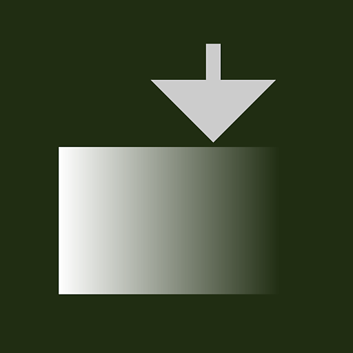
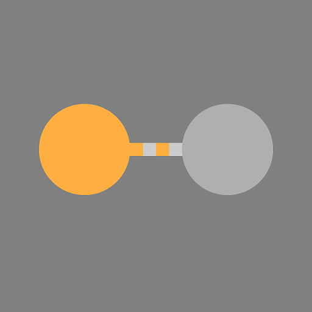
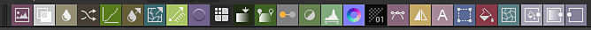

# Atomic nodes

Atomic nodes are the basic building blocks of Substance graphs.

All other Substance graph nodes in the [Library](../../../interface/the-library/the-library.md) are built out of atomic nodes, should you break them down to their lowest level.

<table>
<tr style="border: 0;">
<td style="border: 0;" valign="top">

[Bitmap](bitmap/bitmap.md)

</td>
<td style="border: 0;" valign="top">

[Blend](blend/blend.md)

</td>
<td style="border: 0;" valign="top">

[Blur](blur/blur.md)

</td>
<td style="border: 0;" valign="top">

[Curve](curve/curve.md)

</td>
<td style="border: 0;" valign="top">

[Directional blur](directional-blur/directional-blur.md)

</td>
</tr>
</table>

<table>
<tr style="border: 0;">
<td style="border: 0;" valign="top">

[Directional warp](directional-warp/directional-warp.md)

</td>
<td style="border: 0;" valign="top">

[Emboss](emboss/emboss.md)

</td>
<td style="border: 0;" valign="top">

[Distance](distance/distance.md)

</td>
<td style="border: 0;" valign="top">

[Gradient (Dynamic)](gradient-dynamic/gradient-dynamic.md)

</td>
<td style="border: 0;" valign="top">

[Gradient map](gradient-map/gradient-map.md)

</td>
</tr>
</table>

<table>
<tr style="border: 0;">
<td style="border: 0;" valign="top">

[FX-Map](fx-map/fx-map.md)

</td>
<td style="border: 0;" valign="top">

[Grayscale conversion](grayscale-conversion/grayscale-conversion.md)

</td>
<td style="border: 0;" valign="top">

[HSL](hsl/hsl.md)

</td>
<td style="border: 0;" valign="top">

[Input color](input/input.md)

</td>
<td style="border: 0;" valign="top">

[Input grayscale](input/input.md)

</td>
</tr>
</table>

<table>
<tr style="border: 0;">
<td style="border: 0;" valign="top">

[Input value](input/input.md)

</td>
<td style="border: 0;" valign="top">

[Levels](levels/levels.md)

</td>
<td style="border: 0;" valign="top">

[Normal](normal/normal.md)

</td>
<td style="border: 0;" valign="top">

[Output](output/output.md)

</td>
<td style="border: 0;" valign="top">

[Pixel processor](pixel-processor/pixel-processor.md)

</td>
</tr>
</table>

<table>
<tr style="border: 0;">
<td style="border: 0;" valign="top">

[Sharpen](sharpen/sharpen.md)

</td>
<td style="border: 0;" valign="top">

[Channels shuffle](channel-shuffle/channel-shuffle.md)

</td>
<td style="border: 0;" valign="top">

[SVG](svg/svg.md)

</td>
<td style="border: 0;" valign="top">

[Text](text/text.md)

</td>
<td style="border: 0;" valign="top">

[Transformation 2D](transformation-2d/transformation-2d.md)

</td>
</tr>
</table>

<table>
<tr style="border: 0;">
<td style="border: 0;" valign="top">

[Uniform color](uniform-color/uniform-color.md)

</td>
<td style="border: 0;" valign="top">

[Value processor](value-processor/value-processor.md)

</td>
<td style="border: 0;" valign="top">

[Warp](warp/warp.md)

</td>
<td style="border: 0;" valign="top">

</td>
<td style="border: 0;" valign="top">

</td>
</tr>
</table>

## Placing atomic nodes

There are several ways to create atomic nodes in Substance graphs:

### <b>The node palette</b>

The node palette sits in the [Graph View toolbar](../../../interface/the-graph-view/the-graph-view.md) and provides easy access to atomic nodes: simply click a node or drag it in the graph.

The palette is toggled using this button: 

### <b>The node menu</b>

Press *Spacebar* or *Tab* in the Graph View displays a searchable list of nodes and lists all atomic nodes by default.

The search field lets you browse [all the other nodes in the Library](../node-library/node-library.md), including [your own content](../../../interface/the-library/managing-custom-content/managing-custom-content-and-filters.md) (if added).

### <b>The graph contextual menu</b>

Right-click in the graph and go to the 'Add node' submenu to access a list of atomic nodes.

### <b>The Library</b>

The 'Atomic nodes' category of the [Library](../../../interface/the-library/the-library.md) hosts all atomic nodes. They can be dragged and dropped into a Substance graph.

### <b>Keyboard shortcuts</b>

You can define [your own keyboard shortcuts](../../../interface/preferences-window/preferences-window.md) to instantly create any node in a graph, including atomic nodes.

 