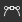
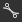
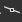
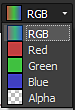

# Curve

<table>
<tr style="border: 0;">
<td width="33.33%" style="border: 0;" valign="top">

{width="200px"}

</td>
<td width="100.00%" style="border: 0;" valign="top">

Remaps the values in an image using a custom curve.

The node provides an interface to image tonality remapping, similar to other 2D image editing applications. The user can place points and adjust Bezier curves to remap the input, which can be either grayscale or color.It is especially useful when used with gradient transitions to remap them to a specific height profile, it allows for very precise modeling of bevel profiles and the like.

</td>
</tr>
</table>

Unlike most other nodes, the Curve node does not have a typical standard interface with sliders and parameters, but instead presents a full fledged curve editor. See the below expandable section on how to use it.

[This does however mean that none of the parameters from a Curve node can be exposed to a subgraph](../../../manage-parameters/exposing-a-parameter/exposing-a-parameter.md). The only option here is to use a [Multi-Switch](../../node-library/filters/blending/multi-switch/multi-switch.md) to switch between different curve profiles.

<table>
<tr style="border: 0;">
<td width="100.00%" style="border: 0;" valign="top">

</td>
<td width="83.33%" style="border: 0;" valign="top">

</td>
<td width="100.00%" style="border: 0;" valign="top">

</td>
</tr>
</table>

<table>
<tr style="border: 0;">
<td style="border: 0;" valign="top">

</td>
<td style="border: 0;" valign="top">

</td>
<td style="border: 0;" valign="top">

</td>
</tr>
</table>

## Parameters

|  |  |
| --- | --- |
| <b>Apply/Expose curve</b> *Boolean* | Allows to copy the user curve to the output instead of applying it to the input image |
| <b>Curve addressing</b> *Boolean* | This parameter determines how HDR pixels out of the &#91;0, 1&#93; range in the input are handled: clamped or fold up to &#91;0, 1&#93;. |
| <b>Curve</b> *Array of curve keys* | The custom curve used to map the input grayscale values.   May be edited using the . |

## Curve editor

### Create and move a point

In order to create a point, simply double-click anywhere on the Curve view:

### Controlling the point influence

<table>
<tr style="border: 0;">
<td width="100.00%" style="border: 0;" valign="top">

In order to obtain precise results, the curve nodes offers different modes for each point:

</td>
<td width="33.33%" style="border: 0;" valign="top">

</td>
</tr>
</table>

  Reset the point mode to the default value.

  Lock/Unlock the 2 bezier handlers so the user can move them together or independently.

  Both side of the point are controlled by a Bezier handler.

  The right side of the point is controlled by a Bezier handler while the left side remains flat.

  The left side of the point is controlled by a Bezier handler while the right side remains flat.

  The point sides remain flat

### Show input histogram

You can show/hide the histogram of your input just by clicking on 

### Controlling each channel individually (color input)

<table>
<tr style="border: 0;">
<td width="100.00%" style="border: 0;" valign="top">

When you input is a color node, you have the ability to ajust the curve for each channel:

Just select the curve you want to ajust in the dropdown list located on the top right:

</td>
<td width="33.33%" style="border: 0;" valign="top">

</td>
</tr>
</table>

While in RGB curve mode, you canhide/show the individual channel curves by pressing/unpressing :

### Aligning, mirroring and flipping

<table>
<tr style="border: 0;">
<td width="100.00%" style="border: 0;" valign="top">

If you right click on the curve view, you will get some more options.

<b>Align top:</b> Align the selected points horizontally with the highest one.

<b>Align middle:</b> Align the selected points horizontally to the selection's average height.

<b>Align bottom:</b> Align the selected points horizontally with the lowest one.

</td>
<td width="50.00%" style="border: 0;" valign="top">

</td>
</tr>
</table>

<b>Distribute horizontally/vertically:</b> Distribute the points on the selected axis

<b>Flip horizontally/vertically:</b> Flip the selected points according to the selected axis.

<b>Mirror horizontally/vertically:</b> Mirror the whole curve, according to the selected axis

### Keyboard Shortcuts

+++LMB + Drag

Draw a selection box.

+++

+++Shift + Drag

Constrain the movement on the X or Y axis.

+++

+++Atl + LMB + Drag

Temporarily break the handles to move them independently.

+++

### Adjust the framing of the curve

While tweaking the handlers, you may be in a case where one handler is going over the curve view.

In that case, you can use the  button to fit the size to the content.

The  button resets the zoom level to 1

## Input connectors

|  |  |
| --- | --- |
| <b>Input</b> *Grayscale/Color* PRIMARY | The image to be processed. |

## Output connectors

|  |  |
| --- | --- |
| <b>Output</b> *Grayscale/Color* |  |

## Examples

*Coming soon.*

 