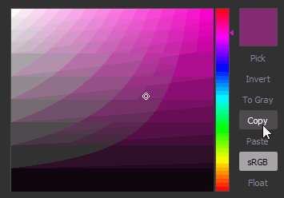
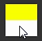
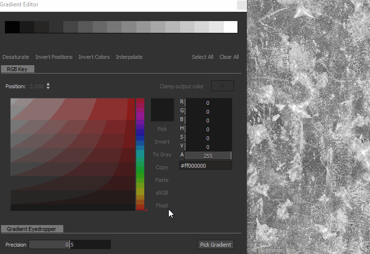

# Gradient map

<table>
<tr style="border: 0;">
<td width="33.33%" style="border: 0;" valign="top">

{width="200px"}

</td>
<td width="100.00%" style="border: 0;" valign="top">

Remaps the grayscale values in an image using a custom gradient.

This node serves a dual purpose: It may be simply used as a<b> </b>grayscale-to-color conversion node, or to colorize grayscale input my mapping it to a custom color ramp.

</td>
</tr>
</table>

The node offers an advanced and feature-rich gradient editor to map multiple colors with precision: go to the [Gradient editor](#gradient-editor) section in this page to learn more.

<table>
<tr style="border: 0;">
<td width="100.00%" style="border: 0;" valign="top">

</td>
<td width="83.33%" style="border: 0;" valign="top">

</td>
<td width="100.00%" style="border: 0;" valign="top">

</td>
</tr>
</table>

## Examples

## Parameters

|  |  |
| --- | --- |
| <b>Color mode</b> *Boolean* | Sets the output mode to Color or Grayscale. |
| <b>Gradient adressing</b> *Boolean* | Sets the gradient to either repeat (tile) or clamp values that are out of the &#91;0, 1&#93; range. |
| <b>Gradient</b> *Array of gradient keys* | The custom gradient ramp used to map the input grayscale values.   May be edited in place or using the [Gradient editor](#gradient-editor). |

## Gradient editor

This window offers controls to edit the reference gradient used by the Gradient Map node to map grayscale values to colors.

It can be opened from the Gradient Map node's <b>Properties</b> in the following ways:

* Click LMB on the <b>Gradient Editor</b> button;
* Double-click LMB on a pin in the gradient bar. The clicked pin will then be automatically selected in the Gradient Editor so you can directly edit its values.

### Editing the gradient pins

The colors and their positions along the gradient is controlled by pins placed along the gradient bar.

Each pin sets a color at its position along the gradient.

The portions of the gradient before and after the first and last pins are set to those pin's colors respectively.

The following controls are available to edit pins:

<table>
<tr style="border: 0;">
<td style="border: 0;" valign="top">

<b>Add pin</b>

Click LMB on the gradient or just below to add a pin at the position you clicked in the gradient bar.

The new pin will be set to the gradient's color at that position.

</td>
<td style="border: 0;" valign="top">

</td>
</tr>
</table>

<table>
<tr style="border: 0;">
<td style="border: 0;" valign="top">

<b>Move pin</b>

Hold LMB and drag the selected pins along the gradient bar to move them.

You can also set the position of a pin with a numerical value by selecting it and using the <b>Position</b> parameter. The position is a value in the &#91;0;1&#93; range where 0 is the start of the gradient and 1 is its end.

</td>
<td style="border: 0;" valign="top">

</td>
</tr>
</table>

When multiple pins are selected, they can all be moved *concurrently*. When one or more pins reach and end of the gradient as they are moved, two behaviours are available depending on the mouse button used for moving:

* <b>LMB:</b> Pins remain at the end, meaning they will be stacked at that location as they reach it and their relative positions are changed;
* <b>MMB:</b> Pins loop back around to the other end of the gradient, meaning their relative positions remain unchanged.

<table>
<tr style="border: 0;">
<td style="border: 0;" valign="top">

<b>Delete pin</b>

Select the pins and press Delete, or drag the pins off the gradient bar to delete them.

</td>
<td style="border: 0;" valign="top">

</td>
</tr>
</table>

<table>
<tr style="border: 0;">
<td style="border: 0;" valign="top">

<b>Invert positions</b>

Mirrors the positions of the selected pins on the gradient.

</td>
<td style="border: 0;" valign="top">

</td>
</tr>
</table>

<table>
<tr style="border: 0;">
<td style="border: 0;" valign="top">

<b>Clear all</b>

Removes all the pins from the gradient bar.

</td>
<td style="border: 0;" valign="top">

</td>
</tr>
</table>

<b>Invert colors</b>

This button switches the colors of the selected pins to their negative.

<b>Desaturate</b>

This button desaturates the colors set on the selected pins.

### Interpolation modes

Once pins are set up, you can control how colors transition from one pin to the next using the available interpolation modes:

+++Linear
The default interpolation mode: applies a simple linear interpolation between each pin, so the gradient progresses uniformly.

+++

+++Flat Tangents
When thinking about the transition between gradients as Bezier curves where pins are points of the curve, this mode sets these points to have horizontal tangents.

This results in a transition that is evocative of a smoothstep interpolation.

When this mode is selected, the <b>Midpoint</b> parameter is enabled and lets you offset the horizontal position of the curve's vertical midpoint between the points. This effectively tips the scale between the 'out' and 'in' tangents.

+++

+++Smooth
Applies smoothing to the interpolation curve between each point.

When this mode is selected, the <b>Smoothness</b> parameter is enabled and lets you adjust the intensity of the smoothing where a value of 0 is equal to the <b>Linear</b> interpolation mode.

+++

+++No Interpolation
Color only changes at a pins' location, and stays constant until the next pin along the gradient bar.

This results in hard steps between colors, and only the colors set by the pins are present on the gradient.

+++

### color picker

The Color Picker lets you set a color in several ways:

* <b>Gradient and hue bar</b>

  <table>
  <tr style="border: 0;">
  <td style="border: 0;" valign="top">

  Tweak the positions of the gizmo in the gradient and of the notch in the hue bar to set a color.

  </td>
  <td style="border: 0;" valign="top">

  

  </td>
  </tr>
  </table>

* <b>RGB, HSV, and Alpha sliders</b>

  <table>
  <tr style="border: 0;">
  <td width="100.00%" style="border: 0;" valign="top">

  The RGB, HSV and Alpha sliders let you set a color precisely, by tweaking the sliders or directly setting their numerical values.

  Alternatively, use a hexcode in the dedicated input field below the sliders.

  </td>
  <td width="33.33%" style="border: 0;" valign="top">

  

  </td>
  </tr>
  </table>

* <b>Pick on screen</b>

  <table>
  <tr style="border: 0;">
  <td style="border: 0;" valign="top">

  Use the <b>Pick</b> button and click LMB anywhere in the screen to sample the color at that location.

  </td>
  <td style="border: 0;" valign="top">

  

  </td>
  </tr>
  </table>

<table>
<tr style="border: 0;">
<td width="100.00%" style="border: 0;" valign="top">

The selected color is previewed in the upper half of the color thumbnail.  
The lower half displays the previously used color. Double-click LMB on it to revert the tweaked color to it.

</td>
<td width="16.67%" style="border: 0;" valign="top">

</td>
</tr>
</table>

When multiple pin are selected, the RGB, HSV and Alpha sliders turn into delta (Δ) sliders, meaning they are used to offset the value of each pin by the same amount.

<table>
<tr style="border: 0;">
<td width="100.00%" style="border: 0;" valign="top">

Additionally, the following capabilities are available below the color thumbnail as buttons:

<b>Invert:</b> Switches the color to its negative;

<b>To Gray:</b> Desaturates the color;

<b>Copy</b>*:* Copy the currently selected color to the clipboard;

<b>Paste:</b> Switch to the color currently in the clipboard;

<b>sRGB</b>: Use the sRGB color space to display colors. When disabled, the Linear color space is used;

<b>Float:</b> Display RGB, HSV and Alpha slider values in floating point.

</td>
<td width="25.00%" style="border: 0;" valign="top">

</td>
</tr>
</table>

### Gradient Eyedropper

The Gradient Eyedropper is one of the most useful features this node offers, as you can create complex gradients just by drawing a line on a reference picture.

The <b>Precision</b> slider will help you adjust your newly created gradient by increasing or decreasing the number of keys: the lower their values, the more precise your gradient will match your picked values.

## Input connectors

|  |  |
| --- | --- |
| <b>Input</b> *Grayscale* PRIMARY | The grayscale image to be processed. |

## Output connectors

|  |  |
| --- | --- |
| <b>Output</b> *Grayscale* |  |

## Examples

*Coming soon.*
