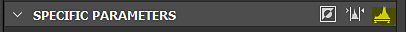

# Levels

<table>
<tr style="border: 0;">
<td width="33.33%" style="border: 0;" valign="top">

.png "Atomic node: Levels"){width="200px"}

</td>
<td width="100.00%" style="border: 0;" valign="top">

Adjusts the global tonal range and color balance of an image's shadows, midtones and highlights.

The Levels node allows you to remap the tones of an input by setting input and output remap factors, presented in a histogram interface familiar from other 2D image editors.

</td>
</tr>
</table>

It is one of the core, most useful nodes in Substance 3D Designer, and is very often used to remap and adjust values in a graph, as it provides the most precise and accurate interface to changing values.

While it is an important node, for some use cases the interface can be a bit cumbersome, so make sure to look into [Auto Levels](../../../../compositing-graphs/nodes-reference-for-com/node-library/filters/adjustments/auto-levels/auto-levels.md), [Contrast/Luminosity](../../../../compositing-graphs/nodes-reference-for-com/node-library/filters/adjustments/contrast-luminosity/contrast-luminosity.md) and [Histogram Scan](../../../../compositing-graphs/nodes-reference-for-com/node-library/filters/adjustments/histogram-scan/histogram-scan.md) for alternatives.

<table>
<tr style="border: 0;">
<td width="100.00%" style="border: 0;" valign="top">

</td>
<td width="83.33%" style="border: 0;" valign="top">

</td>
<td width="100.00%" style="border: 0;" valign="top">

</td>
</tr>
</table>

## Examples

## Parameters

The node offers two interfaces to adjust its values: histogram and sliders. You can switch between them with the rightmost button in the 'Specific parameters' header bar:

<table>
<tr style="border: 0;">
<td width="100.00%" style="border: 0;" valign="top">

The highlighted yellow button toggles the interface between the histogram (top) value sliders (bottom)

</td>
<td width="66.67%" style="border: 0;" valign="top">

</td>
</tr>
</table>

|  |  |
| --- | --- |
| <b>Level in low</b> *Float/Float4* | Defines the input image's lowlight levels. Remaps input Low values to become full black. |
| <b>Level in high</b> *Float/Float4* | Defines the input image's highlight levels.  Remaps input High values to become full white. |
| <b>Level in mid</b> *Float/Float4* | Defines the input image's midtone levels.  Remaps input Mid values to become mid gray. |
| <b>Level out low</b> *Float/Float4* | Defines the output image's lowlight levels.  Clamps output Black values to set limit. |
| <b>Level out high</b> *Float/Float4* | Defines the output image's highlight levels.  Clamps output White values to set limit. |
| <b>Intermediary clamp</b> *Boolean* | Determines if transformed input value is clamped to &#91;0, 1&#93; before computing output level. |

## Usage guide

Check out this video overview of the Levels node and its histogram editor:

### Quick actions

In the 'Specific parameters' header bar, you can find buttons to access convenient functions of the histogram:

<b>1 - Invert:</b> Swaps the values of the 'Level out low' and 'Level out high' parameters.

<b>2 - Auto level:</b> Automatically adjusts the values of the 'Level in low' and 'Level in high' parameters respectively to the lowest and highest value present in the image.

<b>3 - Switch interfaces:</b> Toggles between the histogram and slider editors.

### Histogram

The histogram editor is intended for visual, quick adjustments where accurate values are not really needed, and exposing parameters is not of importance. It is generally the fastest and easiest way to work with Levels.

Depending on the input type (Color or Grayscale) you can use the dropdown above the Histogram to choose which channel you are modifying.

### Sliders

The sliders editor does away with any visual editor and presents only numerical sliders, useful mostly if you want to clamp or remap to very exact values, or if you intend to [expose any of these parameters](../../../../compositing-graphs/manage-parameters/exposing-a-parameter/exposing-a-parameter.md), as this is only possible in the sliders editor.

The sliders change depending on a Color or Grayscale input: Color inputs create 4 Sliders for each RGBA channel separately, Grayscale only has a single slider, making it easier to work with. See above Parameter listing for an explanation on every slider.

## Input connectors

|  |  |
| --- | --- |
| <b>Input</b> *Grayscale/Color* PRIMARY | The image to be processed. |

## Output connectors

|  |  |
| --- | --- |
| <b>Output</b> *Grayscale/Color* |  |

## Examples

*Coming soon.*
