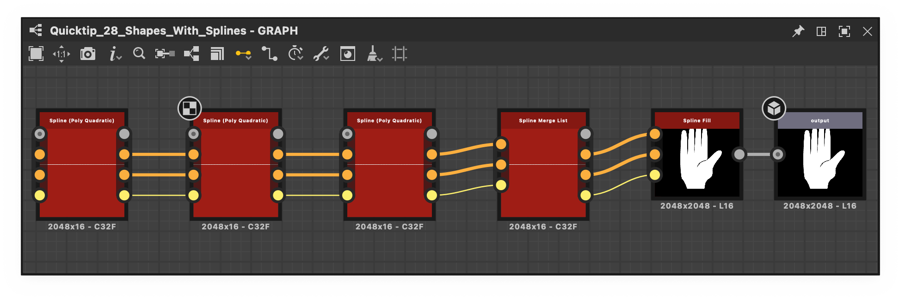

# Output

<table>
<tr style="border: 0;">
<td width="33.33%" style="border: 0;" valign="top">

{width="200px"}

</td>
<td width="100.00%" style="border: 0;" valign="top">

The Output node specifies the <b>result</b> of a Substance graph, or one of its results if more than one Output node is present in it.

The image or value connected to a graph's Output node is  output by any [instance node](../../../inheritance-compositing/inheritance-in-substance-compositing-graphs.md) representing this graph, and can [exported as a graph output](../../../exporting-bitmaps/exporting-bitmaps.md).

</td>
</tr>
</table>

Similarly, when a [published SBSAR file](../../../publishing-asset-files/publishing-substance-3d-asset-files-sbsar.md) includes this graph, then that file can output that image in any integration or plugin which consumes the file.

It has a single input slot that is type-agnostic, which means it types itself after the data type connected to it.

It has no parameters, but rather attributes that are of great importance for properly labeling the output and putting it to its intended use.

Every Substance graph must have *at least one* Output node. If no output exists, the graph can never return an actual result and a [warning](../../../../technical-issues/warnings-and-errors/warnings-and-errors.md) is raised.

<table>
<tr style="border: 0;">
<td width="100.00%" style="border: 0;" valign="top">

</td>
<td width="83.33%" style="border: 0;" valign="top">

</td>
<td width="100.00%" style="border: 0;" valign="top">

</td>
</tr>
</table>

<table>
<tr style="border: 0;">
<td style="border: 0;" valign="top">

</td>
<td style="border: 0;" valign="top">

</td>
<td style="border: 0;" valign="top">

</td>
</tr>
</table>

## Attributes

|  |  |
| --- | --- |
| <b>Identifier</b> *String* | The unique identifier of the output. This property cannot be left blank and cannot contain special characters or spaces.   The identifier is used as the node's label is the 'Label' property is left blank. It may also be used to name [exported textures](../../../exporting-bitmaps/exporting-bitmaps.md). |
| <b>Description</b> *String* | Optional description used as the output's tooltip is Substance graphs.. |
| <b>Label</b> *String* | This is used as a label for the output node, and its corresponding connector in [instance nodes](../../../inheritance-compositing/inheritance-in-substance-compositing-graphs.md) representing this graph. The label may contain spaces and special characters. |
| <b>User data</b> *String* | Optional metadata that may be used for specific filtering operations. [Substance 3D Painter](https://www.adobe.com/products/substance3d/apps/painter.html) make use of this data to [drive some features](https://helpx.adobe.com/substance-3d-painter/content/creating-custom-effects/user-data.html).. |
| <b>Group</b> *String* | Attribute used to group outputs together for Designer's [link creation modes](../../../../interface/the-graph-view/link-creation-modes/link-creation-modes.md).   Outputs with an identical 'Group' attribute are presented as a single connection in the 'Compact Material' link creation mode. |

## Integration attributes

These are attributes which are meant to be used by integrations/plugins which consume the graph in a [published SBSAR file](../../../publishing-asset-files/publishing-substance-3d-asset-files-sbsar.md).

As such, they have no impact on the format of [bitmap exports](../../../exporting-bitmaps/exporting-bitmaps.md). Additionally, only the <b>Usage</b> attribute is used in Designer, see below for details.

<b>Usage</b>

|  |  |
| --- | --- |
| <b>Component</b> *String* | Used to map some texture channels to the appropriate SVBRDF shader inputs in AxF workflows. |
| <b>Usage</b> *String* | Defines the type and usage of the output node. This property is important as it drives:<ul data-preserve-html="true"> <li data-preserve-html="true">Connection of nodes in Substance graphs when using some [link creation modes](../../../../interface/the-graph-view/link-creation-modes/link-creation-modes.md) </li> <li data-preserve-html="true">Connection of textures to shaders in the 3D View (see below: '')</li> <li data-preserve-html="true">Connection of textures to materials in integrations/plugins</li> </ul> |
| <b>Color space</b> *String* | Sets the color space this output should be interpreted in. Is used by some integrations in other applications, and has no impact in Designer. |

### About the role of usages in the 3D View

Since graph outputs are often intended to be the final result for a specific texture channel, outputs can be automatically sent to the appropriate sampler of the shader used in the 3D View.

Indeed, an output which <b>Usage</b> property *matches a sampler usage* in the 3D View will be connected to that sampler. E.g., an Output with a `basecolor` usage will be connected to the `basecolor` sampler of the 3D View shader. Learn more in the [View data in the 3D View](../../../../interface/3d-view/3d-view.md) section of the [3D View](https://substance3d.adobe.com/documentation/display/draftdesigner/.3d%20view%20vdraftversion) page.

Click RMB on an empty area in the [Graph view](../../../../interface/the-graph-view/the-graph-view.md) and select the <b>View outputs in 3D view</b> option in the contextual menu to connect all outputs to 3D View samplers with *matching usages*.

>[!IMPORTANT]
>
> If multiple usages are set up in order, for instance, to assign usages to channels in a packed texture, only the *first usage* in the list will be connected to the 3D View. This is a known limitation.

## Default output

When a graph has more than one output, one of those can be set as the default output for that graph. This specifies which of the outputs should be used for:

* The thumbnail of any instance node representing that graph
* Viewing these instance nodes in the 2D View
* The thumbnail of that graph in the Library (learn about adding your own resources [here](../../../../interface/preferences-window/project-settings/project-settings.md))

This feature lets you arrange graph outputs in any order independently from how the graph will be visualised as a node.

To set an Output node as a graph's default output:

* Right-click on an Output node and select the 'Set as default output' action in the contextual menu.
* In the Output node's properties, use the 'Set as default' button in the header of the 'Attributes' section.

Here is an example of instance nodes before and after setting a default output:

<table>
  <tr>
    <td>
      
       <i>Before</i>
    </td>
    <td>
      
       <i>After</i>
    </td>
  </tr>
</table>
