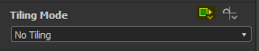

# Transformation 2D

<table>
<tr style="border: 0;">
<td width="33.33%" style="border: 0;" valign="top">

{width="200px"}

</td>
<td width="100.00%" style="border: 0;" valign="top">

Applies a 2D transformation matrix to an image: translation, rotation, scaling, symmetry and shearing.

It is quite similar to Transforming (Ctrl-T) in Photoshop, or using the 2D mapping manipulator in Substance 3D Painter.

</td>
</tr>
</table>

This is an extremely useful and widely applied node, it allows for increasing tiling, removing tiling, placing an image in a specific position, stretching or squashing an input, etc.

It can however not be a perfect match for certain applications, so the following nodes can be of interest: [Safe Transform](../../node-library/filters/transforms/safe-transform/safe-transform.md), [Non-Square Transform](../../node-library/filters/transforms/non-square-transform/non-square-transform.md), [Quad Transform](../../node-library/filters/transforms/quad-transform/quad-transform.md) and [Trapezoid Transform](../../node-library/filters/transforms/trapezoid-transform/trapezoid-transform.md).

<table>
<tr style="border: 0;">
<td width="100.00%" style="border: 0;" valign="top">

</td>
<td width="83.33%" style="border: 0;" valign="top">

</td>
<td width="100.00%" style="border: 0;" valign="top">

</td>
</tr>
</table>

>[!TIP]
>
> Disabling tiling
> 
> Set the [inheritance method](../../../../glossary/glossary.md) of the 'Tiling mode' [base parameter](../../../../glossary/glossary.md) to 'Absolute', which then lets you set the parameter value to 'No Tiling':
> 
> 

>[!NOTE]
>
> The values for scaling and rotation in the node's properties are *relative to the current transformation*, and are not applied to the 2D View until you click the 'Apply' button.

<table>
<tr style="border: 0;">
<td style="border: 0;" valign="top">

</td>
<td style="border: 0;" valign="top">

</td>
</tr>
</table>

## Parameters

|  |  |
| --- | --- |
| <b>Transformation matrix</b> *Float4* | Open the underlying transform matrix for direct editing. Allows you to change rotation and scaling. Can also be adjusted through the gizmo in the 2D view.   Warning: they do not directly correlate to the view, and are relative adjustments that can be applied in steps. |
| <b>Offset</b> *Float2* | Defines the 2D displacement of the image. Allows you to change the position or offset Can also be adjusted through the gizmo in the 2D view.   Does relate directly to the 2D view output. |
| <b>Mipmap mode</b> *Integer* | Allows you to switch to a manual [mipmap](../../../../glossary/glossary.md) level, which reduces artifacts in an image using texture filtering. |
| <b>Mipmap level</b> *Integer* | Sets the [mipmap](../../../../glossary/glossary.md) level to be used.     *Available when 'Mipmap mode' is set to 'Manual'* |
| <b>Matte color</b> *Float4* | The color used as background when tiling of transformation is disabled. I.e., sets the color used when the transformed input does not cover an area of the output.   Can be made transparent if working in RGBA color. |
| <b>Filtering</b> *Integer* | Sets the downsampling method used. Does not work particularly well with Mipmap Level being reduced. |

## Input connectors

|  |  |
| --- | --- |
| <b>Input</b> *Grayscale/Color* PRIMARY | The image to be transformed. |

## Output connectors

|  |  |
| --- | --- |
| <b>Output</b> *Grayscale/Color* |  |

## Examples

*Coming soon.*

 