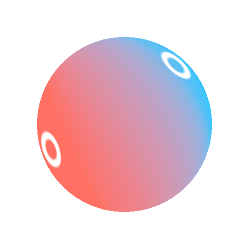

# Gradient 2 Points

<table>
<tr style="border: 0;">
<td style="border: 0;" valign="top">

{width="250px"}

## Gradient 2 Points

**In:** *3D View/HDRI Tools*

**Intermediate**

</td>
<td style="border: 0;" valign="top">

## Description

Creates a gradient of 2 colors between two user-selected points. Result is adjusted for spherical projection. Similar to [Gradient Linear (HDRI)](../gradient-linear-hdri/gradient-linear-hdri.md), but with two points instead of one.

## Parameters

* **Point 1 Position**:   
  User-selected first point position. Has handle in 2D view.
* **Point 1 Color**: *(Color value)*   
  Color at gradient start.
* **Point 1 Contrast**: *0.0 - 1.0*   
  Contrast of first point mask.
* **Point 2 Position**:   
  User-selected second point position. Has handle in 2D view.
* **Point 2 Color**: *(Color value)*   
  Color at Gradient end.
* **Point 2 Contrast**: *0.0 - 1.0*Contrast of second point mask.

## Example Images

</td>
</tr>
</table>
