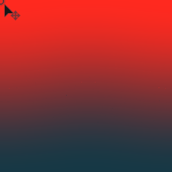

# Gradient Linear (HDRI)

<table>
<tr style="border: 0;">
<td style="border: 0;" valign="top">

{width="200px"}

## Gradient Linear

**In:** *3D View/HDRI Tools*

**Simple**

</td>
<td style="border: 0;" valign="top">

## Description

Creates a Linear gradient across the centre and with a user-placed point. The end result is adjusted for spherical projection, unlike the regular [Gradient Linear 1](../../../texture-generators/patterns/gradient-linear-1/gradient-linear-1.md).

## Parameters

* **Point Position**:   
  Position of oint used to determine gradient direction.
* **Top Color**: *(Color value)*  
  Color of top part of gradient (at point)
* **Bottom Color**: *(Color value)*  
  Color of bottom part of gradient (away from point).
* **Contrast**: *0.0 - 1.0*  
  Adjusts the contrast of the result.

## Example Images

</td>
</tr>
</table>
