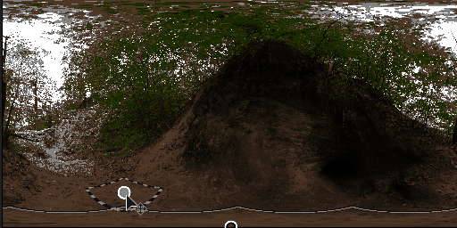

# Nadir Patch

<table>
<tr style="border: 0;">
<td style="border: 0;" valign="top">

{width="200px"}

## Nadir Patch

**In:** *3D View/HDRI Tools*

**Complex**

</td>
<td style="border: 0;" valign="top">

## Description

This node provides functionality to patch over the central ground point (nadir) of a spherically mapped image. It can be used to hide or "clone out" an ugly nadir, or visible camera or tripod. It works like a [Clone Patch](../../../../../../help/compositing-graphs/nodes-reference-for-com/node-library/material-filters/scan-processing/clone-patch/clone-patch.md), but with adjustments for spherically mapped images. The user selects a point elsewhere in the image, that is the cloned and blended in at the nadir. No other external inputs are required other than a single HDRI to process, but an external mask can be used as alpha for the patch effect.

effect can be quickly checked and validated with [Nadir Extract](../../../../../../help/compositing-graphs/nodes-reference-for-com/node-library/3d-view-library/hdri-tools/nadir-extract/nadir-extract.md).

## Inputs

* **Input**: *Color Input*
* **Mask Input**: *Grayscale Input*   
   Optional mask slot used for masking the patch. Function like an alpha.

## Parameters

* **Enable**: *False/True*  
  Enable or disable patching effect.
* **Show Frames Helper**: *False/True*  
  Show or hide the helper lines, for debug purposes.
* **Frame Thickness**: *0.0 - 1.0*  
  Thickness of helper lines.
* **Patch Scale**: *0.0 - 1.0*  
  Global, uniform scale of patch. Affects both source and target.
* **Patch Size**: *0.0 - 1.0*  
  Non-uniform size of patch.
* **Patch Rotation**: *0.0 - 1.0*  
  Rotation of the patch. Affects source and target.
* **Patch Alpha**: *Smooth Square, Gaussian, Mask Input*  
  Set what alpha is used to blend the patch with the background.
* **Patch Hardness**: *0.0 - 1.0*  
  Set hardness/contrast of alpha.
* **Source Rotation Offset**: *0.0 - 1.0*  
  Rotation only for source of the patch.
* **Position Coordinates**   
  * **Source Position**:   
    Position of source. Has handle in 2D view.
  * **Patch Position**:   
    Position of target. Has handle in 2D view.

## Example Images

</td>
</tr>
</table>
