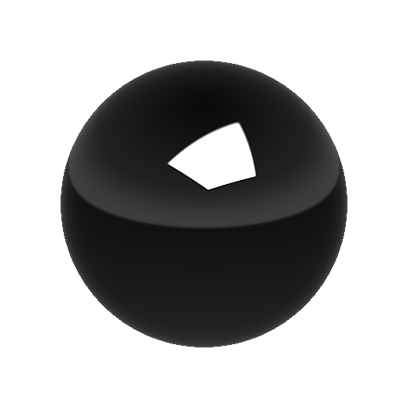

# Plane Light

<table>
<tr style="border: 0;">
<td style="border: 0;" valign="top">

{width="200px"}

## Plane Light

**In:** *3D View/HDRI Tools*

**Complex**

</td>
<td style="border: 0;" valign="top">

## Description

Generates a spherically projected plane shape. The plane can be placed and oriented in 3d using the input parameters.

It differs from the simpler [Shape Light](../shape-light/shape-light.md) in that it has more advanced placement options outside of simpler Distance from origin projection, and more patterns and masks can be applied, similar to [Line Light](../line-light/line-light.md).

## Inputs

* **Background Image Input**: *Color Input*  
  Optional background onto which to compose the generated light.
* **Shape Image Input**: *Color Input*  
  Optional image to map onto Line light. Only used when Shape Color Mode is set to Image Input.
* **Pattern Image Input**: *Grayscale Input*  
  Custom pattern image, used when the "Pattern" parameter is set to "Image Input".

## Parameters

* **Position Mode**: *Ground / Ceiling, Distance from Origin, World Positions*  
  Select from three different placement modes. Ground/Ceiling and Distance from Origin support manipulation in the 2D view, World positions can only be changed through properties, but does support more exact placement.
* **Show Ground Grid**: *False/True*  
  Helper function to enable a debug ground grid to be drawn. Helps estimate position of lines in space.
* **Position Coordinates**  
  * **Up Vector**: *Z Up, Y Up*  
    Only with World Position mode, determine orientation of coordinate system.
  * **Plane UV Position**:   
    Only with Ground / Ceiling and Distance from Origin. Sets plane position in UV space.
  * **Plane World Position**: *-2.0 - 2.0*  
    Only with World Positions mode. Sets plane position world space. No 2D view interaction supported.
  * **Plane Absolute Height**: *0.0 - 1.0*  
    Only with Ground / Ceiling Position Mode, sets absolute height from ceiling. Use Show Ground Grid to estimate position better.
  * **Distance from Origin**: *0.0 - 1.0*  
    Only with Distance from Origin Position Mode. Sets distance from panorama center for both points.
* **Shape Color Mode**: *RGB, Temperature (Kelvin), Image Input*  
  Choose what method to use to set shape color. Image Input enables use of the second input slot.
* **Color**: *(Color value)*  
  Only with Shape Color Mode set to RGB. Picks color for shape.
* **Temperature**: *800.0 - 20000.0*  
  Only with Shape Color Mode set to Temperature. Sets Kelvin value for shape color.
* **Shape Image UV Mode**: *Stretch, Stretch Middle only, Repeat + Spacing*  
  Only with Shape Color Mode set to Image Input. Sets how image is applied to the line shape, determines UV repetition behaviour.
* **Shape Image Repeat Spacing**: *0.0 - 1.0*  
  Only with Shape Color Mode set to Image Input and with UV Mode set to Repeat + Spacing. Sets amount of spacing when image repeats along line.
* **Shape Image Gamma**: *sRGB, Linear*  
  Only with Shape Color Mode set to Image Input. Determine how to interpret Shape Image Input.
* **Exposure (EV)**: *0.0 - 10.0*  
  Set exposure value for generated shape, Ideally matched to background image exposure value.
* **Plane Scale**: *0.0 - 1.0*  
  Set uniform scale of the Plane shape.
* **Plane Size**: *0.0 - 1.0*  
  Set non-uniform size of the Plane shape.
* **Plane Rotation**: *0.0 - 1.0*  
  Rotate Plane along its central axis.
* **Pattern**: *Smooth Square, Sharp Square, Cone, Hemisphere, Image Input*  
  Select what pattern shape to use.
* **Pattern Hardness**: *0.0 - 1.0*  
  Set hardness/contrast for pattern.
* **Pattern UV Mode**: *Stretch, Stretch Middle only*  
  Set how to use secondary pattern mask, applied on top of Shape Image.
* **Enable Ground Clipping**: *False/True*  
  Enable if Plane can be clipped by a ground plane, or is still shown when going below it. Use Show Ground Grid to better estimate this.
* **Ground Height**: *-2.0 - 0.0*  
  Adjust ground height for clipping.
* **Enable Backgound Input**: *False/True*  
  Toggles use of optional background image. Composites generated light on top of background.
* **Background Color**: *(Color value)*  
  If Background Input is not used, set a solid color background value here.
* **Background Gamma**: *sRGB, Linear*If Background Input is used, set how to interpret Background input.

## Example Images

</td>
</tr>
</table>
