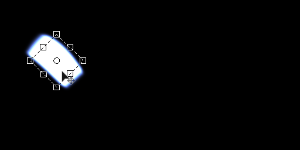

# Shape Light

<table>
<tr style="border: 0;">
<td width="33.33%" style="border: 0;" valign="top">

{width="200px"}

<b>In:</b> 3D View &gt; HDRI Tools

</td>
<td width="100.00%" style="border: 0;" valign="top">

## Description

Generates a spherically projected rectangular shape. The shape transformation is driven by a transformation gizmo.

</td>
</tr>
</table>

## Inputs

|  |  |
|:---|:---|
| <b>Background Image Input</b> <i>Color Input</i> | Optional background onto which to compose the generated light. |
| <b>Shape Image Input</b> <i>Color Input</i> | Optional image to map onto Sphere light. Only used when Shape Color Mode is set to Image Input. |

## Parameters

|  |  |
|:---|:---|
| <b>Shape Matrix</b> |  |
| <b>Matrix</b> <i>(Transformation Matrix)</i> | Transformation control for the result. Result can be modified by directly interacting with the canvas. |
| <b>Offset</b> <i>-2.0 - 2.0</i> | Moves or translates the result. Result can be modified by directly interacting with the canvas. |
| <b>Shape</b> <i>Rectangle, Disc</i> | Choose what shape to place. |
| <b>Shape Color Mode</b> <i>RGB, Temperature (Kelvin), Image Input</i> | Choose what method to use to set shape color. Image Input enables use of the second input slot. |
| <b>Color</b> <i>(Color value)</i> | Only with Shape Color Mode set to RGB. Picks color for shape. |
| <b>Shape Temperature</b> <i>800.0 - 20000.0</i> | Only with Shape Color Mode set to Temperature. Sets Kelvin value for shape color. |
| <b>Shape Image Input Gamma</b> <i>sRGB, Linear</i> | Only with Shape Color Mode set to Image Input. Determine how to interpret Shape Image Input. |
| <b>Shape Exposure (EV)</b> <i>0.0 - 10.0</i> | Set exposure value for generated shape, Ideally matched to background image exposure value. |
| <b>Shape Hardness</b> <i>0.0 - 1.0</i> | Set hardness of shape edges. |
| <b>Hotspot Exposure (EV)</b> <i>0.0 - 10.0</i> | Set Exposure of central hotspot. Note this is not very visible in RGB mode. |
| <b>Hotspot Size</b> <i>0.0 - 1.0</i> | Size of the central Hotspot. |
| <b>Hotspot Falloff</b> <i>0.0 - 1.0</i> | Falloff of central hotspot. |
| <b>Hotspot Position</b> <i>0.0 - 1.0</i> | X and Y position of the central hotspot. |
| <b>Enable Backgound Input</b> <i>False/True</i> | Toggles use of optional background image. Composites generated light on top of background. |
| <b>Background Color</b> <i>(Color value)</i> | If Background Input is not used, set a solid color background value here. |
| <b>Background Gamma</b> <i>sRGB, Linear</i> | If Background Input is used, set how to interpret Background input. |

## Examples

<table style="margin-top: 32px; margin-bottom: 32px">
    <tr style="border: 0">
        <td style="border: 0; background: transparent">
            
        </td>
    </tr>
</table>
