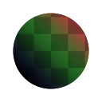

# Channel Mixer

<table>
<tr style="border: 0;">
<td style="border: 0;" valign="top">

{width="128px"}

## Channel Mixer

**In:** *Filters/Adjustments*

**Simple**

</td>
<td style="border: 0;" valign="top">

## Description

Allows you to mix, swap and blend RGB channels. Can be used to swizzle channels around, do more accurate grayscale conversions and different kinds of packing.

## Parameters

* **Red Channel**: *-200.0 -* 200.0  
  Determines how much of the input RGB channels go into the output Red channel.
* **Green Channel**: *-200.0 - 200.0*  
  Determines how much of the input RGB channels go into the output Green channel.
* **Blue Channel**: *-200.0 - 200.0*Determines how much of the input RGB channels go into the output Blue channel.
* **Monochrome**: *False/True*Output to monochrome. Allows for more precise grayscale conversion.

## Example Images

</td>
</tr>
</table>
