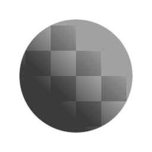

# Clamp

<table>
<tr style="border: 0;">
<td style="border: 0;" valign="top">

{width="128px"}

{width="128px"}

## Clamp (Grayscale)

**In:** *Filters/Adjustments*

**Simple**

</td>
<td style="border: 0;" valign="top">

## Description

Clamps input values to defined limits.

## Parameters

* **Min**: *0.0 -* 1.0  
  Lower clamp limit.
* **Max**: *0.0 - 1.0*Upper clamp limit.
* **Apply to Alpha**: *False/True* (Color version only)  
  Choose whether clamping is applied to the alpha as well.

## Example Images

</td>
</tr>
</table>
