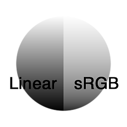

# Convert to sRGB

<table>
<tr style="border: 0;">
<td style="border: 0;" valign="top">

{width="128px"}

{width="128px"}

## Convert to sRGB (Grayscale)

**In:** *Filters/Adjustments*

**Simple**

</td>
<td style="border: 0;" valign="top">

## Description

Converts a Linear input to sRGB colorspace. Useful when working and converting with photo reference material for example.

## Parameters

*No Parameters.*

## Example Images

|  |
| --- |
| There are no images attached to this page. |

</td>
</tr>
</table>
