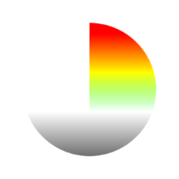
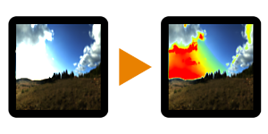

# HDR Range Viewer

<table>
<tr style="border: 0;">
<td style="border: 0;" valign="top">

{width="128px"}

{width="128px"}

## HDR Range Viewer (Grayscale)

**In:** *Filters/Adjustments*

**Simple**

</td>
<td style="border: 0;" valign="top">

## Description

Debug tool to check exact areas with High Dynamic Range. Both Color and Grayscale versions exist.

## Parameters

* **Range Min**: *-2.0 - 0.0*Minimum range to start highlighting.
* **Range Max**: *1.0 - 3.0*Maximum range to highlight up to.

## Example Images

| 

 |
| --- |
|  |

</td>
</tr>
</table>
