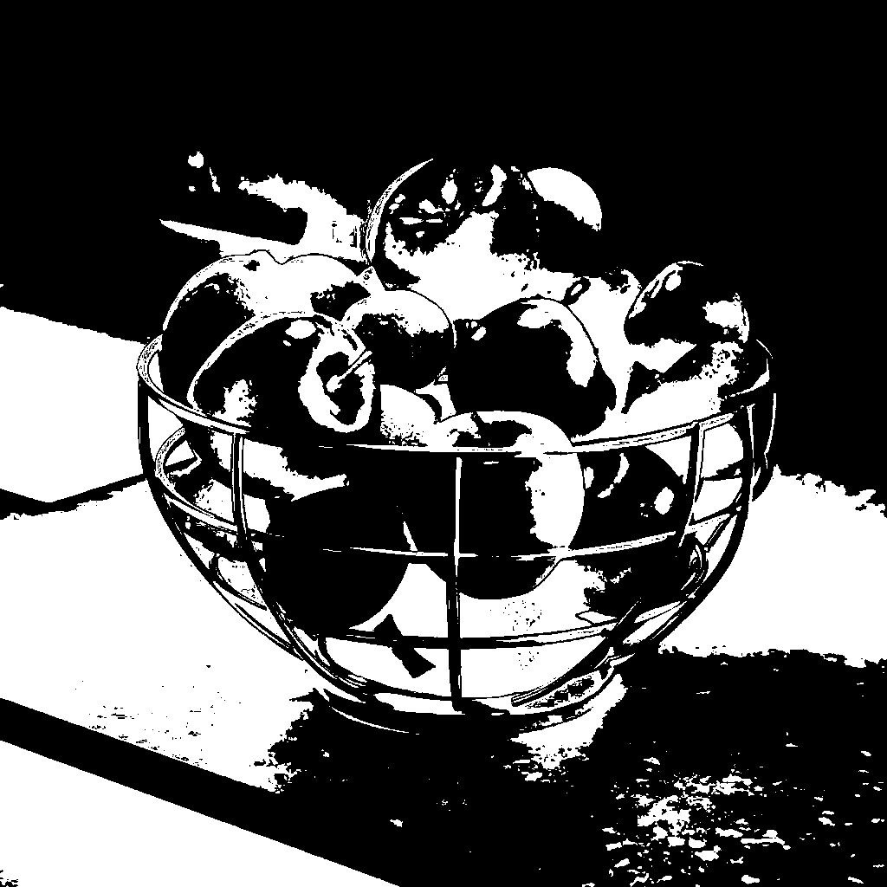

# Histogram compute

<table>
<tr style="border: 0;">
<td width="33.33%" style="border: 0;" valign="top">

{width="200px"}

<b>In:</b> Filters &gt; Adjustments

</td>
<td width="100.00%" style="border: 0;" valign="top">

## Description

Computes the histogram for a grayscale image.

The histogram is encoded as a row of pixels in an image, where each pixel value is the *population* of the color value matching the pixel position on the X-axis.  
E.g., a pixel value of 75 at (0.25, 0) means there are 75 pixels which have the 0.25 color value in the image.

</td>
</tr>
</table>

The node also outputs the *cumulative distribution function* (CDF) computed for the image.

Custom tools can be created using the data computed by the node, such as custom masks, as shown below in the 'Examples' section.

>[!IMPORTANT]
>
> All values out of the &#91;0,1&#93; range are clamped, therefore the histogram may not be accurate for HDR images.

<table>
<tr style="border: 0;">
<td style="border: 0;" valign="top">

</td>
<td style="border: 0;" valign="top">

### Output connectors

</td>
<td style="border: 0;" valign="top">

### Parameters

</td>
</tr>
</table>

## Input connectors

|  |  |
| --- | --- |
| <b>Input</b> *Grayscale* PRIMARY | The image for which the histogram should be computed. |

## Output connectors

|  |  |
| --- | --- |
| <b>Histogram</b> *Grayscale* | The histogram computed for the input image, encoded as a row of pixels where each pixel value is the *population* of the color value matching the pixel position on the X-axis.   E.g., a pixel value of 75 at (0.25, 0) means there are 75 pixels which have the 0.25 color value in the image. |
| <b>CDF</b> *Grayscale* | The result of the *cumulative distribution function* (CDF) computed for the image, encoded in a row of pixels where each pixel is the sum of all pixel values to its left.   That sum is then *normalized* against the total number of pixels in the image. |

## Parameters

|  |  |
| --- | --- |
| <b>Histogram resolution</b> *Integer* | The width of the histogram. A higher value allows for a finer value distribution.   Available resolutions are, in pixels:  256, 512, 1024, 2048, 4096 |

## Examples

{zoomable="yes"}

<table>
  <tr>
    <td>
      
       <i>Before</i>
    </td>
    <td>
      
       <i>After</i>
    </td>
  </tr>
</table>
