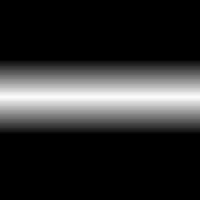

# Histogram Select

<table>
<tr style="border: 0;">
<td width="33.33%" style="border: 0;" valign="top">

{width="128px"}

<b>In:</b> Filters &gt; Adjustments

</td>
<td width="100.00%" style="border: 0;" valign="top">

## Description

Similar to [Histogram Scan](../../../../../../compositing-graphs/nodes-reference-for-com/node-library/filters/adjustments/histogram-scan/histogram-scan.md), this effect sets a grayscale value position, with a range around that it fades from. Contrast can be adjusted to make the range sharper.

[Click here to watch a Substance Academy video on Histogram Select.](https://youtu.be/p9wcmJBFyGA?t=535)

</td>
</tr>
</table>

## Parameters

|  |  |
|:---|:---|
| <b>Position</b> <i>0.0 - 1.0</i> | Sets the middle position where the range selection happens. |
| <b>Range</b> <i>0.0 - 1.0</i> | Sets width of the selection range. |
| <b>Contrast</b> <i>0.0 - 1.0</i> | Adjusts the contrast/falloff of the result. |

## Examples

<table style="margin-top: 32px; margin-bottom: 32px">
    <tr style="border: 0">
        <td style="border: 0; background: transparent">
            
        </td>
    </tr>
</table>
