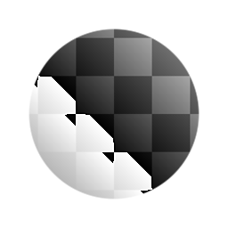

# Histogram Shift

<table>
<tr style="border: 0;">
<td style="border: 0;" valign="top">

{width="128px"}

## Histogram Shift

**In:** *Filters/Adjustments*

**Simple**

</td>
<td style="border: 0;" valign="top">

## Description

Completely shifts the whole range of the image, wrapping around when reaching range limits.

[Click here to watch a Substance Academy video on Histogram Shift.](https://youtu.be/p9wcmJBFyGA?t=492)

## Parameters

* **Position**: *0.0 - 1.0*  
  How much to shift the input by. 1.0 is a full rotation and is equal to 0.0.

## Example Images

</td>
</tr>
</table>

 