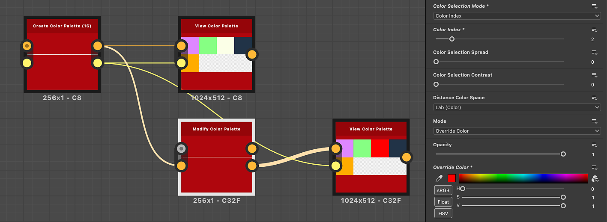
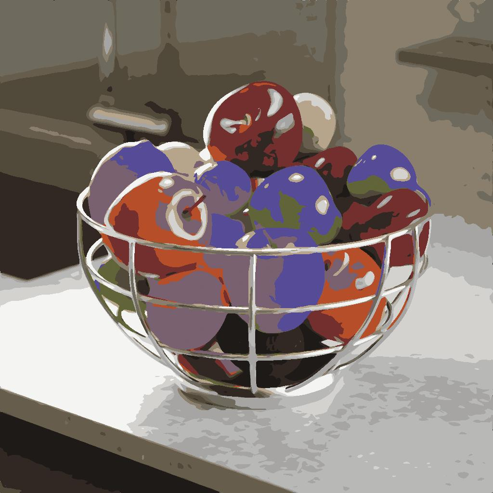

# Modify Color Palette

<table>
<tr style="border: 0;">
<td width="33.33%" style="border: 0;" valign="top">

{width="200px"}

<b>In:</b> Filters &gt; Adjustments

</td>
<td width="100.00%" style="border: 0;" valign="top">

## Description

Modifies the colors in an ordered palette and applies it to an image using an ID map.

Colors can be selected by matching the indexes in the ID map to the indexes of colors in the palette.

For instance, color #2 in the palette will be applied to all pixels in the ID map with an ID value of 2.

This node may be used in combination with the following nodes: [Quantize Color](../../../../../../compositing-graphs/nodes-reference-for-com/node-library/filters/adjustments/quantize-color/quantize-color.md), [Create Color Palette](../../../../../../compositing-graphs/nodes-reference-for-com/node-library/filters/adjustments/create-color-palette-16/create-color-palette-16.md), [Apply Color Palette](../../../../../../compositing-graphs/nodes-reference-for-com/node-library/filters/adjustments/apply-color-palette/apply-color-palette.md), [View Color Palette](../../../../../../compositing-graphs/nodes-reference-for-com/node-library/filters/adjustments/view-color-palette/view-color-palette.md).

</td>
</tr>
</table>

<table>
<tr style="border: 0;">
<td style="border: 0;" valign="top">

</td>
<td style="border: 0;" valign="top">

### Output connectors

</td>
<td style="border: 0;" valign="top">

### Parameters

</td>
</tr>
</table>

## Input connectors

|  |  |
| --- | --- |
| <b>ID</b> *Grayscale* PRIMARY | The input ID map used to select colors, in order to modify and distribute them in the output.   An ID map is an image where pixels which are part of a whole (E.g., a shape) all hold the same unique identification value. In this case, the value is an integer.   An ID map can be produced using a [Quantize Color](../../../../../../compositing-graphs/nodes-reference-for-com/node-library/filters/adjustments/quantize-color/quantize-color.md) node. |
| <b>Palette</b> *Color* | An ordered list of RGB colors encoded as a row of pixels. The palette can hold a maximum of 256 colors. This is the palette that the node modifies.   Palettes may be produced with the [Quantize Color](../../../../../../compositing-graphs/nodes-reference-for-com/node-library/filters/adjustments/quantize-color/quantize-color.md) or [Create Color Palette](../../../../../../compositing-graphs/nodes-reference-for-com/node-library/filters/adjustments/create-color-palette-16/create-color-palette-16.md) nodes. |

## Output connectors

|  |  |
| --- | --- |
| <b>Output</b> *Color* | The result of mapping the colors in the modified palette to the indexes of the ID map. |
| <b>Palette</b> *Color* | The updated palette with the specified color modifications applied.   The palette may be applied to another image with the [Apply Color Palette](../../../../../../compositing-graphs/nodes-reference-for-com/node-library/filters/adjustments/apply-color-palette/apply-color-palette.md) node, or visualized with the [View Color Palette](../../../../../../compositing-graphs/nodes-reference-for-com/node-library/filters/adjustments/view-color-palette/view-color-palette.md) node. |

## Parameters

|  |  |
| --- | --- |
| <b>Color selection mode</b> *Integer* | The method of selecting the target color in the palette which should be modified:<ul data-preserve-html="true"> <li data-preserve-html="true"><b>Color index:</b> The index of the target color</li> <li data-preserve-html="true"><b>Image space:</b> The position in the ID map where the index should be sampled. When this mode is selected, a position gizmo is available in the 2D View for easy selection</li> </ul> |
| <b>Color position</b> *Float2*   *Available when 'Color selection mode' is set to 'Image space'* | The position in the ID map where the index should be sampled.   Use the gizmo in the 2D View for easily selecting a location in the image.   Tip: You may display the quantized image that the ID map is extracted from, then select the Modify Color Palette node to display the gizmo. This makes selecting a color to modify more intuitive. |
| <b>Color index</b> *Integer*   *Available when 'Color selection mode' is set to 'Color index'* | The index of the target color.   Colors in the palette are ordered from left to right, and the first color's index is 0. |
| <b>Color selection spread</b> *Float* | Controls how far the selection reaches into neighbouring colors.   Colors are arranged in a *cube* which width, height and depth are a gradient where each component of a color increases from 0 to 1 (E.g. red, green and blue in RGB).   This parameter adjusts how far around the selected color in the cube other colors can also be modified, where 1 is the full cube's width. |
| <b>Color selection contrast</b> *Float* | Controls the falloff gradient of the selection over neighbouring colors.   Colors are arranged in a *cube* which width, height and depth are a gradient where a component of a color increases from 0 to 1 (E.g. red, green and blue in RGB).   This parameter adjusts the selection falloff over other colors in the cube around the selected color, where 0 is a smooth gradient from the selected color to the farthest and 1 is a cutoff from fully included to not included. |
| <b>Distance color space</b> *Integer* | Colors are arranged in a *cube* which width, height and depth are a gradient where a component of a color increases from 0 to 1 (E.g. red, green and blue in RGB).   This parameter lets you select the color space used to distribute colors in the cube, which changes neighbouring colors.   You may select the color space which fits your use case:<ul data-preserve-html="true"> <li data-preserve-html="true"><b>Lab (Color):</b> A standardized perceptual color space, which distributes colors in such a way that colors that 'feel' close are actually close in the cube. This is appropriate for images which may be visualized on displays.</li> <li data-preserve-html="true"><b>RGB (Data):</b> Color is split into Red, Green and Blue and distributed straight along those axis, disregarding human perception. This is appropriate for images holding raw data, such as normal maps.</li> </ul> |
| <b>Mode</b> *Integer* | The method of modifying the target color:<ul data-preserve-html="true"> <li data-preserve-html="true"><b>Override color:</b> replace the color with another one</li> <li data-preserve-html="true"><b>HSL:</b> adjust the color using hue, saturation and lightness offsets</li> </ul> |
| <b>Opacity</b> *Float* | Controls the interpolation between the original and modified colors, where 1 means the modified color fully replaces the original color. |
| <b>Override color</b> *Float3*   *Available when 'Mode' is set to 'Override color'* | Specifies the color which should replace the original color. |
| <b>HSL</b> *Float3*   *Available when 'Mode' is set to 'HSL'* | Controls the hue, saturation and lightness offsets applied to the original color. |

## Examples

{zoomable="yes"}

{zoomable="yes"}

<table>
  <tr>
    <td>
      
       <i>Before</i>
    </td>
    <td>
      
       <i>After</i>
    </td>
  </tr>
</table>
