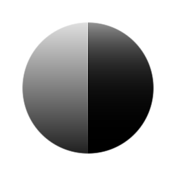

# Pow

<table>
<tr style="border: 0;">
<td style="border: 0;" valign="top">

{width="128px"}

{width="128px"}

## Pow (Grayscale)

**In:** *Filters/Adjustments*

**Simple**

</td>
<td style="border: 0;" valign="top">

## Description

Powers the input by a specified exponent. Similar to adjusting the [Levels ](../../../../atomic-nodes/levels/levels.md)Midpoint, but in a simpler package. Useful also for when you want to perform an exact mathematical power operation.

Important: make sure to use the correct version, depending on whether you have a Color or Grayscale input!

## Parameters

* **exponent**: *0.0 - 10.0*Exponent by which to power the input.

## Example Images

</td>
</tr>
</table>
