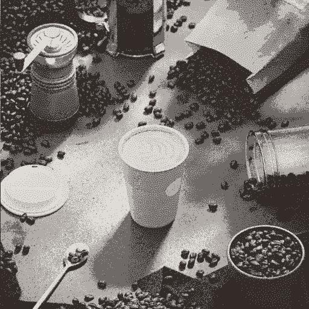

# Quantize Color

<table>
<tr style="border: 0;">
<td width="33.33%" style="border: 0;" valign="top">

{width="200px"}

<b>In:</b> Filters &gt; Adjustments

</td>
<td width="100.00%" style="border: 0;" valign="top">

## Description

Reduces the amount of colors in a color image, effectively flattening gradients.

In addition to the processed image, the node also extracts the following:

* A <b>palette</b> of the remaining colors, which may be used to colorize other images
* An <b>ID map</b> of the quantized areas, which may be used to recolorize the processed image using a different palette
* The <b>amount</b> of remaining colors as a raw integer value

</td>
</tr>
</table>

If the 'Ignore alpha' parameter is set to 'False', the alpha channel of the original image is used to select the areas of the image from which the colors should be extracted for the quantization process, while colors in transparent areas are ignored.

This effectively provides some control over the extracted colors.

This node may be used in combination with the following nodes: [Create Color Palette](../../../../../../compositing-graphs/nodes-reference-for-com/node-library/filters/adjustments/create-color-palette-16/create-color-palette-16.md), [Apply Color Palette](../../../../../../compositing-graphs/nodes-reference-for-com/node-library/filters/adjustments/apply-color-palette/apply-color-palette.md), [Modify Color Palette](../../../../../../compositing-graphs/nodes-reference-for-com/node-library/filters/adjustments/modify-color-palette/modify-color-palette.md), [View Color Palette](../../../../../../compositing-graphs/nodes-reference-for-com/node-library/filters/adjustments/view-color-palette/view-color-palette.md).

<table>
<tr style="border: 0;">
<td style="border: 0;" valign="top">

</td>
<td style="border: 0;" valign="top">

### Output connectors

</td>
<td style="border: 0;" valign="top">

### Parameters

</td>
</tr>
</table>

## Input connectors

|  |  |
| --- | --- |
| <b>Input</b> *Color* PRIMARY | The color image which should be quantized. |

## Output connectors

|  |  |
| --- | --- |
| <b>Output</b> *Color* | The quantized color image. |
| <b>ID</b> *Grayscale* | A map where each quantized color is assigned a unique integer identifier.   This may be used to:<ul data-preserve-html="true"> <li data-preserve-html="true"><b>Extract a mask</b> out of some quantized areas with the [ID to Mask](../../../../../../compositing-graphs/nodes-reference-for-com/node-library/filters/adjustments/id-to-mask/id-to-mask.md) node</li> <li data-preserve-html="true"><b>Recolorize</b> the quantized image with the [Apply Color Palette](../../../../../../compositing-graphs/nodes-reference-for-com/node-library/filters/adjustments/apply-color-palette/apply-color-palette.md) or [Modify Color Palette](../../../../../../compositing-graphs/nodes-reference-for-com/node-library/filters/adjustments/modify-color-palette/modify-color-palette.md) nodes</li> </ul> |
| <b>Palette</b> *Color* | The palette extracted from the image, holding the remaining colors after quantization.   The image is an ordered list of RGB colors encoded as a row of pixels, and can hold a maximum of 256 colors.   The palette may be visualized with the [View Color Palette](../../../../../../compositing-graphs/nodes-reference-for-com/node-library/filters/adjustments/view-color-palette/view-color-palette.md) node. |
| <b>Palette color amount</b> *Integer* | The amount of colors stored in the palette. |

## Parameters

|  |  |
| --- | --- |
| <b>Max. color amount</b> *Integer* | The maximum amount of colors which should be used in the quantized image.   This amount is the same used in the Palette extracted from the image.   'Maximum' means this amount may not be met, because of the quantization technique being used. Check the 'Palette Color Amount' output for the actual amount of extracted colors. |
| <b>Contour smoothing</b> *Float* | Controls the radius of a smoothing effect applied to the input image, used to simplify the quantized image into more solid, cohesive shapes.   Note: This smoothing requires intensive computations thus raising this value noticeably increases the node's computation time. |
| <b>Dithering</b> *Float* | Applies a dithering pattern in order to recreate the gradients and color blends in the original image, while still only using the colors remaining after the quantization.   Make sure to use a 'Contour Smoothing' value of 0 to produce the expected dithering effect. |
| <b>Dithering pattern</b> *Integer* | The dithering pattern used to recreate the gradients and color blends in the original image:<ul data-preserve-html="true"> <li data-preserve-html="true">Blue noise</li> <li data-preserve-html="true">Bayer</li> </ul> |
| <b>Ignore alpha</b> *Boolean* | By default, the alpha channel of the original image is used to select the areas of the image from which the colors should be extracted for the quantization process, while colors in transparent areas are ignored. This effectively provides some control over the extracted colors.   Indeed, you may wish to only use the colors in the visible parts of the image for the quantization process.   This toggle lets you disable this masking and use the *full* image regardless of transparency. |
| <b>Distance color space</b> *Integer* | Colors are arranged in a *cube* which width, height and depth are a gradient where each component of a color increases from 0 to 1 (E.g. red, green and blue in RGB).   The quantization process involves selecting the *defining colors* in an image, then finding the colors closest to them in the cube and replacing them with that defining color.   This parameter lets you select the color space used to distribute colors in the cube, which changes the result of the quantization by changing the criteria for detecting a defining color and rearranging neighbouring colors.   You may select the color space which fits your use case:<ul data-preserve-html="true"> <li data-preserve-html="true"><b>Lab (Color):</b> A standardized perceptual color space, which distributes colors in such a way that colors that 'feel' close are actually close in the cube. This is appropriate for image which may be visualised on displays</li> <li data-preserve-html="true"><b>RGB (Data):</b> Color is split into Red, Green and Blue and distributed straight along those axis, disregarding human perception. This is appropriate for images holding raw data, such as normal maps</li> </ul> |
| <b>ID sort mode</b> *Integer* | Colors are arranged in a *cube* where width, height and depth are a gradient where each component of a color increases from 0 to 1 (E.g. red, green and blue in RGB).   This parameter selects the method used to order the list of colors in the extracted palette, and the indexes in the areas of the extracted ID map:<ul data-preserve-html="true"> <li data-preserve-html="true"><b>Z-curve:</b> colors are sorted by next found in the color cube using a Z-curve, from white to black</li> <li data-preserve-html="true"><b>Hue:</b> colors are sorted by closest hue</li> <li data-preserve-html="true"><b>Representativity:</b> colors are sorted from most to least used in the quantized image</li> </ul> |
| <b>Downscale filtering</b> *Integer* | The color quantization process involves computing a histogram of an image at a reduced size (I.e. downscaled), in order to sort its colors by importance. This parameter controls the method of filtering the downscaled image before computing its histogram:<ul data-preserve-html="true"> <li data-preserve-html="true"><b>Bilinear:</b> applies bilinear filtering to the image, resulting in a histogram with interpolated colors which may not be part of the original image, diluting some of the original colors. This helps with images using lots of colors.</li> <li data-preserve-html="true"><b>Nearest:</b> samples the color of the nearest pixel with no filtering, resulting in a histogram using colors from the original image exclusively. This is appropriate for images using few colors.</li> </ul> |

## Examples

<table>
  <tr>
    <td>
      
       <i>Before</i>
    </td>
    <td>
      
       <i>After</i>
    </td>
  </tr>
</table>

<table>
  <tr>
    <td>
      
       <i>Before</i>
    </td>
    <td>
      
       <i>After</i>
    </td>
  </tr>
</table>

<table>
  <tr>
    <td>
      
       <i>Before</i>
    </td>
    <td>
      
       <i>After</i>
    </td>
  </tr>
</table>

<table>
  <tr>
    <td>
      
       <i>Before</i>
    </td>
    <td>
      
       <i>After</i>
    </td>
  </tr>
</table>

<table>
  <tr>
    <td>
      
       <i>Before</i>
    </td>
    <td>
      
       <i>After</i>
    </td>
  </tr>
</table>
