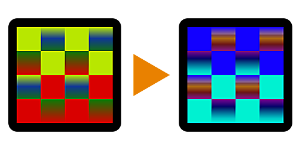

# Replace Color

<table>
<tr style="border: 0;">
<td style="border: 0;" valign="top">

{width="128px"}

## Replace Color

**In:** *Filters/Adjustments*

**Simple**

</td>
<td style="border: 0;" valign="top">

## Description

Hue shifts Source Color towards Target Color.

See [Replace Color Range](../../../../../../help/compositing-graphs/nodes-reference-for-com/node-library/filters/adjustments/replace-color-range/replace-color-range.md) or [Color Match](../../../../../../help/compositing-graphs/nodes-reference-for-com/node-library/filters/adjustments/color-match/color-match.md) for more advanced versions.

## Parameters

* **Source Color**: *(Color value)*Color to start shifting hue from.
* **Target Color**: *(Color value)*Color to shift hue towards.

## Example Images

| 

 |
| --- |
|  |

</td>
</tr>
</table>
