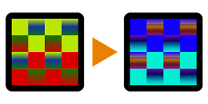

# Replace Color

<table>
<tr style="border: 0;">
<td width="33.33%" style="border: 0;" valign="top">

{width="128px"}

<b>In:</b> Filters &gt; Adjustments

</td>
<td width="100.00%" style="border: 0;" valign="top">

## Description

Hue shifts Source Color towards Target Color.

See [Replace Color Range](../../../../../../compositing-graphs/nodes-reference-for-com/node-library/filters/adjustments/replace-color-range/replace-color-range.md) or [Color Match](../../../../../../compositing-graphs/nodes-reference-for-com/node-library/filters/adjustments/color-match/color-match.md) for more advanced versions.

</td>
</tr>
</table>

## Parameters

|  |  |
|:---|:---|
| <b>Source Color</b> <i>(Color value)</i> | Color to start shifting hue from. |
| <b>Target Color</b> <i>(Color value)</i> | Color to shift hue towards. |

## Examples

<table style="margin-top: 32px; margin-bottom: 32px">
    <tr style="border: 0">
        <td style="border: 0; background: transparent">
            
        </td>
    </tr>
</table>
