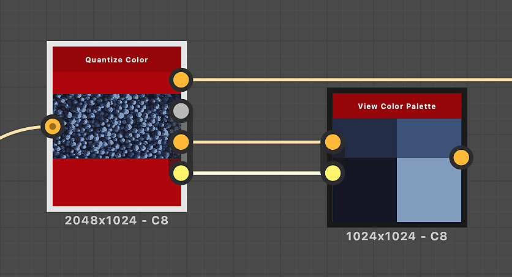
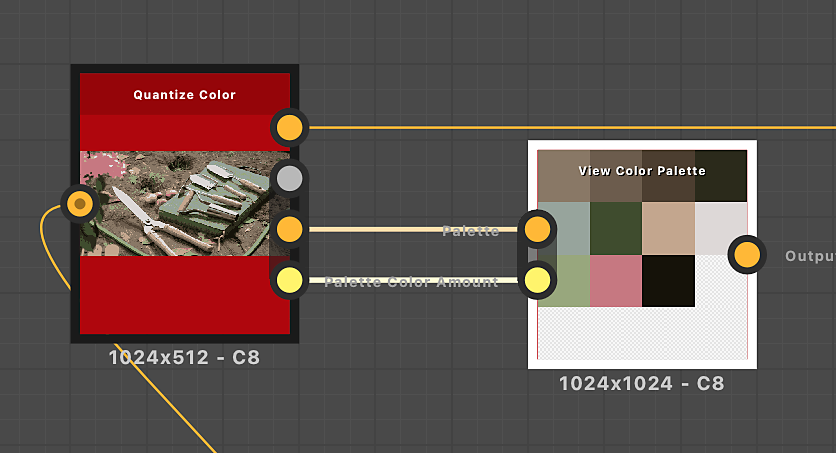

# View Color Palette

<table>
<tr style="border: 0;">
<td width="33.33%" style="border: 0;" valign="top">

{width="200px"}

<b>In:</b> Filters &gt; Adjustments

</td>
<td width="100.00%" style="border: 0;" valign="top">

## Description

Packs a color palette into a square or rectangle to visualize it more easily in the Graph View or 2D View.  
The packing aims at leaving as few empty slots as possible.

</td>
</tr>
</table>

The order of colors in the palette is preserved, with the colors flowing from left to right and top to bottom similarly to text wrapping.

This node may be used to visualize the palettes produced by the following nodes: [Quantize Color](../../../../../../help/compositing-graphs/nodes-reference-for-com/node-library/filters/adjustments/quantize-color/quantize-color.md), [Create Color Palette](../../../../../../help/compositing-graphs/nodes-reference-for-com/node-library/filters/adjustments/create-color-palette-16/create-color-palette-16.md), [Modify Color Palette](../../../../../../help/compositing-graphs/nodes-reference-for-com/node-library/filters/adjustments/modify-color-palette/modify-color-palette.md).

<table>
<tr style="border: 0;">
<td style="border: 0;" valign="top">

</td>
<td style="border: 0;" valign="top">

### Output connectors

</td>
<td style="border: 0;" valign="top">

</td>
</tr>
</table>

## Input connectors

|  |  |
| --- | --- |
| <b>Palette</b> *Color* PRIMARY | An ordered list of RGB colors encoded as a row of pixels. The palette can hold a maximum of 256 colors.   This is the palette that the node packs and renders. |
| <b>Palette Color Amount</b> *Integer* | The amount of colors stored in the palette.   If that number does not match the actual amount of colors in the 'Palette' image input, the visualization may be incomplete or have more blank slots than absolutely necessary. |

## Output connectors

|  |  |
| --- | --- |
| <b>Output</b> *Color* | The visualization of the packed palette. |

## Examples

<table>
<tr style="border: 0;">
<td style="border: 0;" valign="top">

{zoomable="yes"}

</td>
<td style="border: 0;" valign="top">

{zoomable="yes"}

</td>
</tr>
</table>

<table>
<tr style="border: 0;">
<td style="border: 0;" valign="top">

{zoomable="yes"}

</td>
<td style="border: 0;" valign="top">

{zoomable="yes"}

</td>
</tr>
</table>
