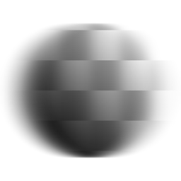

# Anisotropic Blur

<table>
<tr style="border: 0;">
<td style="border: 0;" valign="top">

{width="128px"}

{width="128px"}

## Anisotropic Blur (Grayscale)

**In:** *Filters/Blurs*

**Simple**

</td>
<td style="border: 0;" valign="top">

## Description

Performs a high quality [directional blur](../../../../../../help/compositing-graphs/nodes-reference-for-com/atomic-nodes/directional-blur/directional-blur.md), with a few settings to customise appearance. Also known as "motion blur".

Important: make sure to use the appropriate version for your input! Use "Anisotropic Blur" for Color inputs, or "Anisotropic Blur Grayscale" for Grayscale inputs.

## Parameters

* **Intensity**: *0.0 - 16.0*Strength (Radius) of the blur. The higher this value, the further the blur will reach.
* **Anisotropy**: *0.0 - 1.0*Directionality of the blur. Setting this to 0.0 is the same as performing a regular blur.
* **Angle**: *0.0 - 1.0*Sets the angle for the blur direction.
* **Quality**: *0 - 1*Switches between a[ box blur](../../../../../../help/compositing-graphs/nodes-reference-for-com/atomic-nodes/blur/blur.md) and an HQ blur internally. Trades in speed for quality.

## Example Images

</td>
</tr>
</table>
