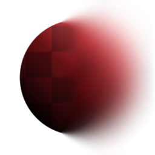
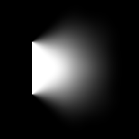

# Non Uniform Blur

<table>
<tr style="border: 0;">
<td style="border: 0;" valign="top">

{width="128px"}

{width="128px"}

## Non Uniform Blur (Grayscale)

**In:** *Filters/Blurs*

**Intermediate**

</td>
<td style="border: 0;" valign="top">

## Description

Performs a High Quality Blur, where the intensity is driven by an input mask. Options allow for Anisotropy and Assymetry to be added.

## Parameters

### Inputs

* **Blur Map**: *Grayscale Input*Mask map to drive effect strength.

### Parameters

* **Intensity**: *0.0 - 50.0*Maximum strength to apply the blur with. Masked by the Blur Map, so this setting will have no effect on black areas of that map.
* **Anisotropy**: *0.0 - 1.0*Optionally adds directionality to the blur effect. Driven by the Angle parameter.
* **Asymmetry**: *0.0 - 1.0*Optionally adds a bias to the sampling. Driven by the Angle parameter.
* **Angle**: *0.0 - 1.0*Angle to set directionality and sampling bias.
* **Samples**: *1 - 16*Amount of samples, determines quality. Multiplied by amount of Blades.
* **Blades**: *1 -* 9  
  Amount of sampling sectors, determines quality. Multiplied by amount of Samples.

## Example Images

*Below example is driven by a gradient ramp (at 90 degrees) in the Blur Map slot.*

</td>
</tr>
</table>
