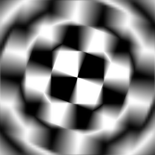

# Radial Blur

<table>
<tr style="border: 0;">
<td style="border: 0;" valign="top">

## Radial Blur (Grayscale)

**In:** *Filters/Blurs*

**Simple**

</td>
<td style="border: 0;" valign="top">

## Description

Generates a spinning, motion-type blur on an input.

## Parameters

* **Samples**: *1 - 128*Set the quality of the blur effect.
* **Angle**: *0.0 - 0.5*Set the amount of "spin" of the effect.
* **Center Position**:   
  Set the centerpoint of the effect.

## Example Images

</td>
</tr>
</table>
