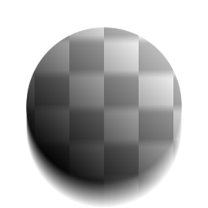
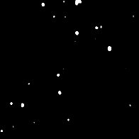
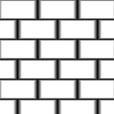

# Slope Blur

<table>
<tr style="border: 0;">
<td style="border: 0;" valign="top">

{width="128px"}

{width="128px"}

## Slope Blur (Grayscale)

**In:** *Filters/Blurs*

**Intermediate**

</td>
<td style="border: 0;" valign="top">

## Description

Performs an advanced, High Quality blur where the Anisotropy/Direction is driven by a Grayscale "Slope Map". Picture it as the Slope Blur effect following the slopes of your Slope Map as if it were a Heightmap, similar to [Directional Warp](../../../../../../help/compositing-graphs/nodes-reference-for-com/atomic-nodes/directional-warp/directional-warp.md) (which it is based on internally).

This is one of the most interesting and powerful blurs in Designer. It can be used to achieve some very interesting and unexpected effects, such as chipping and weathering edges or smearing and leaking dirt or rust.

Important: make sure to use the appropriate version for your input! Use "Slope Blur" for Color inputs, or "Slope Blur Grayscale" for Grayscale inputs.

## Parameters

### Inputs

* **Slope**: *Grayscale Input*Slope map to drive angle of the anisotropy. Should ideally contain sloping gradients; harsh, sharp transitions will not work well!

### Parameters

* **Samples**: *0 - 32*Amount of samples, affects the quality at the expense of speed.
* **Intensity**: *0.0 - 16.0*  
  Blur amount or strength.
* **Mode**: *Blur, Min, Max*|  
  Blending mode for consequent blur passes. "Blur" behaves more like a standard [Anisotropic Blur](../../../../../../help/compositing-graphs/nodes-reference-for-com/node-library/filters/blurs/anisotropic-blur/anisotropic-blur.md), while Min will "eat away" existing areas and Max will "smear out" white areas.

## Example Images

</td>
</tr>
</table>
