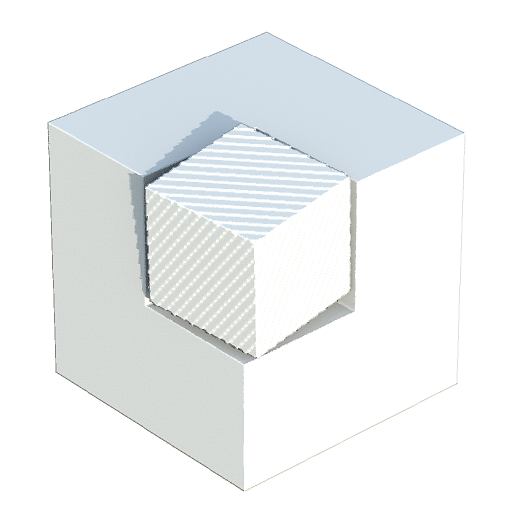
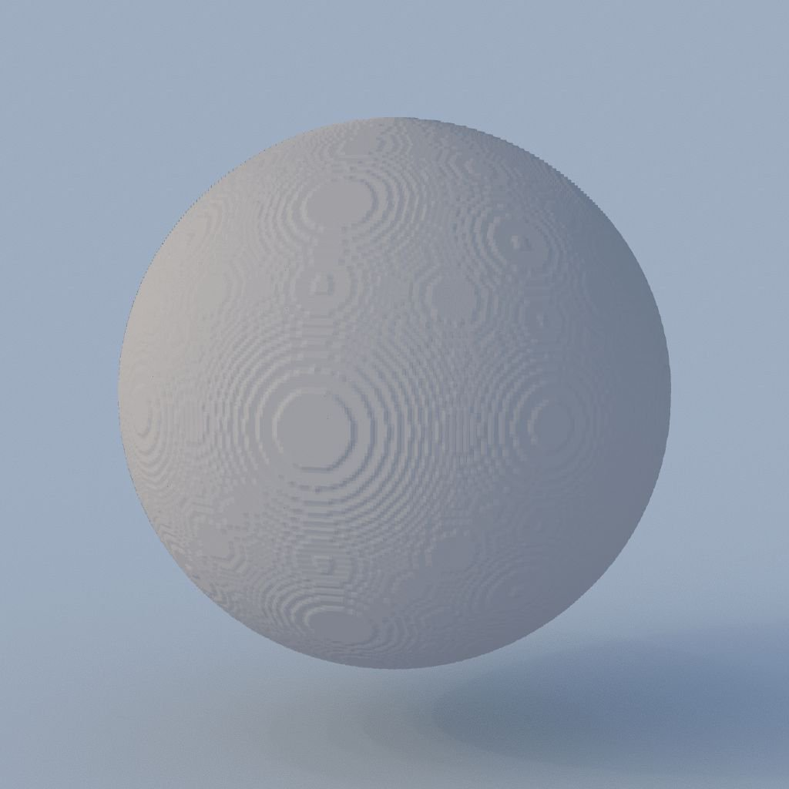

# 3D Texture Surface Render

<table>
<tr style="border: 0;">
<td width="41.60%" style="border: 0;" valign="top">

{width="200px"}

**In:** *Filter/Effect*

**Simple**

</td>
<td width="58.30%" style="border: 0;" valign="top">

## Description

The **3D Texture Surface Render** node renders the surface of a shape described by a *3D texture*, using its corresponding *distance field* from the **3D Distance Field** image input.

The surface is represented within the bounds of a *unit cube*. The lighting is computed using the **Environment** input image mapped to an infinite sphere.

>[!NOTE]
>
> The distance field is expected to be a **4096x4096** texture describing the shape with a **16x16** grid of 256 slices.  
> You may use the [3D Texture SDF](../../../../../../compositing-graphs/nodes-reference-for-com/node-library/filters/effects/3d-texture-sdf/3d-texture-sdf.md) node to compute the distance field for a 3D texture of 256 slices.

</td>
</tr>
</table>

## Parameters

### Inputs

* **3D Distance Field** *Grayscale*  
  The 4096x4096 image representing the 256 *slices* of a shape's *distance field*, arranged in a 16x16 grid.  
  You may use the [3D Texture SDF](../../../../../../compositing-graphs/nodes-reference-for-com/node-library/filters/effects/3d-texture-sdf/3d-texture-sdf.md) node to compute the distance field for a 3D texture of 256 slices.
* **Environment** *Color*  
  The image representing the *environment* which should be mapped to an infinite sphere in the render, and used for computing the *lighting*.  
  The image is also used to render the scene background when the **Background Mode** parameter is set to *Ambient* or *Environment*.

### Parameters

* **Output Resolution** *Integer2*  
  The resolution of the output image in **X** and **Y**, expressed as a *power of two*.
* **Camera Position** *Float2*  
  The position of the camera around the shape.  
  When the node is selected, you may use the position gizmo in the **2D View** to *orbit* the camera.
* **Camera Distance** *Float*  
  The distance from the camera to the shape.
* **Camera FOV** *Float*  
  The field of view of the camera in *degrees*.
* **Albedo** *Float3*  
  The albedo color of the shape's surface.
* **Background Mode** *Integer*  
  The method of representing the background of the rendered scene:  
  * *Ground Irradiance*: The computed irradiance of the ground plane  
  * *Ambient*: The ambient color of the **Environment** image input mapped to an infinite sphere, which is akin to a strongly blurred version of the image  
  * *Uniform Color*: Uniformly fill the background with a specified color  
  * *Environment*: The **Environment** image input mapped to an infinite sphere
* **Background Color** *Float4*  
  The color used to uniformly fill the background of the rendered scene.  
  *Note*: This parameter is only available when the **Background Mode** parameter is set to *Uniform Color*.
* **Enable Ground Plane** *Boolean*  
  When *True*, renders a ground plane. The *unit cube* enclosing the shape rests on this plane.
* **Infinite Plane** *Boolean*  
  Sets the ground plane to *extend infinitely* to the horizon.  
  *Note*: This parameter is only available when the **Enable Ground Plane** parameter is set to *True*.
* **Ground Plane Size** *Float2*Adjusts the size of the ground plane.  
  *Note*: This parameter is only available when the **Enable Ground Plane** parameter is set to *True* and the **Infinite Plane** parameter is set to *False*.

## Example Images

<table>
<tr style="border: 0;">
<td style="border: 0;" valign="top">

{width="256px"}

</td>
<td style="border: 0;" valign="top">

{width="256px"}

</td>
<td style="border: 0;" valign="top">

{width="256px"}

</td>
<td style="border: 0;" valign="top">

{width="256px"}

</td>
<td style="border: 0;" valign="top">

{width="512px"}

</td>
</tr>
</table>
