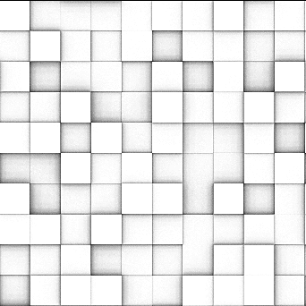
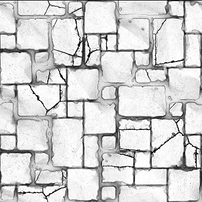

# Ambient Occlusion (RTAO)

<table>
<tr style="border: 0;">
<td width="41.60%" style="border: 0;" valign="top">

<b>In:</b> *Filters/Effects*

</td>
<td width="58.30%" style="border: 0;" valign="top">

## Description

Generates an Ambient Occlusion map based on a height map input.

This filter gives more accurate results compared to the HBAO but should not be used in combination with the CPU (SSE) engine due to computation time.

See [Ambient Occlusion (HBAO) (Filter Node)](../../../../../../compositing-graphs/nodes-reference-for-com/node-library/filters/effects/ambient-occlusion-hbao/ambient-occlusion-hbao-filter-node.md) for a faster, simpler alternative.

</td>
</tr>
</table>

## Parameters

<b>Use Physical Size</b> *Boolean*  
Toggle to use Physical Size settings to determine the height scale.

<b>Physical Size</b> *Float3* (Available when <b>Use Physical Size</b> is set to *True*)  
Adjusts the height scale based on the real physical size of the surface

<b>Samples</b>*Integer*  
The number of rays used to compute the ambient occlusion.  
A higher value provides a smoother and more precise result at the cost of performance.

<b>Height Scale</b> *Float* (Available when <b>Use Physical Size</b> is set to *False*)  
Multiplier for the intensity of the height map input.

<b>Distribution</b> *Integer*Sets the distribution method. Affects falloff towards shadowed areas,

<b>Maximum Distance</b> *Float*  
Sets the maximum distance rays can travel to be occluded.

<b>Spread Angle</b> *Float*  
Sets the spreading angle for the rays to be shot at. A value of 1 is a full hemisphere.

## Example Images

<table>
<tr style="border: 0;">
<td style="border: 0;" valign="top">

</td>
<td style="border: 0;" valign="top">

</td>
</tr>
</table>
