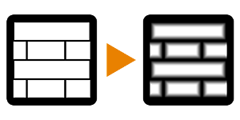

# Bevel (Filter Node)

<table>
<tr style="border: 0;">
<td width="33.33%" style="border: 0;" valign="top">

{width="128px"}

<b>In:</b> Filters &gt; Effects

</td>
<td width="100.00%" style="border: 0;" valign="top">

## Description

Peforms an edge-beveling effect on an input grayscale Heightmap. Returns both beveled Heightmap and Normalmap based on that Heightmap.

This is a useful node for applying exact curve profiles on an ideally binary (high contract black/white), basic Heightmap.

</td>
</tr>
</table>

## Inputs

|  |  |
|:---|:---|
| <b>input</b> <i>Grayscale Input</i> | Heightmap to convert. |
| <b>Custom Curve</b> <i>Grayscale Input</i> | Gradient that determines the exact curve/slope. Ideally a Gradient Linear node, on which you can perform any kind of adjustment such as [Levels](../../../../../../compositing-graphs/nodes-reference-for-com/atomic-nodes/levels/levels.md) or [Curves](../../../../../../compositing-graphs/nodes-reference-for-com/atomic-nodes/curve/curve.md). Only active when "Use Custom Curve" is True. |

## Parameters

|  |  |
|:---|:---|
| <b>Distance</b> <i>-1.0 - 1.0</i> | How far the bevel effect should reach. |
| <b>Corner Type</b> <i>Round, Angular</i> | Whether the beveling profile should be rounded or straight. |
| <b>Smoothing</b> <i>0.0 - 5.0</i> | How much additional smoothing (blurring) to perform after the bevel. |
| <b>Use Non-Uniform Blur</b> <i>False/True</i> | Whether smoothing should be done non-uniformly. |
| <b>Use Custom Curve</b> <i>False/True</i> | Toggles use of your own custom height curve. See above for more info. |
| <b>Normal Intensity</b> <i>0.0 - 50.0</i> | Intensity of the generated Normalmap. |
| <b>Normal Format</b> <i>DirectX, OpenGL</i> | Switch between different Normalmap formats (inverts the Green channel). |

## Examples

<table style="margin-top: 32px; margin-bottom: 32px">
    <tr style="border: 0">
        <td style="border: 0; background: transparent">
            
        </td>
    </tr>
</table>
