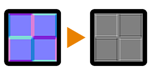

# Curvature (Filter Node)

<table>
<tr style="border: 0;">
<td style="border: 0;" valign="top">

{width="128px"}

## Curvature

**In:** *Filters/Effects*

**Simple**

</td>
<td style="border: 0;" valign="top">

## Description

Performs a simple, harsh single-pass curvature conversion to input [Normalmap](../../../../atomic-nodes/normal/normal.md). The resulting map has white tints for convex areas and black tints for concave. Curvature will always produce pixel-thin lines and sharp transitions.

This node is useful for some quick highlighting or darkening of certain edges. It is limited in comparison to [Curvature Smooth](../curvature-smooth/curvature-smooth.md) (which produces higher quality results) and [Curvature Sobel](../curvature-sobel/curvature-sobel.md) (which has more options).

## Parameters

* **Intensity**: *0.0 - 10.0*Intensity of the effect. Increases contrast of the result.
* **Normal Format**: *DirectX, OpenGL*  
  Switches between different Normalmap formats (inverts the Green channel).

## Example Images

| 

 |
| --- |
|  |

</td>
</tr>
</table>
