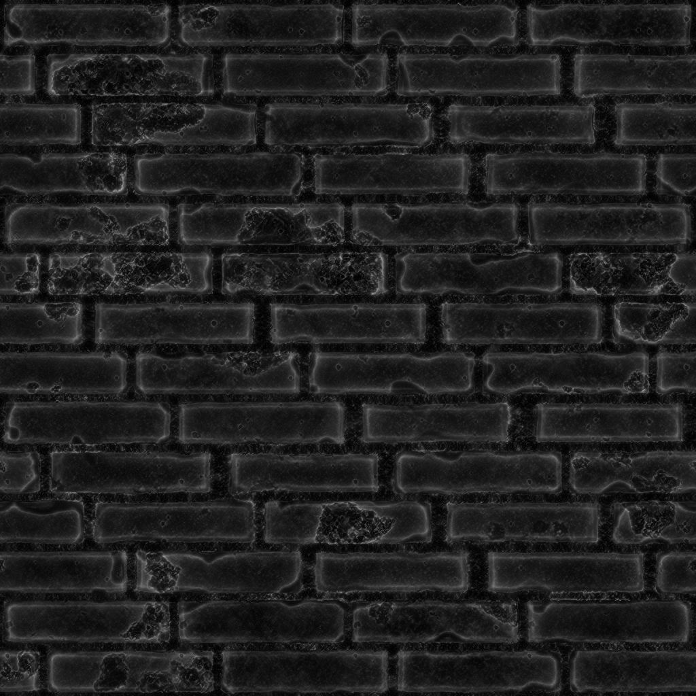

# Curvature Smooth

<table>
<tr style="border: 0;">
<td width="33.33%" style="border: 0;" valign="top">

{width="200px"}

<b>In:</b> Filters &gt; Effects

</td>
<td width="100.00%" style="border: 0;" valign="top">

## Description

Computes the curvature of a surface described by a normal map.

A curvature map represents the concave and convex areas of a surface.  
Flat areas are 50% gray. Convex areas are brighter, while concave areas are darker.

</td>
</tr>
</table>

The concave and convex areas are also split into their own outputs, for easier selection or masking of areas based on those characteristics.

>[!TIP]
>
> Look at [Curvature](../../../../../../compositing-graphs/nodes-reference-for-com/node-library/filters/effects/curvature-filter-node/curvature-filter-node.md) for a sharper version, or[ Curvature Sobel](../../../../../../compositing-graphs/nodes-reference-for-com/node-library/filters/effects/curvature-sobel/curvature-sobel.md) if you need more options.

## Inputs

|  |  |
|:---|:---|
| <b>Normal</b> <i>Color</i> <b>PRIMARY</b> | The normal map describing the surface which curvature should be computed. |

## Outputs

|  |  |
|:---|:---|
| <b>Curvature</b> <i>Grayscale</i> | The curvature map computed out of the input normal map.   Flat areas are 50% gray. Convex areas are brighter, while concave areas are darker. |
| <b>Convexity</b> <i>Grayscale</i> | The convexity map computed out of the input normal map.   The more convex an area is, the brighter it is in the map.  Flat or concave areas are black. |
| <b>Concavity</b> <i>Grayscale</i> | The concavity map computed out of the input normal map.   The more concave an area is, the brighter it is in the map.  Flat or convex areas are black. |

## Parameters

|  |  |
|:---|:---|
| <b>Normal format</b> *Integer* | The format of the input normal map. Effectively inverts the green channel.<ul data-preserve-html="true"> <li data-preserve-html="true"><b>DirectX:</b> The Y axis points up</li> <li data-preserve-html="true"><b style="">OpenGL:</b> The Y axis points down</li> </ul> |

## Examples

<table>
  <tr>
    <td>
      
       <i>Before</i>
    </td>
    <td>
      
       <i>After</i>
    </td>
  </tr>
</table>

<table>
<tr style="border: 0;">
<td style="border: 0;" valign="top">

{zoomable="yes"}

</td>
<td style="border: 0;" valign="top">

{zoomable="yes"}

</td>
</tr>
</table>

<table>
  <tr>
    <td>
      
       <i>Before</i>
    </td>
    <td>
      
       <i>After</i>
    </td>
  </tr>
</table>

<table>
<tr style="border: 0;">
<td style="border: 0;" valign="top">

{zoomable="yes"}

</td>
<td style="border: 0;" valign="top">

{zoomable="yes"}

</td>
</tr>
</table>
