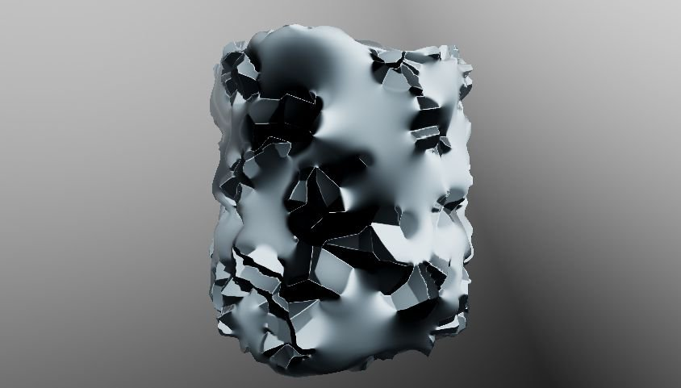

# Diffusion Color

<table>
<tr style="border: 0;">
<td width="33.33%" style="border: 0;" valign="top">

{width="200px"}

<b>In:</b> Filters &gt; Effects

</td>
<td width="100.00%" style="border: 0;" valign="top">

## Description

Apply a diffusion process to the colors in the **Source** image input according to the provided **Mask** image input, creating smooth gradations between colors when using [Substance 3D Designer](https://www.adobe.com/products/substance3d-designer.html).

Only colors from pixels matching the mask are diffused; other pixels do not participate in the result.

</td>
</tr>
</table>

## Inputs

|  |  |
|:---|:---|
| <b>Source</b> <i>Color</i> | The image to diffuse. |
| <b>Mask</b> <i>Grayscale</i> | Diffusion mask: white pixels are sampled in <i>Source</i> and diffused in black pixels. The image should be black and white. If the mask includes gradients, the cutoff value is 0.5. |
| <b>Intensity</b> <i>Grayscale</i> | Defines locally how strong the diffusion process is applied. This map should be <i>contrasted</i> for a noticeable effect. |

## Parameters

|  |  |
|:---|:---|
| <b>Iterations</b> <i>0.0 - 64.0</i> | The number of diffusion iterations to perform (higher is better but slower). Useful values are in the &#91;8, 48&#93; range. Please note that if you are not looking for mathematical correctness, low values are fine or even better. |
| <b>Distance</b> <i>0.0 - 1.0</i> | Adjusts the maximum distance of the diffusion. |
| <b>Enable Dithering</b> <i>True/False</i> | Controls the sampling method of each pass. Dithering allows convergence in less passes, but introduces noise. Without it, each pass is faster but more passes are required to achieve a smooth result without banding artifacts. |
| <b>Is Normal Map</b> <i>True/False</i> | Adds a normalization on values at every step. |
| <b>Use Alpha as Mask</b> <i>True/False</i> | Use the alpha channel of the <i>Source</i> input as the diffusion mask, instead of the <i>Mask</i> input. |

## Examples

<table style="margin-top: 32px; margin-bottom: 32px">
    <tr style="border: 0">
        <td style="border: 0; background: transparent">
            
        </td>
        <td style="border: 0; background: transparent">
            
        </td>
        <td style="border: 0; background: transparent">
            
        </td>
    </tr>
    <tr style="border: 0">
        <td style="border: 0; background: transparent">
            
        </td>
        <td style="border: 0; background: transparent">
            
        </td>
        <td style="border: 0; background: transparent">
            
        </td>
    </tr>
    <tr style="border: 0">
        <td style="border: 0; background: transparent">
            
        </td>
        <td style="border: 0; background: transparent">
            
        </td>
    </tr>
</table>
