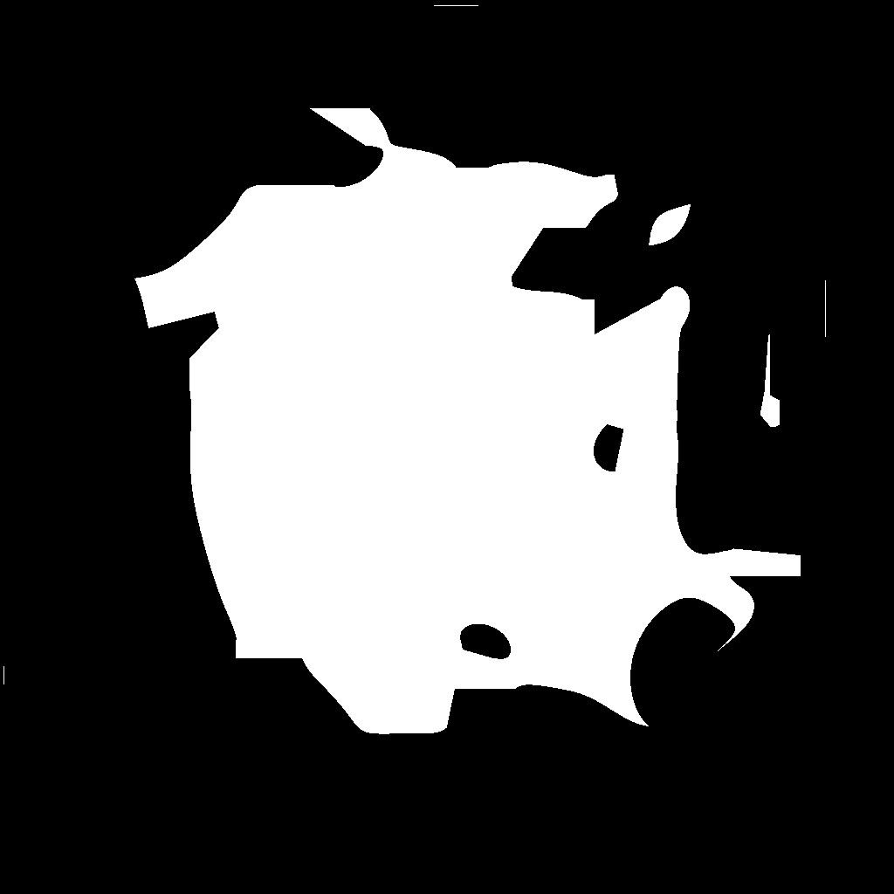
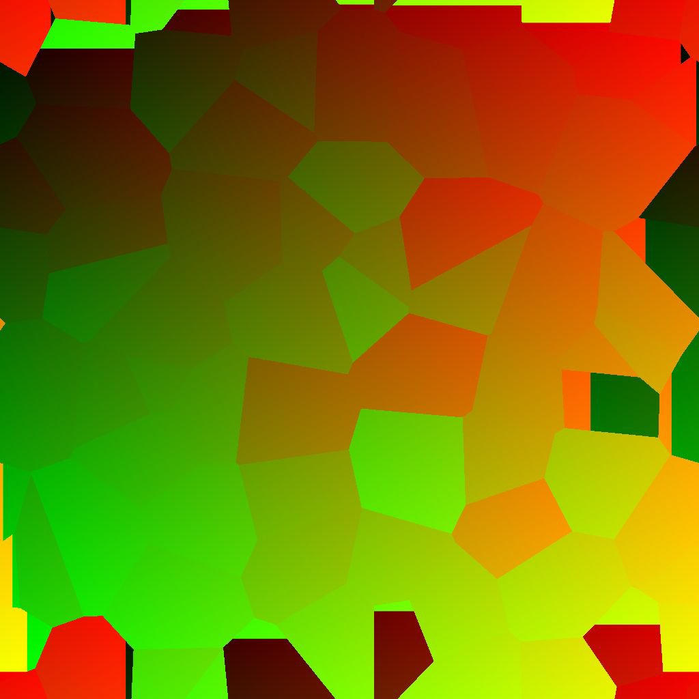
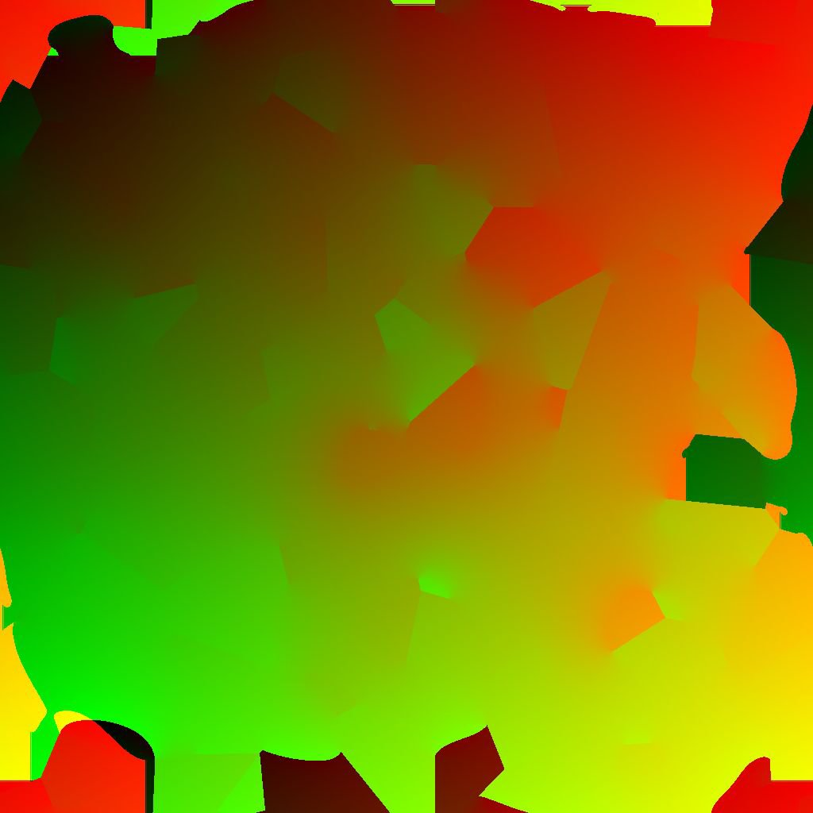

# Diffusion UV

<table>
<tr style="border: 0;">
<td width="41.60%" style="border: 0;" valign="top">

{width="200px"}

**In:** *Filters/Effects*

**Intermediate**

</td>
<td width="58.30%" style="border: 0;" valign="top">

## Description

Apply a diffusion process to the UV coordinates in **Source** image input according to the provided **Mask** image input, interpolating coordinates between values from **Source**.

Only UVs from pixels matching the mask are diffused; other pixels do not participate in the result.

Please note tiling is handled in a special way: When tiling is *enabled* (which is the case by default) neighboring coordinates can be averaged accross the 0/1 limit.

For instance, if the U coordinate value is 0.1 on one pixel and 0.8 on another, the averaged value will be 0.95 rather than 0.45 because *tiling of the coordinates is assumed*. This is independent from the actual pixel position: coordinate values are handled the same way all over the image.

This can lead to undesirable results when using this filter for *texture deformation*. If that happens, make sure your mask defines 'control curves/points' no more than *half a texture length apart*.

</td>
</tr>
</table>

## Parameters

* **Iterations**: *0.0 - 64.0*The number of diffusion iterations to perform (higher is better but slower). Useful values are in the &#91;8, 48&#93; range.  
  Please note that if you are not looking for mathematical correctness, low values are fine or even better.

## Inputs

* **Source** *Color*  
  The UVs to diffuse. Please note tiling is handled in a special way in this filter (see *Description*).
* **Mask** *Grayscale*The diffusion mask: White pixels are sampled in *Source* and diffused in black pixels. The image should be black and white. If the mask includes gradients, the cutoff value is 0.5.

## Example images

<table>
<tr style="border: 0;">
<td style="border: 0;" valign="top">

{width="256px"}

</td>
<td style="border: 0;" valign="top">

{width="256px"}

</td>
</tr>
</table>

<table>
<tr style="border: 0;">
<td style="border: 0;" valign="top">

{width="256px"}

</td>
<td style="border: 0;" valign="top">

{width="256px"}

</td>
</tr>
</table>
